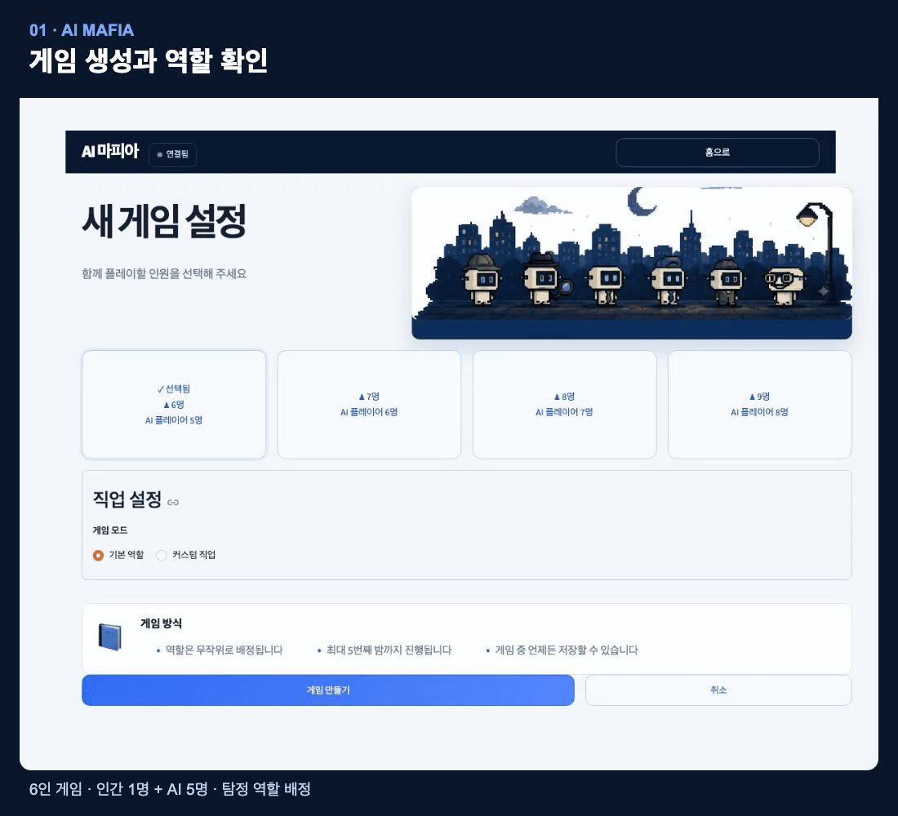
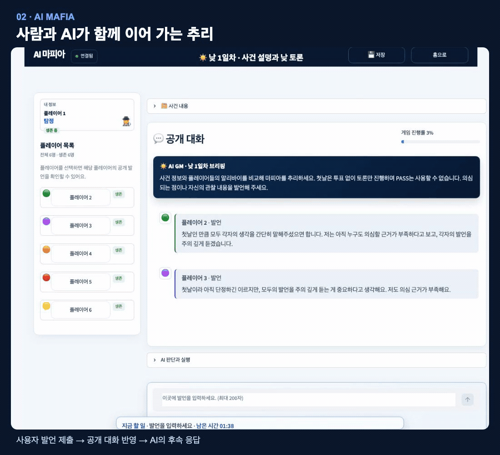
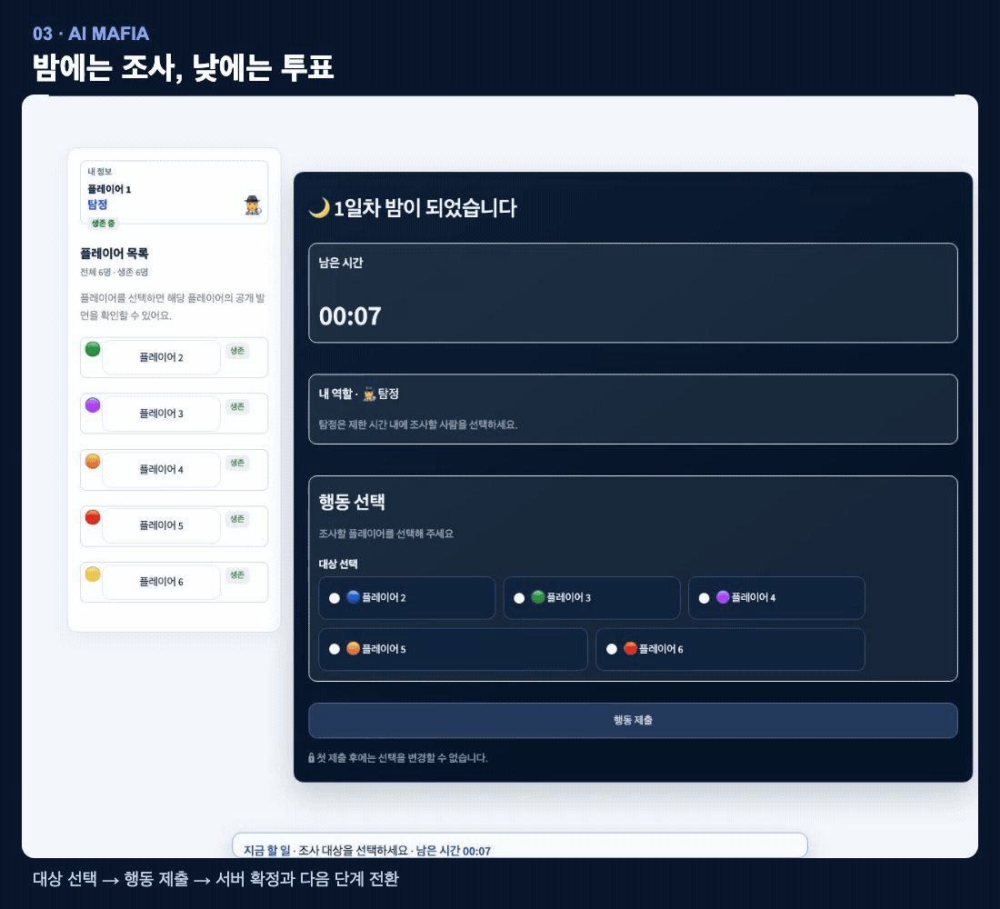
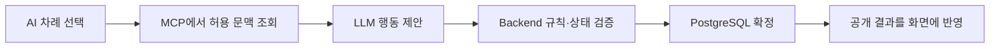

<div align="center">

# AI MAFIA

### 사람 한 명과 AI 플레이어들이 펼치는 대화·추리·블러핑 게임

함께할 사람을 기다리지 않고, 서로 다른 페르소나를 가진 AI들과 마피아 게임을 시작합니다.


**1 HUMAN + 5–8 AI · 5 SCENARIOS · CUSTOM ROLES**

[기술 스택](#tech-stack) · [팀원과 기여](#team) · [프로젝트 소개](#overview) · [주요 화면](#features) · [핵심 설계](#design) · [문제 해결](#troubleshooting) · [실행 방법](#quick-start) · [검증과 한계](#verification)

</div>

---

<a id="tech-stack"></a>

## 기술 스택

**Python 3.12+**를 중심으로 화면·게임 서버·MCP를 분리하고, PostgreSQL을 최종 상태 저장소로 사용합니다.

| 구성 | 기술 | 책임 |
| --- | --- | --- |
| 사용자·관리자 Front | Streamlit | 게임 조작, 진행 동기화, 읽기 전용 운영 분석 |
| Backend | FastAPI | 게임 규칙·상태 변경, Agent 실행, 데이터 접근, API 검증 |
| MCP Server | FastMCP | AI가 읽는 문맥·역할 지침 제공, 행동 요청을 Backend에 위임 |
| LLM 연동 | OpenAI / Gemini / OpenAI 호환 로컬 Provider | actor별 입력을 받아 구조화된 행동 제안 생성 |
| 영속 데이터 | PostgreSQL · psycopg | 게임 상태, 행동 제출, 이벤트, snapshot, 중복 요청 receipt 저장 |
| 보조 데이터 | Redis | 공개 대화 캐시, lock·event stream 보조 |
| 실행·개발 도구 | Docker Compose · uv · pytest · Ruff | 서비스 구성, 의존성 고정, 테스트·정적 검증 |

<a id="team"></a>

## 팀원과 주요 기여

Git 작성자와 실제 변경 파일을 기준으로 요약했습니다. 기능 통합과 개선에는 여러 팀원의 공동 작업이 포함됩니다.

| 팀원 · Git author | 주요 작업 | 대표 커밋 |
| --- | --- | --- |
| **Sim Hwanseok** | MCP·게임 통합, 커스텀 능력, 동시성·복구 오류 개선과 검증 | `c559d45` · `c077c43` · `de00426` · `7062b87` |
| **ik-e** | Backend 게임 흐름·API, Docker 실행 환경, 기획·설계 문서 | `c358a76` · `b725983` · `768f83e` |
| **sungju** | Backend·Agent 초기 기반, 사용자 게임 화면·조작 UI | `b1be377` · `8611779` · `751c2a2` |
| **차해든** | Frontend 연결, 관리자 화면·Agent 로그 조회 | `1edc434` · `8c8b5ca` · `a9b851f` |

Front / Backend / MCP·Data Infrastructure의 세 영역에서 공통 API 계약과 작업 단위(WU)·checkpoint(CP)를 공유하며 개발했습니다. [공통 마스터플랜](docs/개발상세플랜/01_core/AI_MAFIA_MASTER_PLAN.md) · [섹터 간 개발 계약](docs/개발상세플랜/01_core/AI_MAFIA_INDEPENDENT_CONTRACT.md)

<a id="overview"></a>

## 프로젝트 소개

AI MAFIA는 인간 1명과 AI 5~8명이 함께 플레이하는 소셜 디덕션 게임입니다. 사용자는 공개 대화와 사건 기록을 보고 추리하고, AI는 각자의 역할·페르소나·허용된 정보를 바탕으로 발언과 행동을 선택합니다.

핵심 개발 과제는 **AI의 자유로운 대화와 게임 규칙의 일관성을 함께 유지하는 것**이었습니다. 이를 위해 모델은 행동을 제안하고, Backend가 권한·차례·대상·마감을 검증한 뒤 게임 상태와 승패를 확정하도록 설계했습니다.

| 항목 | 내용 |
| --- | --- |
| 프로젝트 형태 | 팀 프로젝트 · AI 마피아 MVP |
| 개발 범위 | 사용자·관리자 화면, 게임 엔진, AI 실행, MCP 연동, 데이터 저장·복원 |
| 플레이 구성 | 6~9인, 5개 사건 배경, 기본 역할 또는 인간 전용 커스텀 직업 |
| 핵심 경험 | 게임 생성 → 역할 확인 → 토론·밤 행동·투표 → 결과·피드백 |
| 실행 환경 | Python 개발 환경 또는 Docker Compose · 개인 개발 환경/접근이 통제된 사설망 |

[프로젝트 기획서](docs/arrangement/00_AI_MAFIA_PROJECT_PROPOSAL.md) · [프로젝트 수행과정](docs/arrangement/08_PROJECT_EXECUTION_REPORT.md)

<a id="features"></a>

## 주요 기능과 화면

| 기능 | 사용자 경험 |
| --- | --- |
| AI와 대화·추리 | 공개 채팅에서 의심과 근거를 주고받고, 역할별로 조사·보호·공격·투표 수행 |
| 커스텀 직업 | 인간 플레이어의 직업명과 능력을 구성하고, 허용된 단계에서 사용 |
| 저장·재개 | 진행 중인 게임을 저장하고 상태·잔여 시간을 복원하여 이어서 플레이 |
| 관전·결과 | 탈락 후 공개 진행을 관찰하고, 종료 후 결과와 기록 확인 |
| 관리자 분석 | 게임·Agent 작업 로그 조회, 공개 AI 발언의 주제·키워드·근거 분석 |

### 게임 생성과 역할 확인

인원과 게임 모드를 선택하면 역할과 개인 사건 정보가 공개됩니다. 아래 시연은 인간 1명과 AI 5명이 참여한 6인 게임입니다.



### AI와 공개 토론

사용자가 발언을 제출하면 공개 대화에 반영되고, AI가 앞선 대화를 읽고 후속 의견을 이어 갑니다.



### 밤 행동과 투표

탐정은 밤에 조사 대상을 선택하고, 낮 토론 뒤에는 의심하는 플레이어에게 투표합니다. 제출 여부와 단계 전환은 서버가 확정한 상태로 표시됩니다.



GIF는 `http://127.0.0.1:18501`에서 직접 플레이한 화면을 녹화한 뒤 Remotion으로 주요 구간을 편집하고 변환했습니다. 대기 구간을 생략했으며 공개 토론 GIF는 1.5배속입니다. 시연 게임은 첫 투표 이후 두 번째 밤에서 저장하고 나왔으며, 종료·승패 화면은 이번 녹화에 포함하지 않았습니다.

### 관리자 발언 분석

공개 발언을 페르소나·주제별로 살펴보고 반복 표현과 원문 근거를 확인합니다. 발언 분석은 별도 설정을 켜고 분석 데이터가 쌓였을 때 사용할 수 있습니다.


관리자 이미지는 저장소에 보관된 시연 캡처입니다. 상세 흐름은 [사용자·관리자 화면 설계](docs/arrangement/05_SCREEN_DESIGN.md)를 참고하세요.

<a id="system"></a>
<a id="design"></a>

## 아키텍처와 핵심 설계

[](docs/diagrams/system-map.html)

[관계도 HTML](docs/diagrams/system-map.html)은 내려받아 브라우저에서 확대할 수 있습니다.

### AI Agent를 사용한 이유와 적용 방법론

마피아 게임에는 여러 플레이어가 서로 다른 정보를 가지고 대화·의심·블러핑을 이어 가는 경험이 필요합니다. **AI Agent로 빈자리를 채우면 혼자서도 게임을 시작할 수 있고**, 정해진 대사만 반복하는 NPC보다 공개 대화와 현재 상황에 반응하는 상대를 구성할 수 있습니다.

게임에는 **역할·페르소나 기반 다중 Agent**, **관찰 → 판단 → 행동 → 결과 확인의 반복**, **구조화된 출력과 규칙 검증**을 적용했습니다.

| 방법론 | 게임에 적용한 방식 |
| --- | --- |
| 역할·페르소나 분리 | AI마다 시민·마피아·탐정·의사 역할과 말투·성격 지침을 부여해 판단의 목적과 표현을 구분 |
| 제한된 정보로 판단 | MCP Resource로 공개 기록, 본인 정보, 허용 행동을 읽고 actor별 문맥으로 추론 |
| 구조화된 행동 선택 | LLM이 행동 종류·대상·발언을 JSON schema에 맞춰 제안하고, 오케스트레이터가 형식과 허용 범위를 검사 |
| Tool 사용과 서버 판정 | MCP Tool 또는 Backend 제출 경로로 행동을 요청하고, 엔진이 차례·권한·마감·승패를 확정 |
| 상태 기반 반복·복구 | 확정 결과를 다음 판단에 반영하고, 지연·실패 응답은 기존 행동 창에 묶어 거부 또는 fallback 처리 |

이 반복은 `AgentOrchestrator.run`으로 구현했습니다. LangGraph·StateGraph는 후속 설계안이며 현재 기술 스택에는 포함하지 않습니다. 모델의 내부 사고 원문 대신 공개 가능한 처리 상태와 행동 결과를 화면에 표시합니다.

### 1. AI의 제안과 게임의 최종 판정을 분리

모델이 유효하지 않은 행동을 생성하거나 이미 지난 차례의 응답을 반환할 수 있습니다. Agent는 구조화된 제안을 만들고, Backend는 행동 종류·대상·현재 상태 버전·행동 창·마감을 다시 검사합니다. 검증을 통과한 변경만 PostgreSQL transaction으로 확정합니다.



이 경계 덕분에 모델 응답 성공과 게임 반영 성공을 구분할 수 있고, 거부·중복·오래된 응답을 게임 기록과 대조할 수 있습니다.

코드: [AgentOrchestrator](backend/app/agent/orchestrator.py) · [행동 적용](backend/app/services/game/action_command.py) · [게임 엔진](backend/app/game_engine/)

<a id="agents"></a>

### 2. AI마다 볼 수 있는 정보를 따로 구성

같은 공개 대화를 읽더라도 각 AI의 역할과 조사 결과는 다릅니다. Backend의 actor별 projection으로 정보를 나누고, 매 판단마다 해당 AI의 입력을 새로 구성합니다.

| 입력 범위 | 전달하는 정보 |
| --- | --- |
| `public` | 공개 상태·명부·대화·확정 사건 |
| `me` | 본인 역할·본인 조사 결과·개인 기록 |
| `turn` | 해당 actor에게 허용된 행동·대상·행동 창·마감 |
| `persona` | 본인에게 배정된 말투·성격·역할 지침 |

다른 AI의 비공개 컨텍스트나 미공개 선택은 공유하지 않습니다. 이는 입력과 행동 주체를 분리한 구조이며, AI마다 별도 모델이나 프로세스를 실행한다는 의미는 아닙니다. 현재 MCP 모델 입력은 사건 배경 서사와 개인 알리바이·관찰을 제외하므로, 화면에 보이는 모든 사건 정보가 AI에게 전달되지는 않습니다.

코드: [actor 정보 투영](backend/app/services/game/actor_context.py) · [MCP Resource](mcp_server/mafia_game/api/resources/registry.py) · [OpenAI 요청 구성](backend/app/llm_provider/openai_provider.py)

### 3. 원본 데이터와 복구 가능한 데이터를 구분

게임의 최종 원본은 PostgreSQL에 저장합니다. 행동 제출, 확정 이벤트, snapshot, command receipt를 구분하여 상태 복원과 중복 요청 판정에 사용합니다. Redis는 공개 대화 캐시 등 보조 계층이며 비공개 actor 컨텍스트를 공개 캐시에 넣지 않습니다.

저장·재개와 지연 응답이 겹치더라도 처음 판단한 행동 창과 버전을 기준으로 검증합니다. 오래된 응답을 새로운 차례에 옮겨 적용하지 않는 것이 핵심입니다.

코드·설계: [저장소 계층](backend/app/repositories/) · [DB·Redis 설계와 ERD](docs/arrangement/01_DB_REDIS_DESIGN.md#3-논리-데이터-구조)

<a id="mcp"></a>

<details>
<summary>MCP 구현 범위와 행동 제출 경로</summary>

현재 등록은 **Tool 3개 · Resource 템플릿 2개 · Prompt 1개**입니다.

| Tool | 용도 |
| --- | --- |
| `submit_action` | 발언·PASS·밤 행동·투표의 제출 위임 |
| `manipulate_vote` | 인간의 `vote.triple.v1` 능력으로 본인 표를 3표로 제출 |
| `inspect_special_roles` | 인간의 `intel.special_roles.v1` 능력으로 다른 탐정·의사 조회 |

Resource는 공개 `mafia://context/current/{game_id}/{user_id}`와 actor별 `mafia://context/scoped/{game_id}/{user_id}/{player_id}/{scope}`이며, Prompt는 `agent_instruction`입니다.

정상 AI 발언은 MCP `submit_action`을 거치지만, 투표·밤 행동과 일부 복구 경로는 Backend에 직접 제출합니다. 모든 AI 행동이 MCP Tool을 통과하는 것은 아닙니다. MCP runtime은 DB·Redis·LLM에 직접 접근하지 않고 Backend 내부 API를 호출합니다.

정본의 다섯 `mafia://session/*` Resource는 확장 계약이며 현재 등록과 구분합니다. [StateGraph 문서](docs/AI_MAFIA_AGENT_ARCHITECTURE_DESIGN.md) 역시 후속 설계안이고, 현재 실행은 `AgentOrchestrator.run` 기반입니다.

[Tool 등록 코드](mcp_server/mafia_game/api/tools/registry.py) · [MCP 설계](docs/arrangement/03_MCP_DESIGN.md)

</details>

<a id="troubleshooting"></a>

## 트러블슈팅

### 인간의 투표를 기다리다 AI가 자동 선택으로 넘어가는 문제

**증상:** 9인 게임의 기록에서 AI 45표 중 28표가 자동 선택(`AUTO`)으로 저장됐습니다. 발언 생성은 성공하고 있어 Provider 전체 장애로 설명할 수 없었습니다.

**원인:** 인간의 첫 투표가 있어야 AI 판단을 시작했고, AI 응답을 순차 생성한 뒤 한꺼번에 저장했습니다. 단순 병렬화만으로는 먼저 제출된 표가 상태 버전을 바꾸어 나머지 응답을 무효화하는 문제도 있었습니다.

**개선:** 인간 투표 대기 조건을 제거하고, 열린 투표의 미제출 AI 판단을 병렬로 시작했습니다. 완료된 표부터 개별 transaction으로 저장하고, 비공개 표 제출과 공개 상태 버전 갱신의 경계를 나눴습니다.

**확인:** 실게임의 두 일반 투표 창에서 AI 13표가 모두 `AGENT`로 저장됐고 `AUTO`는 0표였습니다. 두 창에서 마지막 AI 표는 각각 3.517초·4.928초에 저장됐습니다. 이는 해당 실행의 관측값이며, 모든 상황의 성능이나 자동 선택 제거를 보장하는 수치는 아닙니다.

[문제·원인·검증 기록](docs/개발상세플랜/05_reports/AI_MAFIA_PARALLEL_VOTE_BUG_REPORT.md) · [병렬 판단·제출 코드](backend/app/services/game/postgres_runtime.py)

### 행동은 저장됐지만 MCP 응답을 받지 못한 경우

**문제:** 제출이 이미 반영된 뒤 응답만 유실되면 Agent는 성공 여부를 알 수 없습니다. 이때 현재 차례를 다시 읽어 대체 행동을 제출하면 같은 발언이 다음 차례에도 적용될 위험이 있습니다.

**대응:** 복구·대체 제출에도 최초 관찰한 행동 창과 상태 버전을 유지합니다. 이미 다음 차례로 넘어갔다면 오래된 제출을 거부하고, 확인하지 못한 성공을 Agent activity에 `APPLIED`로 기록하지 않습니다.

**확인:** AGT-012 합성 회복 시험 300회에서 submission·receipt가 각각 1개만 남고 새 행동 창에는 다시 적용되지 않음을 확인했습니다. 실제 제출이 저장돼도 activity는 `FAILED`일 수 있어, 적용 건수는 activity만 보지 않고 원장과 대조해야 합니다. 실제 서비스의 장애 복구 성공률을 측정한 시험은 아닙니다.

[시험 결과와 해석](docs/arrangement/07_AGENT_TEST_RESULT_REPORT.md) · [회복 경로 테스트](backend/tests/test_agent_report_recovery.py) · [제출 복구 코드](backend/app/services/game/postgres_runtime.py)

### 저장·재개 뒤 AI 발언이 멈추는 문제

**원인:** 상태 버전이 달라진 만료 작업을 다시 예약할 때 투표만 허용하여, 저장·재개 뒤의 발언 작업이 예약되지 않았습니다.

**개선:** 발언(`SPEECH`)도 현재 상태로 다시 예약하도록 조건을 보완했습니다. 과거 판단을 그대로 적용하지 않고 새로운 상태에서 판단을 시작합니다. Git 커밋 `7062b87`의 [Agent 작업 저장소](backend/app/repositories/agent_repository.py) 변경으로 확인할 수 있습니다.

<a id="quick-start"></a>
<a id="development"></a>

## 실행 방법

### Python 개발 환경

Python 3.12+, uv, 접속 가능한 팀 PostgreSQL·Redis, OpenAI API key가 필요합니다. 아래 명령은 저장소 루트에서 실행합니다.

```bash
uv sync --locked --dev
uv sync --project mcp_server --locked --dev

# 기존 설정을 보존하고, 파일이 없을 때만 예제에서 시작합니다.
test -f .env || cp .env.example .env
chmod 600 .env
```

<a id="configuration"></a>

`.env`의 placeholder를 실행 환경에 맞게 설정합니다. 실제 비밀값은 저장소에 커밋하지 않습니다.

| 설정 | 용도 |
| --- | --- |
| `TEAM_DATABASE_URL`, `DATABASE_NAME` | 팀 테스트 DB의 runtime 연결·DB 이름 |
| `REDIS_URL` | Backend가 사용할 Redis 연결 |
| `AI_MAFIA_STORAGE_MODE=team` | 통합 실행의 기본 저장소 모드 |
| `OPENAI_API_KEY`, `OPENAI_MODEL` | OpenAI 호출 설정. 모델 기본값은 코드에서 `gpt-4.1-mini` |
| `GAME_STATE_KEYRING_FILE`, `GAME_STATE_ACTIVE_KEY_ID` | 저장소 밖에 준비한 게임 상태 암호화 keyring 경로·활성 key ID |
| `ADMIN_USER_IDS` | 관리자 UUID allowlist. 비어 있으면 접근 거부 |
| `SPEECH_ANALYSIS_ENABLED` | 발언 분석 활성화 여부. 기본 `false`, 별도 모델 호출 발생 |

keyring 설정은 둘을 함께 지정해야 합니다. 기존 평문 개발 환경은 둘 다 비울 수 있지만, 이미 암호화된 게임을 복원하려면 과거 key도 보존해야 합니다. 예제 경로 그대로는 실행할 수 없고, 실행 스크립트가 keyring을 생성하거나 기존 데이터를 암호화하지 않습니다.

<a id="running"></a>

설정 후 점검하고 서비스를 시작합니다. `run_openai.sh`는 Provider를 OpenAI로 지정합니다.

```bash
./run_openai.sh --check
./run_openai.sh
```

| 서비스 | 기본 주소 |
| --- | --- |
| 사용자 화면 | `http://127.0.0.1:18501` |
| Backend API 문서 | `http://127.0.0.1:18000/docs` |
| MCP | `http://127.0.0.1:18100/mcp` |

macOS/Linux의 `--check`는 설정·import·DB·Redis·seed 준비 상태를 읽기 전용으로 확인하며 유료 모델을 호출하지 않습니다. 실제 게임에서의 모델 응답까지 보장하지는 않습니다.

<details>
<summary>Windows·관리자 앱·마이그레이션 안내</summary>

Windows도 루트와 MCP 가상환경을 준비한 후 `.env.example`을 **기존 `.env`가 없을 때만** 복사하고 위 설정을 채웁니다.

```powershell
uv sync --locked --dev
uv sync --project mcp_server --locked --dev
if (-not (Test-Path .env)) { Copy-Item .env.example .env }
```

설정을 마친 뒤 PowerShell에서 실행합니다.

```powershell
.\run_openai.bat --check
.\run_openai.bat
```

Windows의 `--check`는 필수 환경값·import 확인까지이며 DB·Redis·seed 연결 검증은 포함하지 않습니다.

관리자 Front는 통합 스크립트와 별도로 실행합니다. Backend의 `ADMIN_USER_IDS`에 관리자 앱이 사용할 UUID를 등록해야 실제 API에 접근할 수 있습니다. 아래는 macOS/Linux에서 루트 가상환경을 사용하는 예시입니다.

```bash
BACKEND_API_URL=http://127.0.0.1:18000 ADMIN_DEMO_MODE=false \
  .venv/bin/python -m streamlit run frontend_admin/app.py \
  --server.address 127.0.0.1 --server.port 18502 --server.headless true
```

팀 DB가 개발·연동 검증의 기본 대상입니다. 로컬 DB로 임의 전환하지 않으며, 다른 테스트의 자료나 실행 프로세스를 정리하지 않습니다. 같은 팀 DB를 쓰는 Backend worker는 포트가 달라도 게임 처리 대상을 공유하므로 버전과 실행 주체를 맞춰야 합니다.

마이그레이션은 Backend가 SQL을 소유하고 MCP·인프라 담당자가 실행합니다. `DATABASE_MIGRATION_URL`에는 별도 DDL 계정을 사용하며 Backend runtime에 전달하지 않습니다.

```bash
uv run python -m backend.app.infrastructure.migrations
```

위 runner는 `backend/migrations/`의 001~012 전체 SQL을 이름순으로 실행합니다. 기존 DB에서는 적용 이력·대상·백업·서비스 상태를 확인한 뒤 범위를 정해야 합니다. 012는 baseline 정렬 과정에서 대상 legacy 객체에 데이터가 있으면 중단합니다. 상세 절차는 [DB 정본의 migration 전략](docs/개발상세플랜/02_backend_data/AI_MAFIA_DB_DESIGN.md#9-migration-전략)을 따릅니다.

Front에는 Backend URL만, MCP에는 Backend URL·MCP listen 설정만 전달합니다. DB·Redis·모델 키는 Backend에 한정하고 `.env` 전체를 Front나 MCP에 주입하지 않습니다.

</details>

<a id="docker-deployment"></a>

### Docker Compose

팀 DB 개발 환경과 별개로, Docker Compose에는 PostgreSQL·Redis까지 포함한 로컬 시연 구성이 준비되어 있습니다. 별도 로컬 스택을 실행하려는 경우 사용합니다. 관리자 Front는 포함되지 않고 MCP 포트는 호스트에 공개하지 않습니다.

<details>
<summary>Docker 설정·실행·데이터 보존</summary>

Docker Engine/Desktop과 Compose, 이미지 다운로드가 가능한 네트워크가 필요합니다. `.env.deploy`가 없을 때만 [.env.deploy.example](.env.deploy.example)을 복사합니다.

```bash
test -f .env.deploy || cp .env.deploy.example .env.deploy
chmod 600 .env.deploy
```

`OPENAI_API_KEY`, `POSTGRES_MIGRATION_PASSWORD`, `POSTGRES_APP_PASSWORD`를 실제 설정으로 채웁니다. DB 비밀번호는 계정별로 서로 다르게 설정하고, key·비밀번호는 채팅이나 로그에 출력하지 않습니다.

```bash
docker compose --env-file .env.deploy config --quiet
docker compose --env-file .env.deploy pull
docker compose --env-file .env.deploy up -d
docker compose --env-file .env.deploy ps
```

[Compose 파일](docker-compose.yml)은 Docker Hub의 `shs5029/ai-mafia-*` 이미지를 사용하고 `linux/amd64`로 고정되어 있습니다. ARM PC에서는 에뮬레이션이 필요할 수 있습니다. `latest` 이미지와 현재 checkout의 코드가 동일하다고 보장하지는 않습니다.

기본 주소는 사용자 화면 `127.0.0.1:18501`, Backend `127.0.0.1:18000`, PostgreSQL `127.0.0.1:55432`, Redis `127.0.0.1:56379`입니다. Python 개발 환경과 같은 포트를 사용하므로 동시에 실행할 때 충돌을 확인하세요.

```bash
curl http://127.0.0.1:18000/health
curl http://127.0.0.1:18000/ready
curl http://127.0.0.1:18501/_stcore/health
```

PostgreSQL·Redis·Backend·Frontend의 `healthy`와 MCP의 `Up` 상태를 확인합니다. `/ready`는 DB·Redis 연결을 확인하고, LLM·MCP의 실제 게임 호출 성공은 별도 확인이 필요합니다.

PostgreSQL은 **빈 볼륨 최초 초기화 때만** 계정과 migration을 적용합니다. 기존 볼륨에서 `.env.deploy` 비밀번호를 바꾸거나 이미지를 업데이트해도 계정 비밀번호·schema가 자동 변경되지 않습니다. 기존 데이터 업그레이드는 migration 전략을 따릅니다.

서비스를 내리면서 저장 데이터는 보존하려면 다음 명령을 사용합니다.

```bash
docker compose --env-file .env.deploy down
```

`down -v`는 DB·Redis 볼륨도 삭제하므로 일반 종료에 사용하지 않습니다. 직접 이미지를 빌드할 때는 저장소 루트를 build context로 사용하며, 서비스별 Dockerfile은 [docker/](docker/)에 있습니다.

</details>

<a id="verification"></a>

## 검증 결과와 현재 한계

### 기록으로 확인한 검증

| 검증 | 기록된 결과 | 해석 범위 |
| --- | --- | --- |
| Agent 행동·복구 반복 시험 | 127개 변형 × 50회 = 6,350회, **6,296 통과·54 실패** | 실제 Backend 판정 코드 + 합성 상태·fake Provider/MCP/저장소. LLM 추론 정확도 시험 아님 |
| 병렬 투표 실게임 | 두 일반 투표 창, AI 13표 모두 `AGENT` | 해당 게임의 기록. 재투표·장애·다중 게임 전체 보장 아님 |

Agent 시험의 실패는 9인 전원 생존 시 의사가 선택 가능한 대상 9개와 API·MCP client의 최대 8개 제한이 충돌한 것입니다. 고정 재현 50회와 다른 변형 4회가 실패했으며, 후속 계약 조정 과제로 남아 있습니다. 상세 항목과 예외 코드는 [Agent 시험 보고서](docs/arrangement/07_AGENT_TEST_RESULT_REPORT.md)를 참고하세요.

### 현재 checkout에서 실행 가능한 테스트

Backend에는 Agent 보고서용 테스트 2개 파일, 사용자 Front에는 테스트 2개 파일과 pytest 설정이 있습니다. 관리자·MCP의 과거 전체 테스트 소스는 현재 checkout에 없으므로 과거 통과 수치를 현재 전체 회귀 결과로 해석하지 않습니다.

```bash
.venv/bin/python -m pytest frontend_user/tests -c frontend_user/pytest.ini

AGENT_REPORT_SAMPLES=50 PYTHONPATH=. .venv/bin/python -m pytest \
  backend/tests/test_agent_report_behavior.py \
  backend/tests/test_agent_report_recovery.py \
  -q --tb=short --junitxml=/tmp/agent-report-results.xml
```

위 Agent 시험은 외부 LLM·MCP·DB를 호출하지 않습니다. 결과는 실행 환경과 현재 코드 기준으로 다시 확인해야 합니다. README 시연 제작에서는 실행 중인 사용자 앱에서 게임 생성·역할 확인·발언·밤 조사·투표·저장 후 홈 복귀를 직접 확인했습니다. 문서와 GIF만 변경했으므로 자동 회귀 테스트는 생략하고, Git·구현 근거와 로컬 링크, GIF 렌더링을 확인했습니다.

<a id="security"></a>

### 알려진 한계와 개선 과제

- **인증:** `X-User-Id`는 UUID 기반 사용자 구분값이며 인증 증명이 아닙니다. 관리자 allowlist와 현재 최소 MCP도 공개 서비스용 인증을 대신하지 않습니다. 개인 개발 환경 또는 접근이 통제된 사설망에서 사용합니다.
- **행동 계약:** 9인 의사 대상 수 제한 충돌을 해소하고, 허용 대상의 상한을 API·MCP·엔진 전체에서 일치시켜야 합니다.
- **AI 품질:** MCP 장애나 응답 지연 시 기본 발언·PASS 등 fallback이 발생할 수 있습니다. 모델이 선택한 PASS와 장애 대응을 구분해야 하며, 자연스러움·추론력·승률 개선은 별도 평가가 필요합니다.
- **운영·복구:** 같은 DB를 사용하는 여러 Backend의 처리 대상을 포트만으로 격리할 수 없습니다. 실행 주체 식별과 공유 worker 운영 기준을 더 정교하게 만들 필요가 있습니다.
- **검증 범위:** 현재 남은 테스트는 전체 기능을 포괄하지 않습니다. 관리자·MCP 회귀 테스트 복원과 다중 게임·장애 상황 검증이 필요합니다.

실제 `.env`·`secrets.toml`·keyring·token·원문 private context를 커밋하거나 로그에 남기지 않습니다. 기존 운영 기록에 따르면 과거 병합 이력에는 추적 해제 전 실행 로그가 남아 있으므로 외부 공유 시 Git 이력도 점검해야 합니다.

## 프로젝트 구조

```text
.
├── backend/
│   ├── app/
│   │   ├── agent/          # actor별 판단 입력·응답 검증·실행 제어
│   │   ├── game_engine/    # 게임 규칙·상태 전이·결정적 RNG
│   │   ├── services/       # 게임 유스케이스·행동 적용·진행 worker
│   │   ├── repositories/   # PostgreSQL 저장·조회 경계
│   │   ├── llm_provider/   # 모델 제공자별 adapter
│   │   └── mcp/            # Backend에서 호출하는 MCP client
│   ├── migrations/         # 순방향 SQL 001~012
│   └── tests/              # Agent 행동·복구 보고서용 테스트
├── frontend_user/          # 사용자 Streamlit 앱·공통 UI·동기화·테스트
├── frontend_admin/         # 관리자 Streamlit 앱·로그·발언 분석
├── mcp_server/mafia_game/   # FastMCP Resource·Prompt·Tool·Backend adapter
├── docker/                 # 서비스별 이미지 정의·DB 초기화·Redis 설정
├── docs/
│   ├── arrangement/        # 기획·시스템 설계·구현 계획·시험·수행 보고서
│   ├── 개발상세플랜/        # 공통 정본·섹터 계약·검증 기록
│   ├── diagrams/           # 시스템 관계도 원본·HTML·SVG·실제 게임 GIF
│   └── ai_mafia_15min/      # 발표 자료·시연 화면
├── docker-compose.yml      # 데이터 서비스를 포함한 로컬 시연 스택
├── run_openai.sh            # macOS/Linux 통합 실행
├── run_openai.bat           # Windows 통합 실행 진입점
├── run_openai.ps1           # Windows 실행 로직
└── pyproject.toml, uv.lock  # 통합 의존성과 도구 설정
```

## 더 자세히 보기

| 궁금한 내용 | 문서 |
| --- | --- |
| 왜 만들었고 어떻게 진행했는가 | [프로젝트 기획](docs/arrangement/00_AI_MAFIA_PROJECT_PROPOSAL.md) · [수행과정 보고서](docs/arrangement/08_PROJECT_EXECUTION_REPORT.md) |
| 시스템과 데이터는 어떻게 연결되는가 | [전체 아키텍처](docs/arrangement/AI_MAFIA_SYSTEM_ARCHITECTURE_DESIGN.md) · [DB·Redis와 ERD](docs/arrangement/01_DB_REDIS_DESIGN.md) |
| AI의 정보·판단·행동은 어떻게 제한되는가 | [Agent 아키텍처](docs/arrangement/06_AGENT_ARCHITECTURE_DESIGN.md) · [MCP 설계](docs/arrangement/03_MCP_DESIGN.md) |
| API와 게임 규칙의 정본은 무엇인가 | [API 명세](docs/개발상세플랜/01_core/AI_MAFIA_API_SPEC.md) · [마스터플랜](docs/개발상세플랜/01_core/AI_MAFIA_MASTER_PLAN.md) |
| 무엇을 검증했고 무엇이 남았는가 | [Agent 시험 보고서](docs/arrangement/07_AGENT_TEST_RESULT_REPORT.md) · [검증 기록](docs/개발상세플랜/90_history/) |
| 코드를 수정하려면 어디부터 읽는가 | [개발 문서 목차](docs/개발상세플랜/README.md) · [작업 규칙](AGENTS.MD) |

---

[맨 위로](#ai-mafia)
