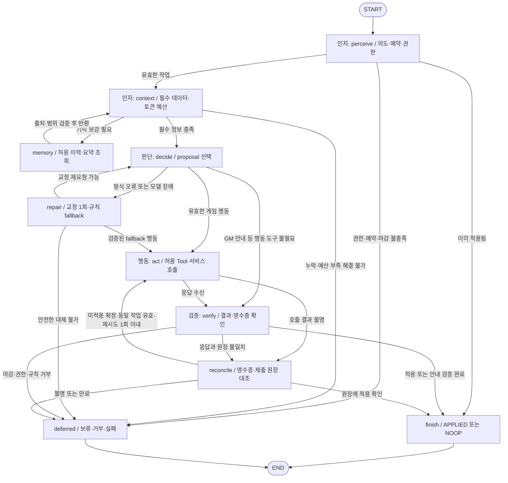
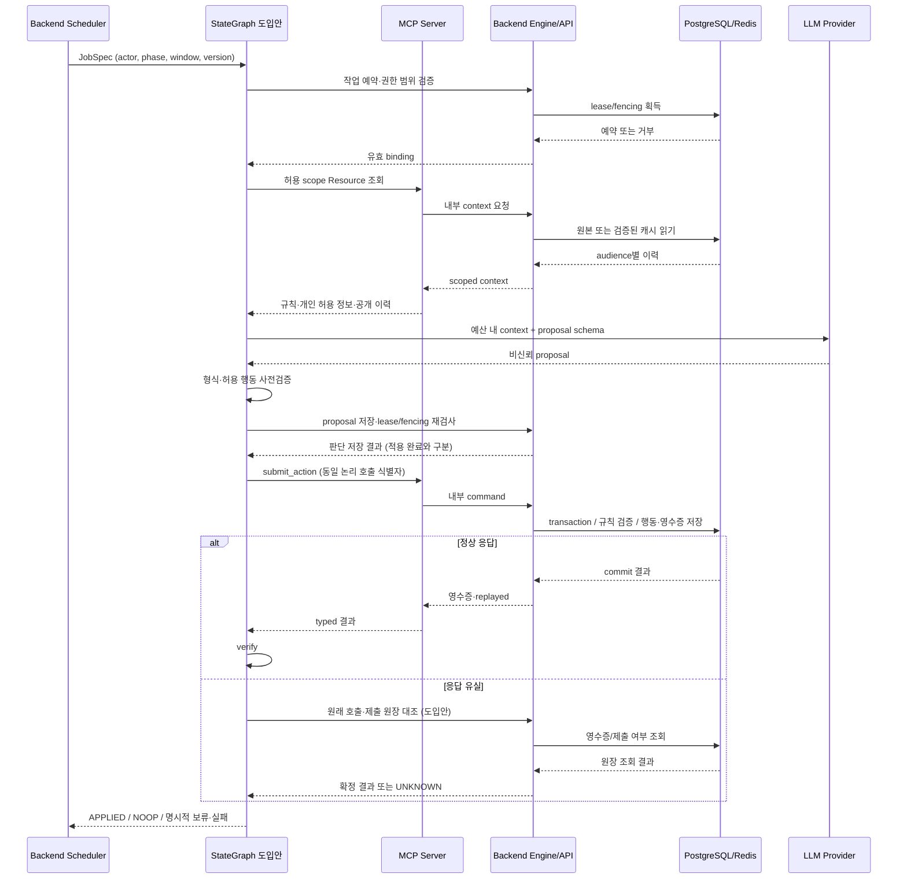

# AI 마피아 에이전트 아키텍처 설계서

작성일: 2026-09-07 · 범위: WU-B6 에이전트 실행 흐름의 파생 설계 문서

이 문서는 현재 코드의 실행 경계를 바탕으로 **인지 → 판단 → 행동 → 검증을 StateGraph로 표현하는 도입안**을 정의한다. 현재 구현은 `AgentOrchestrator`의 직접 비동기 호출이며, StateGraph 런타임·지속 요약 메모리·아래 공유 상태 객체는 아직 구현하지 않았다. 이 작업은 문서 작성만 수행하며 API, DB schema, 게임 동작을 변경하지 않는다. 후속 구현에서 계약이나 저장 구조가 바뀌면 관련 정본 갱신과 섹터 합의를 먼저 진행한다.

정본: [마스터플랜](개발상세플랜/01_core/AI_MAFIA_MASTER_PLAN.md), [API 명세](개발상세플랜/01_core/AI_MAFIA_API_SPEC.md), [MCP 서버 설계](개발상세플랜/03_mcp_agent/AI_MAFIA_MCP_SERVER_DESIGN.md), [DB 설계](개발상세플랜/02_backend_data/AI_MAFIA_DB_DESIGN.md). 이 문서의 상태 필드는 내부 그래프 설계이며 MCP Resource의 별도 wire schema가 아니다. Resource 상세 계약은 API 명세를 따른다.

## 1. 현재 구현과 설계 변경점

| 영역 | 현재 코드에서 확인한 동작 | StateGraph 도입안 |
| --- | --- | --- |
| 실행 | 작업 예약 → 권한 발급 → scope별 컨텍스트 → Provider → proposal 검증·저장 | 노드별 상태 갱신과 명시적 조건부 전이 |
| 판단 | 단일 Provider 구조화 JSON, 형식 오류 재요청 1회, 규칙 fallback | 같은 계약을 유지하고 예산·반복 감지·종료 사유를 상태에 명시 |
| 행동 적용 | orchestrator 완료 후 runtime이 행동 적용, 발언의 정상 경로는 MCP `submit_action` | 판단 완료와 실제 적용 완료를 분리한 `act`·`verify` |
| 도구 선택 | 모델 proposal을 서버 adapter가 허용 도구/서비스에 매핑 | 기본 경로 유지; native Function Calling은 선택적 후속 확장 |
| 기억 | PostgreSQL 공개 이력 원본 + Redis 전체 공개 이력 캐시 | 요청 내 작업 기억 + 출처가 있는 audience별 지속 요약 설계 |
| 응답 유실 | 발언 runtime은 원래 window/version에 묶인 PASS 시도; 저장 proposal 복구 경로 존재 | 별도 `reconcile`에서 영수증·제출 원장 확인 후에만 재시도 결정 |
| 상태 만료 | 고정 lease와 fencing, 늦은 결과 STALE | 동일 경계를 모든 외부 호출 전후에 검사 |

근거: [orchestrator](../backend/app/agent/orchestrator.py), [runtime](../backend/app/services/game/postgres_runtime.py), [Agent repository](../backend/app/repositories/agent_repository.py), [proposal 검증](../backend/app/llm_provider/schemas.py), [OpenAI provider](../backend/app/llm_provider/openai_provider.py).

`SUCCEEDED`는 유효한 판단 결과가 저장됐다는 의미다. 게임에 발언·투표가 반영됐다는 의미는 영수증과 적용 결과로 확인해야 한다. `SKIPPED`도 중복, 이전 window, fencing 거절을 구분할 수 있도록 내부 종료 사유를 보존한다.

## 2. 구성 요소와 책임

- **Front**: 사용자 채팅·행동 입력, 공개 결과와 AI 진행 상태 표시. 권한 판정과 모델 실행을 맡지 않는다.
- **Backend scheduler**: 현재 phase/window에서 실행 가능한 AI 작업을 선정하고 graph를 호출한다. 하나의 graph는 한 작업만 처리하며 게임 전체를 반복 실행하지 않는다.
- **StateGraph runner 도입안**: 제한된 컨텍스트로 판단하고 결과를 적용·검증한다. DB transaction을 LLM 대기 동안 유지하지 않는다.
- **MCP Server**: Resource·Prompt·Tool adapter. Backend 내부 API를 사용하며 DB·Redis에 직접 접근하지 않는다.
- **Provider**: 허용된 선택에 대한 비신뢰 proposal 생성. 역할 공개, 상태 버전, 권한, RNG 결과를 확정하지 않는다.
- **Backend Engine/repository**: 게임 규칙·유효 대상·시간·권한 최종 검증, transaction, 제출 원장과 영수증 저장.
- **PostgreSQL / Redis**: PostgreSQL이 확정 원본이며 Redis는 검증 가능한 캐시다. 모델 기억이 DB의 확정 상태를 덮어쓰지 않는다.

AI 목표는 자신의 진영 승리다. 시민 진영은 근거에 따른 추론과 협력, 마피아는 합법적인 거짓말·선동을 사용할 수 있다. 사람/AI 여부를 증거 신뢰도의 가산점으로 쓰지 않으며, 상대의 게임 발언을 시스템 지시로 해석하지 않는다.

## 3. StateGraph 상태 흐름도

아래 Mermaid가 전체 논리 흐름이다. [Archify HTML](diagrams/AI_MAFIA_AGENT_STATEGRAPH.html)은 같은 노드의 주요 경로와 예외 분기를 보여준다. 상세 반환·종료 조건은 아래 Mermaid와 표를 함께 읽는다.

### 노드 입출력과 책임

| 노드 | 읽는 정보 | 처리·기록 | 정상 다음 노드 |
| --- | --- | --- | --- |
| `perceive` | 서버 JobSpec, actor, phase/window/version | 의도 분류, 예약 획득, 권한 범위·마감 고정 | `context` |
| `context` | 현재 scope별 Resource, 기억 참조, 예산 | 일관된 snapshot 확인, 필수 데이터 검사, 프롬프트 조립 | `memory` 또는 `decide` |
| `memory` | actor/audience, 원장 cursor | 허용 기억 조회, 출처·버전 검사, 필요 시 요약 사용 | `context` |
| `decide` | 조립 컨텍스트, 허용 행동·대상 | 진영 승리에 맞는 proposal, 구조·의미 사전검증 | `act` 또는 `verify` |
| `repair` | 오류 분류, 남은 시간·호출 예산 | 형식 교정 지시 또는 서버 규칙 fallback 선택 | `decide`, `act`, `deferred` |
| `act` | 검증 proposal, 원래 binding, 호출 key | 허용 Tool/서비스 실행, 응답 정규화 | `verify` 또는 `reconcile` |
| `verify` | 응답, 영수증, 확정 상태 | 작업·actor·행동 대응 및 적용 결과 확인 | `finish`, `reconcile`, `deferred` |
| `reconcile` | 원래 호출 식별자와 원장 | 응답 유실의 적용 여부 확인 | `finish`, `act`, `deferred` |
| `finish` | 검증된 결과 | APPLIED/NOOP 결과 반환, 자원 정리 | END |
| `deferred` | 오류·마감·권한 사유 | 명시적 종료 사유 반환, 자원 정리 | END |

`memory` 조회는 요청당 한 번 수행한다. `context`에 돌아올 때 `memory_loaded=true`로 재진입을 막는다. 필수 데이터가 여전히 없으면 모델에 추측을 요구하지 않고 종료한다. 게임이 종료됐는지는 Backend가 판단하며 graph가 자체 추론해 phase를 변경하지 않는다.

## 4. 분기 조건과 예외 폴백

| 판단 지점 | 조건 | 처리 |
| --- | --- | --- |
| 의도 | 서버 `job_kind=SPEECH` | `SPEAK` 또는 `PASS`만 허용 |
| 의도 | `VOTE`, `NIGHT_ACTION` | 해당 행동과 현재 유효 대상만 허용 |
| 의도 | GM 작업 | 안내 전용 context·검증 경로 사용, player 행동 Tool 부여 금지 |
| 의도 | 알 수 없는 작업/actor 불일치 | `DENIED`; 자유 텍스트에서 도구 권한을 만들지 않음 |
| 필수 데이터 | phase/window/version, 자기 역할, 허용 행동·대상 등 작업별 필수 정보 누락 | 허용 scope 재조회 1회; 복원 실패 시 `MISSING_CONTEXT` |
| 컨텍스트 일관성 | 조회 도중 기준 version/window가 달라짐 | `STALE`; 오래된 proposal을 최신 버전에 자동 이식하지 않음 |
| 사용자 입력 | 게임 내 질문·주장·도발 | 발언 증거로 기록. 이미 답한 질문인지 확인하고 필요한 경우 채팅으로 질문 |
| 사용자 입력 | 조사/투표에 필요한 운영 정보가 실제로 없음 | 그래프를 사용자 응답 대기로 묶지 않고 종료. scheduler가 새 입력 후 새 작업 생성 |
| 도구 필요 | 공개 발언, PASS, 투표, 밤 행동 | 모두 서버 상태를 바꾸므로 도구 또는 승인된 command service 필수 |
| 도구 불필요 | GM 안내 생성·검증 | 안내 전용 검증·저장 경계 사용. 일반 player의 자연어 반환으로 행동을 대신하지 않음 |
| Provider 형식 오류 | 남은 예산 내 첫 실패 | 교정 1회. 원문 오류/비밀값 대신 허용 필드와 검증 오류 종류 전달 |
| Provider 장애/교정 실패 | 현재 binding과 안전한 fallback 존재 | 발언은 규칙 PASS; 투표·밤은 해당 역할의 유효 대상에 한정한 서버 fallback |
| fallback 불가능 | 유효 대상 없음/권한 불명/만료 | `FAILED` 또는 `STALE`; 임의 대상·조사 결과 생성 금지 |
| 호출 거부 | 권한·역할·phase·마감 위반 | 재시도 없이 `DENIED`/`STALE` |
| 발언 제한 | rolling 60초 동안 이미 7회 발언 | `RATE_LIMITED`로 종료; 다음 가능 시각은 scheduler가 판단 |
| 응답 유실 | 서버 commit 여부 불명 | `reconcile`; 적용 여부를 모른 채 다른 행동으로 대체하지 않음 |
| 원장 장애 | commit 여부를 확인할 수 없음 | `UNKNOWN`; 새 key로 재호출하지 않음 |

재조회는 **같은 binding의 누락 보충**만 허용한다. 조회 결과 새 window임이 확인되면 현재 graph를 종료한다. 기존 투표의 버전 예외가 필요한 경로는 기존 Backend 계약이 판단하며 graph가 예외 범위를 확대하지 않는다.

현재 자유 토론은 105초이며 참여자별 rolling 60초에 SPEAK 최대 7회다. AI의 발언 slot이 바뀌어도 토론 전체 deadline은 유지한다. 사람의 발언이 AI 추론 도중 상태를 바꾸면 낡은 결과는 버리고 scheduler가 재선정한다. PASS는 한 작업을 끝내며 전체 토론을 조기 종료하지 않는다.

## 5. 단기·장기 기억과 컨텍스트 관리

### 5.1 기억 계층

| 계층 | 현재/제안 | 저장 내용·수명 | 접근 경계 |
| --- | --- | --- | --- |
| 요청 내 작업 기억 | 현재 context + 제안 graph state | 현재 작업의 snapshot, 후보, 오류, 호출 결과. 작업 종료 후 폐기 | 해당 actor 실행만 |
| Redis 공개 이력 캐시 | 현재 | 전체 공개 이력, 기본 TTL 7일. 버전·cursor·checksum 검증 | 게임별 공개 이력만 |
| PostgreSQL 원장 | 현재 | 공개 사건·발언·확정 행동 및 권한에 따른 개인 기록 | Backend projection을 통해 조회 |
| 구조화 요약 메모리 | 제안 | 원본 cursor와 출처를 가진 장기 게임 기억 | game/actor/audience별 분리 |
| 게임 간 성향 학습 | 범위 밖 | 자동 저장·재사용하지 않음 | 후속 별도 설계 필요 |

Redis는 장기 추론 기억이나 확정 원장이 아니다. 현재 캐시는 낮은 state_version으로 기존 이력을 덮어쓰지 않으며 검증 실패·miss 시 PostgreSQL에서 공개 이력을 복구한다. 요약 저장·검색 API와 checkpoint 저장소는 현재 존재한다고 가정하지 않는다.

근거: [이력 캐시](../backend/app/infrastructure/redis/cache.py), [게임 읽기](../backend/app/services/game/game_read_service.py), [MCP Resource](../mcp_server/mafia_game/api/resources/__init__.py).

### 5.2 요약 내용과 갱신 전략 — 도입안

요약의 식별 범위는 `(game_id, actor_id, audience, through_event_cursor, summary_version)`로 둔다. 자기 개인 기억과 공개 공유 요약은 서로 다른 audience다. MCP는 Backend가 허용한 요약만 전달하며 직접 저장하지 않는다.

요약은 다음 항목을 분리한다.

- **확정 사실**: 처형 시 공개된 역할, 공개 투표 결과, 밤 사망자, 현재 생존자. 원본 event ID를 참조한다.
- **주장**: 발언자, 발언 시점, 자칭 역할, 보호/조사 주장, 대상. 주장과 엔진 확정 결과를 혼합하지 않는다.
- **질문과 답변**: 누가 누구에게 무엇을 물었고 어느 발언에서 답했는지 연결한다.
- **판단 이력**: 자신의 지지·의심 대상, 근거 event ID, 이후 반증 여부. 다른 플레이어의 숨은 추론은 저장하지 않는다.
- **미해결 사항**: 실제 모순과 정보 부족을 구분한다. 여러 AI가 같은 주장을 반복한 것을 독립적인 증거로 세지 않는다.

예: “플레이어 1: 의사이며 자신을 보호하겠다”는 **자기 보호 계획을 이미 답한 주장**이다. 무사망 밤은 의사 역할의 확정 증거가 아니지만, 보호 계획을 말하지 않았다고 다시 기록해서도 안 된다. 탐정 자칭 AI의 조사 발언 역시 엔진이 공개 확인하지 않았다면 주장이다. 밤에 죽었다는 사실만으로 역할까지 확정하지 않는다.

증분 요약은 마지막 cursor 이후의 사건을 원본과 함께 처리한다. 이미 요약된 문장만 계속 재요약하지 않고, 중요한 역할 공개·주장·답변은 원문 참조로 재검증한다. 요약 작성 실패 시 이전 요약+최신 원본을 사용하고 필수 정보가 들어가지 않으면 작업을 보류한다. 요약 호출도 동일한 비용 예산에 포함하며, 긴 요약 작업은 15초 실행 lease 안에서 무조건 수행하는 대신 Backend의 별도 후속 작업으로 분리하는 설계다.

### 5.3 컨텍스트 윈도우 예산 — 도입안

`입력 예산 = 모델별 확인된 context 한도 − 출력 예약량 − 안전 여유량`으로 계산한다. 모델 이름으로 context 길이를 추정하지 않는다. 출력 예약량은 추론 토큰을 포함하는 해당 Provider의 계약을 따라 설정한다. API 키·권한 토큰은 프롬프트에 넣지 않는다.

도입 기본 정책은 예상 입력이 예산의 80%에 도달하면 요약을 선택하고 60% 이하를 목표로 압축하는 것이다. 이는 현재 구현값이 아니며 실제 tokenizer와 모델별 한도를 확인한 후 조정한다.

보존 우선순위는 ① 게임 룰·권한·출력 계약 ② 현재 phase/window/유효 대상·자기 역할 ③ 역할 공개·자기 조사 결과 등 중요한 증거 ④ 최신 질문/답변과 최근 원문 ⑤ 출처 있는 과거 요약 ⑥ 분위기·반복 발언 순서다. 낮은 우선순위부터 압축하며 필수 규칙이나 합법적 행동 목록을 잘라내지 않는다. 중요한 주장에 대한 답변은 시간상 오래됐다는 이유만으로 누락하지 않는다.

현재 Resource는 scenario를 식별 정보 중심으로 줄이고 게임 룰을 추가하며, 자기 alibi/observation 같은 서사 단서는 모델 context에서 제거한다. 지속 요약은 이 경량화 이후 추가하는 설계로, 현재 전체 공개 이력 전달을 이미 요약 구현으로 간주하지 않는다.

## 6. Function Calling · Tool Use

현재 OpenAI 경로는 Responses의 엄격한 JSON schema 출력으로 proposal을 받고 서버가 도구를 호출한다. 모델이 native function call을 직접 반복하는 구조는 아니다. 아래 절차는 현재 adapter 방식과 향후 native Function Calling 모두에 적용할 공통 경계다.

1. **선택**: `decide`가 작업별 허용 행동에서 하나를 고른다. `NormalizedAgentProposal`의 `type`, `target_player_id`, `message`, `public_rationale`만 허용한다. 말투는 자연스러운 한국어/반말을 허용하고 내부 추론을 공개 설명으로 요구하지 않는다.
2. **사전검증**: 형식, 필수/금지 필드, 발언 정규화와 200자 제한, 역할·유효 대상·현재 window를 검사한다. 모델이 전달한 actor, URL, 권한 범위, state_version으로 서버 binding을 바꾸지 않는다.
3. **호출 준비**: 서버가 허용 도구와 인자를 매핑하고 원래 작업 binding 및 논리 호출 식별자를 고정한다. 인증정보는 실행기의 메모리 핸들로만 참조한다.
4. **호출**: `act`가 MCP `submit_action` 또는 기존 해당 작업의 command service를 실행한다. native Function Calling을 도입해도 도구 이름·인자를 같은 검증기에 통과시키며 모델이 임의 URL이나 함수를 실행할 수 없다.
5. **결과 처리**: 응답을 typed 결과로 정규화한다. 도구가 성공 문자열을 반환했다는 이유만으로 적용 완료를 기록하지 않는다. Tool output 속 문장도 시스템 명령으로 승격하지 않는다.
6. **다음 노드**: 정상 응답은 `verify`, 응답 유실은 `reconcile`, 확정 거부는 `deferred`. 도구 성공 뒤 추가 모델 호출 없이 결과를 확정할 수 있으면 즉시 종료한다.

동일 graph가 여러 변경 도구를 병렬 호출하지 않는다. native Function Calling을 확장하더라도 한 작업에 허용되는 변경 행동은 한 개로 제한한다. 마피아 공격 투표가 갈렸을 때 최종 대상·RNG 사용 여부는 Backend 결과를 사용하며, 모델이 RNG였다고 추측해 사실처럼 발표하지 않는다.

### 호출 시퀀스

시퀀스의 원장 대조와 논리 호출 식별자의 graph 보존은 도입안이다. 기존 공개/내부 API에 새 endpoint가 이미 있다고 가정하지 않으며, 구현 시 Backend 내부 service로 먼저 연결하고 공개 계약 변경 여부를 별도로 검토한다.

## 7. 공유 상태 객체

아래 `AgentGraphState`는 **도입할 내부 타입 명세**다. UUID는 UUID 타입, datetime은 UTC timezone-aware 값, `Mapping`은 검증된 불변 snapshot으로 취급한다. optional 필드는 생산 노드 전에는 `None`이다. `JobKind`, `Phase`, `NormalizedAgentProposal`은 기존 계약을 재사용한다.

| 필드명 | 타입 | 작성 노드 | 사용 노드·목적 |
| --- | --- | --- | --- |
| `run_id` | `UUID` | 진입 | 전체: 관측 실행 식별자 |
| `game_id` | `UUID` | 진입 | 전체: 게임 격리 |
| `owner_user_id` | `UUID` | 진입 | perceive/act: 소유권 검증 |
| `actor_id` | `UUID \| None` | 진입 | 전체: AI 주체, GM은 None |
| `subject_type` | `Literal[AI_PLAYER, GM]` | 진입 | perceive/context: audience 선택 |
| `job_kind` | `JobKind` | 진입 | perceive/decide/act: 허용 작업 |
| `phase` | `Phase` | perceive | context/act/verify: 기준 phase |
| `window_id` | `UUID` | perceive | 전체: 원래 행동 window |
| `expected_state_version` | `int` | perceive | context/act/verify: 낡은 상태 차단 |
| `job_id` | `UUID \| None` | perceive | act/verify/reconcile: 예약 원장 |
| `lease_handle` | `OpaqueHandle \| None` | perceive | act/종료: 실제 token은 실행기 메모리만 |
| `lease_expires_at` | `datetime \| None` | perceive | 모든 외부 호출: 만료 검사 |
| `deadline_at` | `datetime` | perceive | 전체: 작업 최종 마감 |
| `capability_handle` | `OpaqueHandle \| None` | perceive | context/act/종료: 원문 비밀값 저장 금지 |
| `allowed_actions` | `frozenset[str]` | context | decide/act: 행동 allowlist |
| `valid_targets` | `frozenset[UUID]` | context | decide/repair/act: 대상 검증 |
| `context_snapshot` | `Mapping[str, ScopedContext]` | context | decide: scope별 불변 정보 |
| `context_cursor` | `str \| None` | context | memory/verify: 원장 cursor, API 타입에 맞춰 adapter 변환 |
| `memory_loaded` | `bool` | memory | context: 반복 조회 방지 |
| `memory_refs` | `tuple[MemoryRef, ...]` | memory | context: audience/cursor/출처 참조 |
| `summary` | `SummaryRecord \| None` | memory | context: 사실·주장·답변 구분 |
| `token_budget` | `TokenBudget` | context | decide/repair: 입력·출력·여유량·사용량 |
| `intent` | `Literal[SPEECH, VOTE, NIGHT_ACTION, NARRATION]` | perceive | decide: 자연어와 분리한 실행 의도 |
| `proposal` | `NormalizedAgentProposal \| None` | decide/repair | act: 비신뢰 결과 검증 후 기록 |
| `narration` | `str \| None` | decide | verify: GM 안내 전용 |
| `tool_call` | `ToolCallRecord \| None` | act | reconcile: 도구명·정규화 인자·논리 key·요청 hash |
| `tool_result` | `ToolResult \| None` | act | verify: 검증 전 응답 |
| `receipt_ref` | `ReceiptRef \| None` | verify/reconcile | finish: Backend 영수증 참조 |
| `result_state_version` | `int \| None` | verify/reconcile | finish: 확정 적용 버전 |
| `repair_count` | `int` | repair | decide: 최대 1회 |
| `context_retry_count` | `int` | context | context: 최대 1회 |
| `transport_retry_count` | `int` | reconcile | act: 최대 1회 |
| `node_visits` | `int` | 실행기 | 전체: 최대 24회 안전 상한 |
| `seen_fingerprints` | `set[str]` | 실행기 | decide/repair: 의미 없는 반복 탐지 |
| `decision_source` | `Literal[MODEL, FALLBACK, DUMMY] \| None` | decide/repair | finish: 판단 출처 |
| `error` | `GraphError \| None` | 실패 노드 | repair/deferred: code·재시도 가능 여부 |
| `outcome` | `GraphOutcome \| None` | finish/deferred | 호출자: 종료 사유 |

보조 타입 정의:

- `MemoryRef`: game/actor/audience, 원본 event 참조, through cursor, summary version.
- `SummaryRecord`: 확정 사실, 주장, 질문·답변 연결, 반증된 판단, 미해결 항목과 각각의 출처.
- `TokenBudget`: context 한도, 출력 예약량, 여유량, 입력 추정량, 누적 사용량, 남은 작업/게임 예산.
- `ToolCallRecord`: 서버 allowlist 도구명, 검증 인자, 동일 호출의 idempotency key, canonical request hash. 인증정보 제외.
- `ToolResult`: 성공/거부/불명 분류, Backend 응답 참조, replay 여부. 예외 원문을 공개 로그에 복사하지 않음.
- `GraphError`: 내부 오류 code, 발생 노드, retryable, 공개 가능한 짧은 사유.
- `GraphOutcome`: `APPLIED | NOOP | STALE | DENIED | RATE_LIMITED | MISSING_CONTEXT | BUDGET_EXHAUSTED | FAILED | UNKNOWN`.

상태 갱신은 노드가 자신 소유 필드의 부분 갱신을 반환하는 방식이다. append가 필요한 관측 기록은 `(run_id, node, attempt)`로 중복 제거하고, 다른 노드가 proposal을 무조건 이어 붙이는 reducer는 쓰지 않는다. 한 actor의 graph 안에서는 변경 노드를 직렬화한다.

checkpoint를 도입하면 원문 context·개인 역할·모델 내부 추론·raw capability를 통째로 저장하지 않는다. game/job/window/version, cursor, 카운터, 보호된 결과 참조 등 허용 필드만 저장하고 재개 시 Backend에서 권한을 다시 검증한다. 기존 DB의 검증된 proposal 복구 규칙을 활용하며, checkpoint만으로 만료된 lease를 되살리지 않는다.

## 8. 중복 제거와 재실행 기준

| 계층 | 기준 | 처리 |
| --- | --- | --- |
| 작업 예약 — 현재 | `(game_id, window_id, player_id, job_kind)` | 동일 작업을 잠금 아래 확인. 살아 있는 예약은 중복 실행하지 않음 |
| 작업 소유권 — 현재 | `job_id + lease_token + lease_expires_at` 및 원래 binding | 만료·교체된 worker의 늦은 완료를 fencing으로 거부 |
| 요청 영수증 — 현재 | `(principal_type, principal_id, idempotency_key)` | 동일 key 재요청은 저장 결과 replay; route/request fingerprint 충돌은 기존 계약대로 거부 |
| 실제 행동 — 현재 | 원래 window/version/actor의 제출 원장 | proposal 성공 여부와 별도로 적용을 확인 |
| Tool 재호출 — 도입안 | 최초 호출의 key + canonical request hash | 응답 유실 후에도 key·인자 유지. 다른 key로 동일 행동 반복 금지 |
| 컨텍스트 — 도입안 | game/actor/audience/version/window/cursor | 같으면 불필요한 재조회·재요약 생략 |
| 추론 반복 — 도입안 | 위 context 식별자 + node + 정규화 proposal hash + 오류 code | 새로운 증거·교정 변화 없이 같은 상태면 fallback 또는 종료 |

근거: [예약 repository](../backend/app/repositories/agent_repository.py), [영수증 repository](../backend/app/repositories/receipt_repository.py).

현재 예약은 같은 버전의 만료된 작업에서 미적용 저장 proposal을 복구할 수 있다. 투표는 기존 코드가 허용한 조건에서 만료된 이전 버전 결과를 폐기하고 새 판단을 예약한다. 성공한 GM 안내는 player 제출 원장으로 복구하지 않는다. 이 차이를 하나의 텍스트 hash로 대체해서는 안 된다.

발언 본문이 같다는 이유만으로 게임 전체에서 제거하지 않는다. 새로운 window에서 유효하게 발언한 동일 문장은 별개 행동일 수 있다. 반대로 화면 polling/SSE가 같은 확정 event ID를 재전송한 것은 화면에서 한 번만 표시한다. 발언 횟수 제한은 텍스트 중복 여부와 독립적으로 서버에서 적용한다.

네트워크 전달이 정확히 한 번 일어난다고 가정하지 않는다. 재전송 가능성을 인정하고 transaction·영수증·제출 원장을 통해 효과의 중복을 차단한다. 원장 확인이 불가능하면 성공이나 실패를 단정하지 않고 `UNKNOWN`으로 종료한다.

## 9. 종료·재시도·자원 정리

**정상 종료**: 실제 행동 적용 및 대응 영수증 확인 시 `APPLIED`; 이미 적용된 작업의 재진입 또는 검증된 무변경 안내 경로는 `NOOP`. PASS도 command 적용이므로 영수증이 확인된 `APPLIED`가 될 수 있다.

**즉시 종료**: 게임 종료, actor 권한 상실, 원래 window 폐쇄, lease 만료, 필수 정보 복원 실패, 호출/토큰 예산 소진, 복구할 수 없는 거부, 반복 상한 도달. 이미 적용됐는지 불명확하면 `UNKNOWN`을 반환한다.

도입 상한은 모델 판단 총 2회(최초+교정 1회), context 재조회 1회, 미적용이 확인된 같은 호출의 전송 재시도 1회, 전체 node 방문 24회다. 상한에 도달하기 전이라도 deadline이 우선한다. 게임 단위 LLM 예산도 별도로 검사한다.

현재 작업 예약 lease는 최대 15초다. graph의 deadline은 이 lease와 현재 window/game deadline 중 가장 이른 시각으로 제한한다. 105초 토론 전체를 한 모델 호출의 허용 시간으로 사용하지 않는다. 외부 호출에 남은 시간을 전달하고, 반환 뒤에도 fencing을 재확인한다. 최초 판단이 시간 예산을 소진하면 교정 호출을 시작하지 않는다.

종료의 `finally`에서는 MCP 세션/클라이언트를 닫고 해당 단계의 capability를 폐기한다. 미적용 예약 반환은 현재 token 소유권과 원장 상태가 확인되는 경우에만 한다. 원장 장애 시에는 lease 만료를 통한 회복을 허용하고, 무한 재예약 루프로 같은 실행을 지속하지 않는다. scheduler는 나중에 **현재 상태로 새 작업**을 선정한다.

## 10. 후속 구현 검증 시나리오

| 시나리오 | 기대 결과 |
| --- | --- |
| 사람이 자기 보호 계획을 이미 발언 | 요약에 답변 연결; AI가 계획 미제출을 사실처럼 반복하지 않음 |
| 사람과 AI가 같은 탐정 자칭 | 같은 근거 기준 적용; AI라는 이유로 확정 역할 처리하지 않음 |
| 여러 AI가 같은 의혹 반복 | 독립 증거 수 증가 없음 |
| 모델이 없는 도구·죽은 대상 선택 | 호출 전 거부 또는 제한된 교정; Backend 재검증도 실패 |
| 사람 발언으로 추론 중 window 변경 | 낡은 결과 STALE, 새 window에 자동 적용하지 않음 |
| 모델 형식 오류가 반복 | 교정 1회 이후 유효 fallback 또는 종료 |
| Tool commit 후 응답 유실 | 원장 대조로 기존 결과 확인, 추가 발언/투표 없음 |
| DB 장애로 적용 여부 불명 | UNKNOWN, 새 key 재제출 없음 |
| 동일 작업 worker 중복 | 하나만 예약/적용, 늦은 worker fencing 거부 |
| 60초 내 8번째 발언 / 토론 105초 경과 | 서버 거부, 모델 출력 존재만으로 화면에 확정 발언 표시하지 않음 |
| 긴 게임·요약 실패 | 필수 역할/룰/답변 유지, 예산 초과 입력 전송 방지 |
| 다른 actor 개인 기억 요청 | audience 검증 거부; 로그·checkpoint에도 개인 정보 유출 없음 |
| 마피아 공격 투표 동률 | 서버가 결정한 RNG 결과와 공개 가능한 설명만 사용 |

후속 테스트는 fake Provider/MCP·가상 시계·합성 이벤트로 진행한다. 실제 유료 모델 호출은 이 문서 작성 검증에 필요하지 않다.

## 11. 산출물·검증 기록

- [인터랙티브 StateGraph HTML](diagrams/AI_MAFIA_AGENT_STATEGRAPH.html): 독립 HTML로 브라우저에서 열 수 있다. 테마 전환, 확대·이동, 검색과 관계 추적을 지원한다.
- [Archify 사양](diagrams/AI_MAFIA_AGENT_STATEGRAPH.workflow.json): `workflow`, `schema_version: 2`, `showcase`.
- [검증 원본](diagrams/AI_MAFIA_AGENT_STATEGRAPH.validation.json): 9/9 검사 통과, composition 오류 0개·경고 0개.
- [전달 영수증](diagrams/AI_MAFIA_AGENT_STATEGRAPH.delivery.json): 사양과 HTML의 SHA-256·byte 수를 기록한다.
- specification SHA-256: `c37a1380da0a06114cc9cad3a3d13ccaf7bd73c1a879703f14017d8d707fcc51`.
- artifact SHA-256: `2849f152df5c22706673ff9b6a387546d18bb9f18b3b8ae6ea61b3230203b4c5`.
- 이전 경로 충돌은 `repair` 노드를 행동 호출 아래 열로 옮기고 자동 경로를 사용해 해결했다. 주요 경로와 예외 분기의 의미는 유지했다.
- 본문은 한국어이며 Archify 고정 뷰어 메뉴와 HTML 언어 메타데이터는 지원 범위에 따라 영어다.
- [화면 검증 기록](diagrams/AI_MAFIA_AGENT_STATEGRAPH.visual-check.json)과 [테마별 캡처](diagrams/AI_MAFIA_AGENT_STATEGRAPH.visual-check.html): 1440×900, 1600×1000, 1920×1080, 2048×1320에서 화면 넘침 없음. 밝은·어두운 테마 캡처를 직접 검토했다 (`visual_review: passed`). 자동 영수증의 `visualReview: pending`은 자동 검사가 사람의 시각 검토를 대체하지 않는다는 도구 표기다.
- 앱 실행 로직을 변경하지 않아 앱 회귀 테스트·서버 재시작·유료 API 호출은 생략한다.
