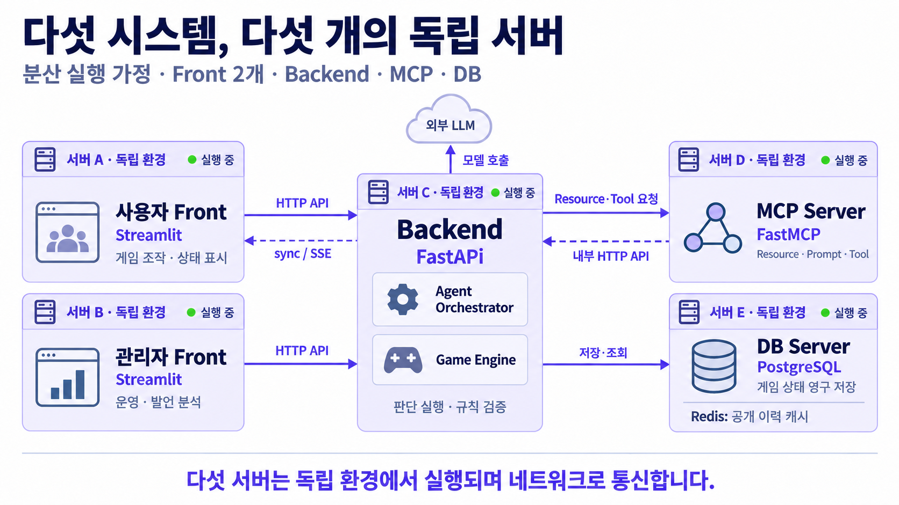
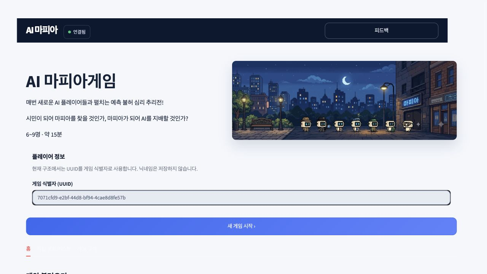
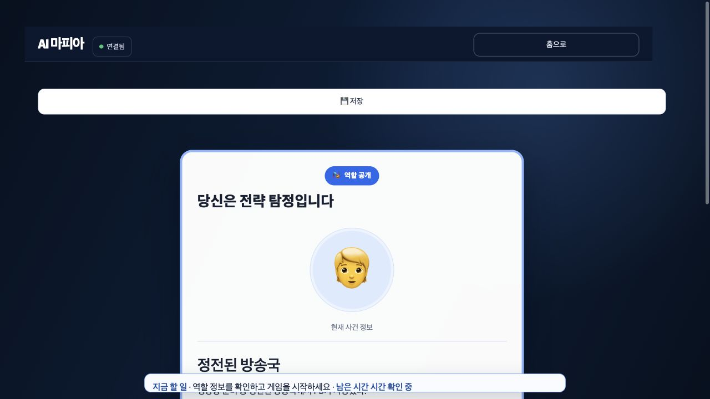
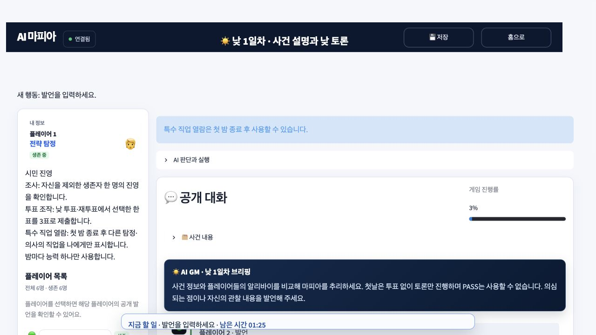
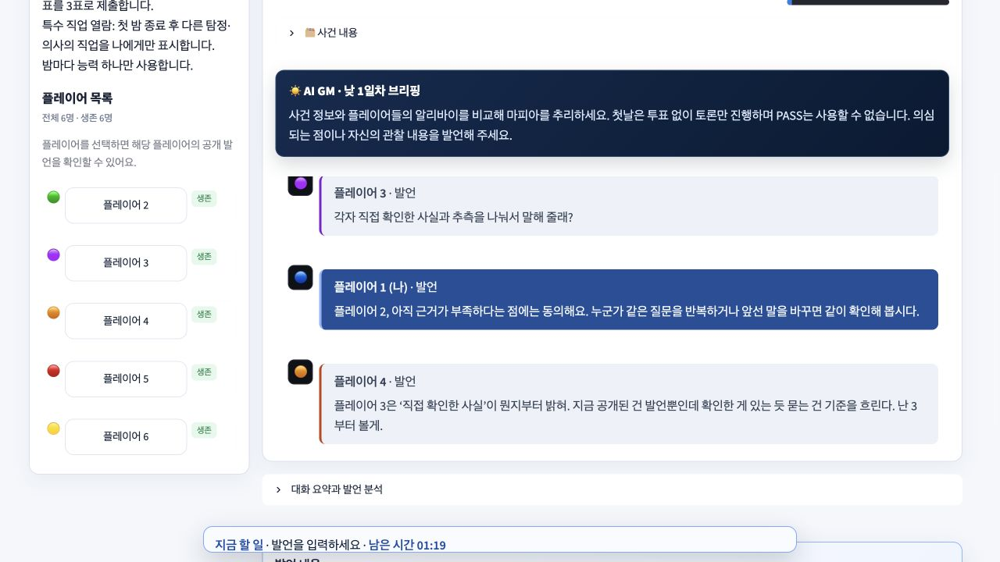
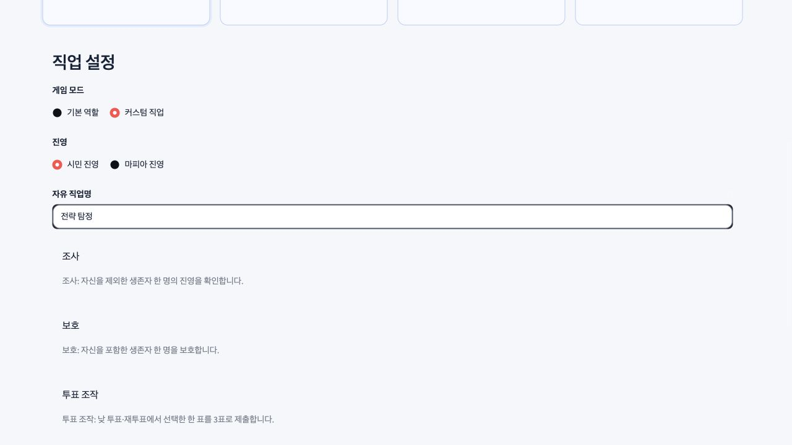
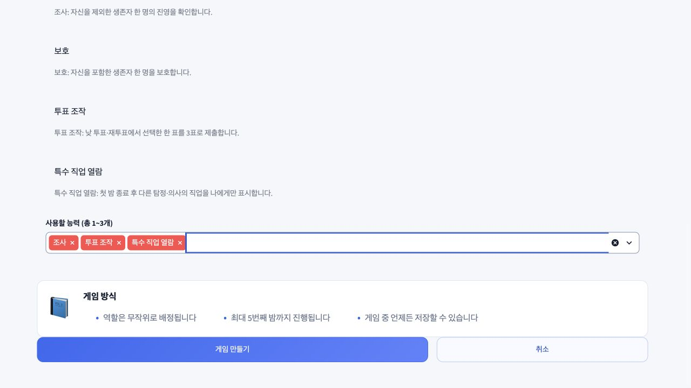
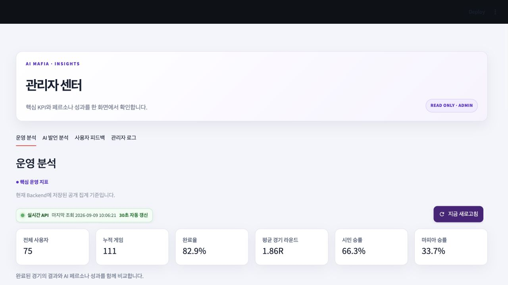
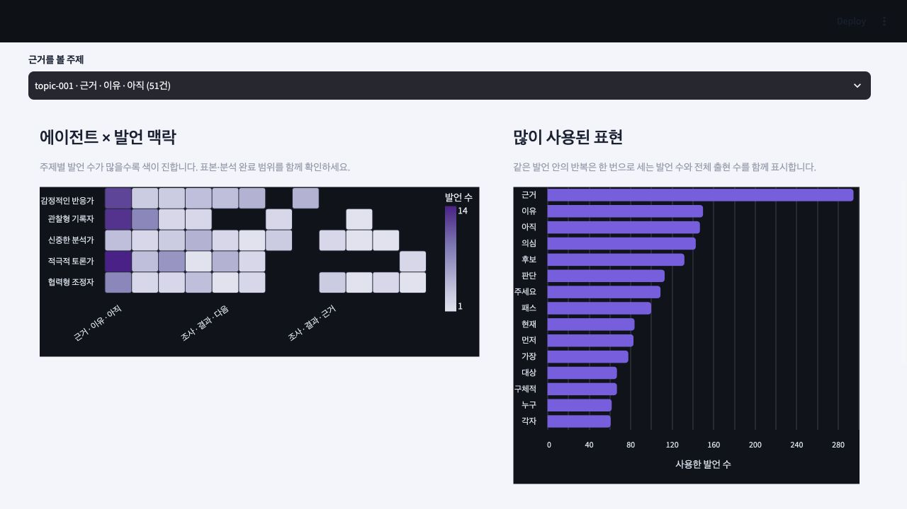

# AI MAFIA — 15분 발표 구성안

- 상태: **승인된 16장 제작·발표자 노트·PPTX/PDF 조립·최종 검증 완료**
- 완성 파일: [PPTX](ai_mafia_15min.pptx), [PDF](ai_mafia_15min.pdf), [발표 대본](speech.md), [검토 기록](qa_report.md)
- 구성 승인: 2026-09-09, 16장·900초 구성과 필수 원본 이미지 배치
- 스타일 승인: 2026-09-09, 사용자 선택 1번 ‘밝은 테크 스타일’
- 기준: 2026-09-09 작업 디렉터리의 현재 코드·README와 날짜별 개발 기록
- 대상: AI Agent·MCP 수업의 강사와 수강생
- 분량: **16장 / 900초 = 15분**. 질의응답은 별도이며 16장에 추가 Q&A 페이지를 넣지 않는다.
- 형식: `codex-ppt` 기반 16:9 이미지형 PowerPoint, 한국어 발표자 노트. 4·8·9·11장은 사용자 승인에 따라 실제 화면을 원본 PowerPoint 이미지로 직접 삽입한다.
- 핵심 메시지: **혼자 시작하는 마피아 게임에서, AI의 판단과 서버의 규칙을 분리하고 능력 조합의 확장 가능성을 구현했다.**
- 이미지 생성 백엔드 승인: 2026-09-09, 사용자가 ‘내장 ImageGen으로 샘플 생성’을 선택했다. 현재 세션에서 호출 가능한 `image_gen__imagegen`을 사용하며 별도 API/CLI 대체 경로는 필요하지 않다.
- 대표 샘플: Slide 5 ‘서로 다른 환경에서 실행되는 다섯 시스템’. 다섯 독립 서버의 ‘독립 환경 · 실행 중’ 상태와 네트워크 연결을 표시하고 ‘분산 실행 가정’을 명시했다. 사용자가 ‘이 수정본으로 전체 PPTX 완성’을 승인했으며, 이 샘플의 스타일과 생성 방식을 나머지 15장에 적용했다.
- 원본 화면 삽입 승인: ImageGen의 화면 재구성 문제를 확인한 뒤 사용자가 ‘원본 화면을 직접 삽입’을 선택했다. 여덟 JPEG 원본의 바이트를 유지하고 PowerPoint의 자르기만 사용한다.

## 확정 시각 스타일

- 방향: 밝은 테크 스타일. 실제 서비스 화면의 흰색·연보라·남색과 연결되는 차분한 기술 발표 분위기.
- 화면: 16:9, 흰색 `#FFFFFF` 또는 아주 옅은 보라 `#F7F5FC` 바탕. 남색 `#17213C` 제목, 보라 `#7357D8` 강조, 연보라 `#EEE8FB` 영역, 회색 `#536079` 본문.
- 글자: 선명한 한국어 고딕 계열. 큰 굵은 제목, 짧은 핵심 문장, 읽기 쉬운 도식 라벨을 사용한다. 세부 구현과 근거는 발표자 노트에 배치한다.
- 구성: 여백을 충분히 두고 한 장에 한 메시지를 중심으로 배치한다. 표지·대응 표·아키텍처·순환 흐름·실제 화면·문제 해결 사례에 맞춰 레이아웃을 바꾼다.
- 이미지: 실제 게임·관리자 화면과 프로젝트 대표 아트를 사용한다. 필수 원본 이미지의 글자·수치·색상·범례를 보존하고 가짜 UI를 만들지 않는다.
- 도식·장식: 둥근 영역, 얇고 명확한 연결선, 단순한 선 아이콘을 사용한다. 서버별 실행 환경의 경계를 시각적으로 분리한다. 그림자와 장식은 최소화한다.
- 밀도: 본문은 핵심 세 덩어리 정도로 제한하고 화면·도식을 크게 배치한다. 장마다 같은 카드 구성을 반복하지 않는다.
- 표기: 현재 구현과 후속 확장은 짧은 라벨로 구분한다. 임의 로고·워터마크·슬라이드 번호는 추가하지 않는다.

## 대표 샘플

Slide 5의 다섯 독립 서버가 각각 실행 중인 가정을 반영한 승인 샘플이다. 실제 화면이 필요한 다른 슬라이드는 승인된 원본 이미지를 별도로 삽입한다. 확인한 글자 크기·색상·도식 밀도와 실행 환경 표현을 전체 제작에 적용한다.

- 생성 프롬프트: [sample_prompt.draft.md](sample_prompt.draft.md)
- 생성·검증 기록: [sources.md](sources.md)

## 발표 시간표

| 장 | 제목 | 시간 | 누적 |
| --- | --- | ---: | ---: |
| 1 | AI MAFIA: 혼자 시작하는 심리 추리전 | 0:25 | 0:25 |
| 2 | 마피아를 AI Agent 프로젝트로 고른 이유 | 0:40 | 1:05 |
| 3 | 기존 플레이 경험의 제약과 우리 팀의 해결 | 1:00 | 2:05 |
| 4 | 실제 플레이: 역할 확인부터 한 판의 시작까지 | 0:35 | 2:40 |
| 5 | 서로 다른 환경에서 실행되는 다섯 시스템 | 1:20 | 4:00 |
| 6 | AI Agent가 활용하는 Resource·Prompt·Tool | 0:55 | 4:55 |
| 7 | 한 AI의 판단이 게임에 반영되는 과정 | 1:10 | 6:05 |
| 8 | 실제 게임 화면: 같은 대화, 서로 다른 반응 | 1:00 | 7:05 |
| 9 | 커스텀게임: 능력을 조합하는 사용자 | 1:05 | 8:10 |
| 10 | Workflow와 Agent의 확장 방식 | 1:05 | 9:15 |
| 11 | 관리자 화면과 벡터 분석·RAG 확장 | 0:55 | 10:10 |
| 12 | 문제 해결 ① 판단했는데도 자동 투표가 된 이유 | 1:25 | 11:35 |
| 13 | 문제 해결 ② 실시간 갱신과 채팅 입력의 충돌 | 1:05 | 12:40 |
| 14 | 문제 해결 ③ 반복 질문과 획일적인 대화 | 0:50 | 13:30 |
| 15 | 프로젝트 의의와 상품화 가능성 | 1:00 | 14:30 |
| 16 | 우리가 만든 것과 다음 단계 | 0:30 | 15:00 |

## Slide 1: AI MAFIA: 혼자 시작하는 심리 추리전

- 시간: 25초
- 역할: 표지. 서비스와 발표의 기술적 주제를 바로 소개한다.
- 핵심 내용:
  - 인간 1명과 AI 5~8명이 참여하는 6~9인 마피아 게임
  - 공개 대화를 공유하면서 역할·성격·개인 정보에 따라 개별 판단
  - Team 4 프로젝트: AI Agent, MCP, 분산 실행 구조
- 시각 아이디어: 프로젝트 캐릭터 아트를 크게 사용하고 제목과 짧은 소개만 배치한다.
- 필수 원본 이미지:
  - 실제 프로젝트의 대표 아트; strict input asset; 캐릭터를 다른 게임의 캐릭터로 교체하지 않는다.

    
- 근거: 루트 README의 소개·AI 플레이어 설명.

## Slide 2: 마피아를 AI Agent 프로젝트로 고른 이유

- 시간: 40초
- 역할: 주제 선정 이유와 학습 목표 설명.
- 핵심 내용:
  - 대화·추리·블러핑을 통해 AI의 상황별 의사결정이 사용자에게 바로 드러난다.
  - 역할별로 목표와 볼 수 있는 정보가 달라 Agent의 정보 경계를 실험하기 좋다.
  - 낮·밤·투표·승패라는 명확한 규칙으로 AI가 제안한 행동을 검증할 수 있다.
  - 함께할 사람을 기다리지 않는 플레이 경험을 만들고자 했다.
- 시각 아이디어: 대화 / 비공개 정보 / 규칙 검증의 세 요소와 가운데 게임 장면.
- 필수 원본 이미지: 없음.
- 근거: README, Master Plan, 현재 `AgentOrchestrator.run`과 게임 엔진 경계.

## Slide 3: 기존 플레이 경험의 제약과 우리 팀의 해결

- 시간: 60초
- 역할: 기존 제품의 강점을 인정하고, 우리가 선택한 문제와 기능을 대응시킨다.
- 핵심 내용:
  - 기존 마피아·소셜 디덕션 게임은 사람 사이의 추리·배신·역할 플레이에 강점이 있다.
  - 함께할 사람의 참여에 의존 → 인간 1명과 AI 플레이어로 한 판을 시작한다.
  - 상대의 참여도에 따라 플레이 경험이 달라짐 → 역할·페르소나별 AI와 서버 마감·대체 행동으로 진행을 관리한다.
  - 역할을 받는 경험에서 조합하는 경험으로 확장 → 커스텀 직업명·진영·능력 선택을 제공한다.
- 시각 아이디어: ‘플레이 제약 → 선택한 해결 → 구현 기능’의 3행 대응 표.
- 표현 경계: 모든 기존 제품에 싱글 플레이·커스텀 기능이 없다고 단정하지 않는다. 참여 의존과 원하는 경험은 팀의 문제 정의이며 시장조사 통계가 아니다.
- 필수 원본 이미지: 없음. 경쟁사 스크린샷 대신 제품명과 기능 설명만 사용한다.
- 외부 근거: [마피아42 개발사 등록 정보](https://play.google.com/store/apps/details?hl=ko&id=com.sopt.mafia42.client), [Among Us 공식 게임 소개](https://www.innersloth.com/games/among-us/). 인원 조건·실시간 심리전 등 확인된 사실만 사용한다.

## Slide 4: 실제 플레이: 역할 확인부터 한 판의 시작까지

- 시간: 35초
- 역할: 기술 설명 전에 서비스 사용 장면을 보여 준다.
- 핵심 내용:
  - 6~9인 게임을 만들고 자신의 역할·진영·능력을 확인한다.
  - 토론 → 밤 행동 → 다음 날 토론·투표 → 승패로 진행한다.
  - 첫날은 투표 없이 밤으로 넘어가며, 중간 저장·이어하기를 지원한다.
- 시각 아이디어: 홈과 역할 공개 화면을 나란히 놓고 아래에 짧은 게임 흐름을 표시한다.
- 필수 원본 이미지:
  - 실제 홈; strict input asset; 상단 서비스 소개·캐릭터 부분을 사용하고 UUID 영역은 배치에서 제외한다.

    

  - 실제 커스텀 직업 역할 공개; strict input asset; ‘전략 탐정’과 ‘정전된 방송국’을 실제 화면 그대로 유지한다.

    
- 근거: 2026-09-09 실행 중인 앱의 직접 캡처, README 게임 규칙.

## Slide 5: 서로 다른 환경에서 실행되는 다섯 시스템

- 시간: 80초
- 역할: 전체 아키텍처. 사용자 요청에 따라 **Frontend 2개·Backend 1개·MCP Server·DB Server가 각각 다른 환경의 독립 서버에서 실행 중인 상황**을 가정해 설명한다.
- 핵심 내용:
  - 환경 A: 사용자 Frontend / Streamlit — 게임 조작과 상태 표시
  - 환경 B: 관리자 Frontend / Streamlit — 읽기 전용 운영·발언 분석
  - 환경 C: Backend / FastAPI — Agent 실행, 게임 규칙 검증, 저장·확정
  - 환경 D: MCP Server / FastMCP — Resource·Prompt·Tool과 Backend 내부 API 연결
  - 환경 E: DB Server / PostgreSQL — 영구 원본, Redis는 재구성 가능한 공개 이력 캐시
- 시각 아이디어:
  - 다섯 개의 서버 경계를 그린다. 각 영역에는 ‘서버 A~E’, ‘독립 환경’, ‘실행 중’을 표시한다. Backend 서버 안에 Game Engine과 Agent Orchestrator를 둔다.
  - 상단에 ‘분산 실행 가정’을 표시하고 하단에는 다섯 서버가 독립 환경에서 실행되며 네트워크로 통신한다는 메시지를 둔다.
  - 사용자·관리자 Front → Backend: HTTP API. 게임 화면으로 돌아가는 sync/SSE도 짧게 표시한다.
  - Backend → MCP: Resource·Tool 요청. MCP → Backend: 내부 HTTP API 요청. 서로 다른 종류의 요청임을 라벨로 구분한다.
  - Backend → LLM Provider: 모델 호출. Backend → PostgreSQL·Redis: 상태와 공개 캐시.
  - LLM Provider는 외부 의존성으로 작게 배치한다. Redis는 DB 환경 옆 보조 저장소로 묶되 독립 주소도 가능함을 노트에서 설명한다.
- 표현 경계: 이 도식은 사용자가 요청한 **다섯 서버의 분산 실행 가정**이다. 이번 발표 준비에서 다섯 원격 호스트의 동시 기동을 검증한 결과로 제시하지 않는다. 실제 분리 배포에는 서비스 주소·네트워크 접근·CORS 설정이 필요하다.
- 필수 원본 이미지: 없음. 기존 `docs/diagrams/system-map.html`은 연결 관계 검토용이며 고정 레이아웃으로 복사하지 않는다.
- 코드 근거: 두 Front의 `core/api_client.py`, Backend `core/config.py`, MCP `main.py`와 `integrations/engine_http.py`.

## Slide 6: AI Agent가 활용하는 Resource·Prompt·Tool

- 시간: 55초
- 역할: MCP 세 요소를 실제 프로젝트 기능과 연결한다.
- 핵심 내용:
  - Resource: 공개 상황·본인 정보·허용 행동·페르소나를 actor별로 읽는다.
  - Prompt: 시민·탐정·의사·마피아의 역할과 현재 단계에 맞는 행동 지침을 제공한다.
  - Tool: 정상 AI 발언의 `submit_action` 제출, 사용자 커스텀 능력의 `manipulate_vote`·`inspect_special_roles`.
  - LLM은 행동을 제안하고 Backend가 권한·대상·현재 행동 창·마감을 검증한다.
- 시각 아이디어: ‘무엇을 아는가 / 어떻게 행동하는가 / 어떤 행동을 실행하는가’ 3열 설명과 Backend 검증 영역.
- 표현 경계:
  - 현재 wire 등록은 Tool 3개·Resource 템플릿 2개·Prompt 1개다. 내부 `propose_*` 이름을 별도 wire Tool로 세지 않는다.
  - Tool 두 개는 HUMAN 전용이다. 모든 AI 행동이 MCP Tool을 통과하는 것은 아니며 투표·밤 행동에는 Backend 직접 적용 경로도 있다.
- 필수 원본 이미지: 없음.
- 근거: 실제 MCP `api/tools/registry.py`, `api/resources/registry.py`, `api/prompts/registry.py`, Backend MCP client·runtime.

## Slide 7: 한 AI의 판단이 게임에 반영되는 과정

- 시간: 70초
- 역할: AI의 ‘생각하는 과정’을 입력·출력과 관찰 가능한 실행 흐름으로 설명한다.
- 핵심 내용:
  - ① 내 역할·공개 대화·유효 대상·현재 차례를 읽는다.
  - ② 역할·페르소나를 포함해 해당 AI의 요청을 새로 구성한다.
  - ③ 모델이 허용된 행동 하나와 발언을 구조화해 제안한다.
  - ④ Backend가 형식과 규칙을 검증하고 현재 상태에 적용한다.
  - ⑤ 다음 판단에서는 새 공개 상태를 읽는다. 출력 오류는 한 번 교정하며 실패·시간 초과에는 정해진 처리 경로를 사용한다.
- 시각 아이디어: 5단계 순환 흐름과 짧은 발언 예시. ‘진술을 비교하는 질문 제안 → SPEAK → submit_action → 상태 반영’으로 구체화한다.
- 표현 경계: **설명용 판단 예시 / 내부 추론 원문 아님**을 표시한다. 자유로운 다단계 Function Call Loop나 StateGraph가 현재 구현됐다고 표현하지 않는다. AI별 독립 입력을 별도 모델·프로세스와 혼동하지 않는다.
- 필수 원본 이미지: 없음. 다음 장의 실제 대화에서 확인되는 반응을 짧은 예시로 연결한다.
- 코드 근거: `backend/app/agent/orchestrator.py:170`, `_request`, `_validate_proposal`, `backend/app/services/game/postgres_runtime.py`.

## Slide 8: 실제 게임 화면: 같은 대화, 서로 다른 반응

- 시간: 60초
- 역할: Agent 설명을 실제 제품 화면으로 확인한다.
- 핵심 내용:
  - 왼쪽은 내 역할·능력·생존 상태와 플레이어 목록이다.
  - 오른쪽은 인간과 AI의 공개 대화이며, 참가자들은 앞선 발언을 읽고 반응한다.
  - 이번 캡처에서 플레이어 3의 사실·추측 구분 질문에 플레이어 4가 근거를 요구하는 장면이 나타난다.
  - 사용자는 대화에 참여하고, 현재 가능한 행동과 남은 시간을 확인한다.
- 시각 아이디어: 실제 대화 캡처를 크게 두고 ‘나의 능력 / 공개 대화 / 행동 마감’에 짧은 설명을 붙인다.
- 필수 원본 이미지:
  - 실제 토론 화면; strict input asset; UI 구조와 실제 글자를 보존한다.

    

  - 실제 공개 대화; strict input asset; 인간 발언과 플레이어 3·4의 발언을 새로 작성하거나 다른 성능 사례로 바꾸지 않는다.

    
- 표현 경계: 한 번의 화면 관찰로 추리 정확도·대화 품질 개선율을 주장하지 않는다. 플레이어 4의 주장은 확인된 사실이 아니다.
- 근거: 2026-09-09 새로 만든 6인 ‘정전된 방송국’ 커스텀 게임. 화면 확보 후 ‘저장됨’을 확인했다.

## Slide 9: 커스텀게임: 능력을 조합하는 사용자

- 시간: 65초
- 역할: 사용자 요청의 Tool 선택 예시를 현재 구현 범위에서 먼저 시연한다.
- 핵심 내용:
  - 직업명 ‘전략 탐정’, 시민 진영을 선택한다.
  - 조사 + 투표 조작 + 특수 직업 열람, 세 가지 능력을 고른다.
  - 밤에는 조사, 낮 투표·재투표에는 본인의 1표를 3표로 제출하는 능력, 첫 밤 이후에는 특수 직업 열람을 사용한다.
  - 선택한 능력 ID와 진영·행동 시점을 Backend가 검증한다.
- 시각 아이디어: 실제 설정 화면에서 직업명·진영과 선택된 3개 능력을 각각 발췌해 ‘선택 → 저장된 능력 → 허용 행동’으로 연결한다.
- 필수 원본 이미지:
  - 실제 직업명·진영 설정; strict input asset.

    

  - 실제 능력 조합; strict input asset; ‘조사 / 투표 조작 / 특수 직업 열람’ 선택값을 보존한다.

    
- 표현 경계: **현재 구현: 인간 플레이어의 커스텀 직업**. 능력 5개와 MCP wire Tool 3개는 서로 다른 분류다. 사용자가 raw Tool명이나 임의 프롬프트를 입력하는 기능은 없다.
- 근거: 현재 생성 화면, README CUSTOM_ROLE, Backend 능력 카탈로그, MCP Tool 등록부.

## Slide 10: Workflow와 Agent의 확장 방식

- 시간: 65초
- 역할: 수업의 Workflow·Agent 차이를 능력 조합 확장 시나리오에 적용한다.
- 핵심 내용:
  - Workflow는 개발자가 정한 단계와 분기를 따라 실행한다. 정해진 게임 규칙·마감·승패 처리에 적합하다.
  - Agent는 주어진 목표·정보·허용 도구를 바탕으로 상황별 선택을 한다. 다양한 상대 발언과 전략 조합을 다루는 데 유리하다.
  - **후속 확장 예시**: 사용자가 AI에게 조사·보호 Tool과 신중한 페르소나를 부여하면, AI가 상황을 보고 허용된 능력·대상을 선택하도록 확장한다.
  - 공통 실행기와 도구 계약을 재사용하므로 모든 전략 조합을 일일이 분기 코드로 적는 부담을 줄일 수 있다.
  - 새 Tool의 구현·권한 검증·평가는 여전히 필요하다. 비용·지연·예측 가능성의 균형도 고려한다.
- 시각 아이디어: 왼쪽 고정 분기 Workflow, 오른쪽 ‘목표 + 페르소나 + 허용 Tool 집합 → 상황별 선택’. 아래에 현재 서비스의 ‘게임 진행 규칙 + 제한된 AI 판단’ 조합을 표시한다.
- 표현 경계: ‘AI Tool 구성 UI’와 조사·보호를 함께 보유한 커스텀 AI는 **미구현 확장 예시**로 표시한다. 기존 HUMAN 전용 Tool을 그대로 AI에 허용한다고 설명하지 않는다. StateGraph 설계도는 후속안이다.
- 필수 원본 이미지: 없음. 미구현 UI를 실제 화면처럼 합성하지 않는다.
- 외부 근거: [Anthropic: Building effective agents](https://www.anthropic.com/engineering/building-effective-agents)의 Workflow·Agent 정의. 이 프로젝트에 대한 확장 효과는 해당 정의를 적용한 설계 해석이다. 수업 원문은 제공되지 않았다.

## Slide 11: 관리자 화면과 벡터 분석·RAG 확장

- 시간: 55초
- 역할: 사용자 게임과 별도로 실행되는 관리자 Front를 짧게 보여 주고, 운영 분석의 벡터 활용과 RAG 확장 방향을 설명한다.
- 핵심 내용:
  - 관리자 화면: 게임 수·완료율·진영/페르소나 승률과 AI 발언의 유사 주제·키워드를 확인한다.
  - 발언 분석: 공개 발언 → 임베딩 → PostgreSQL 저장 → 코사인 유사도로 묶기 → 주제 히트맵. 키워드 빈도는 원문에서 집계한다.
  - 벡터 DB: 팀 PostgreSQL에는 pgvector가 설치되어 있다. 현재 발언 통계는 `speech_analysis`의 숫자 배열을 사용하고, 별도의 운영 자료 검색 코드가 pgvector를 사용하도록 작성돼 있다.
  - RAG 확장: 운영 자료 검색 → 관련 근거 연결 → 답변 생성. 현재 코드는 키워드·벡터 혼합 검색과 근거 문장 제시까지 준비되어 있으며, 색인 테이블 적용·자료 적재·LLM 생성 연결이 남아 있다.
- 시각 아이디어:
  - 관리자 운영 KPI 화면을 작은 도입 이미지로, AI 발언 히트맵을 주 이미지로 배치한다.
  - 옆에 ‘현재: 발언 임베딩 → 유사 주제 통계’와 ‘후속 RAG: 운영 자료 검색 → 근거 → LLM 요약’의 짧은 두 흐름을 둔다. 후속 단계는 명확히 구분한다.
  - 본문은 화면·벡터 분석·RAG의 세 설명으로 제한한다. 상세 차원·자료형·검색 가중치는 발표자 노트용 근거에만 둔다.
- 세부 시간: 관리자 화면 10초, 현재 벡터 분석 25초, RAG 개념과 후속 연결 20초.
- 필수 원본 이미지:
  - 실제 관리자 운영 분석; strict input asset; KPI 값과 ‘실시간 API’ 표시를 바꾸지 않는다.

    

  - 실제 관리자 AI 발언 분석; strict input asset; 히트맵의 축·범례·색상과 키워드 막대를 그대로 사용한다.

    
- 표현 경계:
  - 화면에는 ‘팀 테스트 DB · 화면 예시’를 표시한다. 캡처 수치를 고객 확보·상용 서비스 성과나 모델 품질 개선율로 제시하지 않는다.
  - pgvector 설치와 RAG 운영 완료는 다르다. 2026-09-09 팀 DB의 읽기 전용 확인에서 `vector` 확장은 있었지만 `admin_knowledge_documents`·`admin_knowledge_chunks`는 없었다.
  - 현재 발언 분석은 pgvector 검색이나 RAG 답변 생성이 아니다. 운영 자료 검색의 임베딩도 학습 모델이 아닌 개발용 64차원 토큰 해싱이며, 현재 답변은 상위 근거를 연결하는 추출형이다.
  - 관리자 UI의 현재 네 탭에는 운영 자료 질문 화면이 없다. 완성된 RAG 채팅 화면을 합성하거나 실제 동작처럼 표현하지 않는다.
- 근거: [관리자 Front README](../../frontend_admin/README.md), [발언 통계·검색 저장소](../../backend/app/repositories/admin_repository.py), [검색·추출형 답변 구성](../../backend/app/services/admin_knowledge.py), [pgvector 색인 migration](../../backend/migrations/005_create_admin_knowledge_schema.sql), [발언 분석 저장 migration](../../backend/migrations/006_create_speech_analysis.sql), 팀 DB 스키마 확인과 실제 관리자 화면.
- 개념 근거: [pgvector 공식 저장소](https://github.com/pgvector/pgvector), [RAG 원 논문](https://arxiv.org/abs/2005.11401). RAG의 검색·근거 연결·생성 개념을 짧게 소개하고, 현재 프로젝트의 완료 범위는 위 코드·DB 확인으로 구분한다.

## Slide 12: 문제 해결 ① 판단했는데도 자동 투표가 된 이유

- 시간: 85초
- 역할: 재현·원인·해결·검증이 연결되는 대표 개발 사례.
- 핵심 내용:
  - 증상: 조사한 과거 게임의 AI 45표 중 28표가 AUTO였다. 발언은 모델 생성에 성공하고 있었다.
  - 원인: 인간의 첫 투표를 기다림 + AI별 순차 판단 후 일괄 저장 + 다른 제출로 인한 버전 충돌.
  - 해결: 투표 창이 열리면 미제출 AI를 병렬 실행하고, 완료된 표부터 개별 transaction으로 저장한다.
  - 상태 검증: 비공개 AI 표와 공개 상태 버전을 구분하며, 같은 행동 창·마감·유효 대상 검증은 유지한다.
  - 검증: 과거 두 투표 창에서 AI 13표 모두 AGENT, AUTO 0표. 마지막 AI 저장은 각각 3.517초·4.928초였다.
- 시각 아이디어: 순차 대기 타임라인과 병렬·개별 저장 타임라인 비교. 수치는 ‘2026-09-07 / 1개 게임의 2개 투표 창’이라는 범위를 함께 표시한다.
- 표현 경계: 개선 전후는 서로 다른 관찰 범위다. 일반적 오류율·속도 배수로 계산하지 않는다. 모델 장애 시 자동 선택 자체가 제거된 것은 아니다.
- 필수 원본 이미지: 없음. 원본 보고서의 수치로 생성한 설명 도식이며 실제 로그 화면을 합성하지 않는다.
- 근거: [AI 자동 투표 문제와 병렬 투표 개선 기록](../개발상세플랜/05_reports/AI_MAFIA_PARALLEL_VOTE_BUG_REPORT.md), 현재 `postgres_runtime.py`의 `asyncio.gather`와 개별 제출.

## Slide 13: 문제 해결 ② 실시간 갱신과 채팅 입력의 충돌

- 시간: 65초
- 역할: 실시간 제품에서 동작 정확성과 사용 경험을 함께 다룬 사례.
- 핵심 내용:
  - 증상: 화면 자동 갱신이 입력 영역을 다시 만들면서 초안·포커스와 전송 경험을 방해했다.
  - 해결: 화면 동기화·타임라인·진행 표시를 Streamlit fragment로 나누고 입력과 분리했다.
  - 연속 발언은 FIFO로 예약하고, 응답이 불명확한 재요청은 같은 본문·멱등 키로 확인해 중복을 막았다.
  - 과거 실제 브라우저 검증에서 연속 발언 10개가 순서대로 한 번씩 전송됐다. 토론 종료·저장·사용자 변경 시 미전송 예약은 취소한다.
- 시각 아이디어: ‘입력 초안’과 ‘2초 상태 갱신 / 1초 시계’를 분리한 흐름, 아래에 입력→대기열→서버 확정.
- 표현 경계: 대기열은 브라우저 세션 저장이며 영구 복원 기능이 아니다. 과거 검증에서 실제 한국어 IME 조합은 별도 확인하지 않았다.
- 필수 원본 이미지: 없음. 8장의 실제 화면을 작은 참조로 재사용할 수 있지만 신규 필수 이미지는 없다.
- 근거: [프론트엔드·UI 변경 이력](../개발상세플랜/90_history/2026-09-07-08-frontend-ui.md).

## Slide 14: 문제 해결 ③ 반복 질문과 획일적인 대화

- 시간: 50초
- 역할: 모델 문제를 단순 프롬프트 한 줄로 해결했다고 과장하지 않고, 입력·지침·실행 환경의 구분을 보여 준다.
- 핵심 내용:
  - 증상: 같은 질문을 반복하고, 모든 역할이 비슷한 추궁 방식으로 말하는 문제가 있었다.
  - 입력 개선: 최근 공개 발언·나를 언급한 발언 후보·내 마지막 발언을 `dialogue_focus`로 묶었다.
  - 지침 개선: 일률적인 도발을 줄이고 답변·양보·반박·역할별 선택을 안내했다.
  - 검증과 남은 문제: 입력 전달·역할별 지침 테스트를 확인했지만 자연스러움·승률 개선은 추가 플레이 평가가 필요하다. 공유 DB의 다른 버전 worker도 별도 관리 대상이다.
- 시각 아이디어: 반복 질문 → 관련 문맥 선별 + 역할별 지침 → 다음 답변 평가의 개선 루프.
- 표현 경계: 실제 모델 품질 개선율이나 반복 제거 완료를 주장하지 않는다. 질문받은 AI 우선 응답·오래된 판단 취소는 후속 범위다.
- 필수 원본 이미지: 없음.
- 근거: [페르소나·프롬프트 변경 이력](../개발상세플랜/90_history/2026-09-08-persona-and-prompts.md), 현재 `_dialogue_focus`와 MCP `instructions.py`.

## Slide 15: 프로젝트 의의와 상품화 가능성

- 시간: 60초
- 역할: 실제 가치와 다음 검증 과제를 연결하는 제품 제안.
- 핵심 내용:
  - 사용자 가치: 혼자서도 시작하는 추리 게임, 역할·성격이 다른 상대, 저장·재개와 능력 조합.
  - 기술 가치: 분리 가능한 서비스와 검증 가능한 게임 규칙 위에 AI의 상황별 판단을 연결했다.
  - 상품화 가설: 추가 시나리오·캐릭터/페르소나 팩, 구독형 플레이, 교육용 Agent 실습 환경.
  - 먼저 검증할 지표: 게임 완주율·재방문·턴 지연·게임당 모델 비용·역할 균형·대화 만족도.
  - 출시 과제: 현재 사설망 MVP의 인증 강화, 비용·지연 관리, 공유 worker 버전 관리와 운영 품질 평가.
- 시각 아이디어: ‘현재 제공 가치 → 유료화 가설 → 출시 검증’의 세 구역. 추정 매출이나 검증되지 않은 시장 규모 숫자는 넣지 않는다.
- 표현 경계: 상품화 항목은 제안이며 결제·구독·마켓 기능이 구현됐다는 뜻이 아니다. 관리자 분석은 운영 개선의 기반으로 설명한다.
- 필수 원본 이미지: 없음.
- 근거: README 현재 기능·보안·운영 제약. 수익 모델과 평가 순서는 본 발표의 제안이다.

## Slide 16: 우리가 만든 것과 다음 단계

- 시간: 30초
- 역할: 구현 성과와 확장 가능성을 짧게 마무리한다.
- 핵심 내용:
  - 인간 1명과 독립된 판단 입력을 갖는 AI들의 마피아 게임
  - 다섯 실행 환경을 연결하는 API 구조와 Backend의 최종 규칙 검증
  - 인간 커스텀 능력 조합을 기반으로 AI Tool 구성까지 이어갈 확장 방향
- 시각 아이디어: 핵심 세 문장과 프로젝트 대표 캐릭터 아트. 제목·세 문장 외 텍스트를 최소화한다.
- 필수 원본 이미지:
  - 1장과 같은 프로젝트 대표 아트; strict input asset; 필요하면 일부 캐릭터 영역만 발췌한다.

    

## 승인할 원본 이미지 배치

| 슬라이드 | 원본 | 사용 역할 |
| --- | --- | --- |
| 1·16 | `../../frontend_user/assets/main.png` | 프로젝트 캐릭터와 표지·마무리 |
| 4 | `assets/screenshots/home.jpg` | 실제 홈 소개 영역. UUID 영역 제외 |
| 4 | `assets/screenshots/role_reveal.jpg` | 실제 역할 공개 |
| 8 | `assets/screenshots/game_discussion.jpg` | 실제 게임 화면 구조 |
| 8 | `assets/screenshots/game_chat.jpg` | 실제 인간·AI 대화 |
| 9 | `assets/screenshots/custom_role_setup.jpg` | 실제 직업명·진영 설정 |
| 9 | `assets/screenshots/custom_role.jpg` | 실제 세 가지 능력 선택 |
| 11 | `assets/screenshots/admin_overview.jpg` | 실제 관리자 운영 KPI |
| 11 | `assets/screenshots/admin_speech_analytics.jpg` | 실제 발언 주제 히트맵·키워드 빈도 |

모든 캡처는 실제 실행 화면이다. 슬라이드 생성 시 원본을 필수 입력으로 전달하고, 화면의 글자·선택값·대화를 새 내용으로 바꾸지 않는다. 크기 조절과 내용 보존 범위의 발췌는 허용하되 새 UI를 만들어 실제 구현처럼 표현하지 않는다.

## 다음 단계

이 16장 구성·시간 배분·이미지 배치를 승인받은 뒤 시각 스타일, 이미지 생성 백엔드, 대표 샘플 순서로 진행한다. 승인 후 최종 발표자 대본을 작성하고 PowerPoint 발표자 노트에도 포함한다. 관리자 화면·벡터 분석·RAG 설명 55초를 추가하면서 도입·시연 설명·마무리를 줄였고, 개발 문제 해결 세 사례의 3분 20초는 유지했다.

현재 구현·과거 검증·후속 확장에 관한 상세 근거는 [sources.md](sources.md)에 기록한다.
