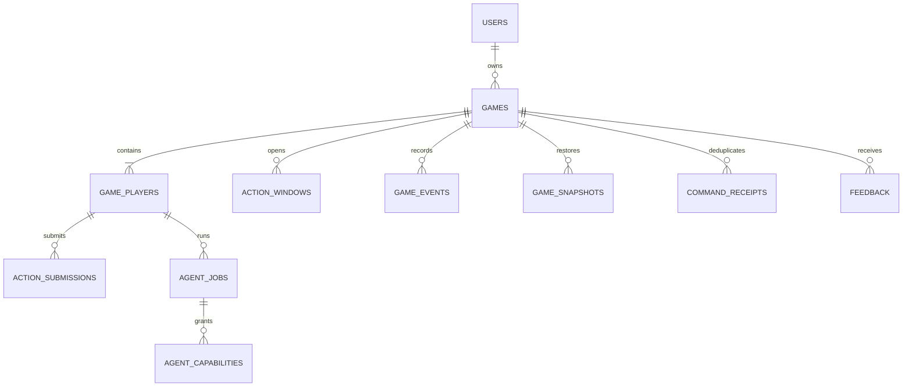

# AI 마피아 DB·Redis 설계서

작성일: 2026-09-09  
문서 기준: 빈 디렉터리에서 현재 구현 상태까지 만들기 위한 데이터 설계

## 1. 목적

게임 진행 중 반드시 보존되어야 하는 확정 상태와, 빠른 동시성 제어를 위해 필요한
보조 상태를 분리한다. PostgreSQL은 게임의 유일한 확정 원장으로 사용하고 Redis는
lock·cache·stream 보조 기능으로만 사용한다.

## 2. 설계 원칙

- 게임 상태·승패·행동 결과는 PostgreSQL transaction으로 확정한다.
- Redis 장애가 확정 상태나 승패를 변경하지 않게 한다.
- 외부 입력은 저장 전에 UUID·enum·상태 버전·소유권을 검증한다.
- 중복 command는 receipt를 통해 기존 결과를 재사용한다.
- 비공개 역할·개인 단서·capability 원문은 공개 cache와 event에 저장하지 않는다.
- 기존 행을 덮어쓰기보다 event·snapshot·receipt로 상태 변화를 재현할 수 있게 한다.

## 3. 논리 데이터 구조



## 4. PostgreSQL 책임

### 4.1 사용자·게임 구성

- `users`: UUID 기반 사용자 식별과 소유권 기준
- `scenario_catalog`: 게임에 선택 가능한 시나리오
- `scenario_templates`: 시나리오별 플레이어·역할 구성
- `agent_personas`: AI 플레이어의 표현 성향
- `games`: 게임 상태, phase, round, state version, seed, 종료 정보
- `game_players`: 게임 좌석, 생존 여부, 역할·persona 연결
- `player_scenario_facts`: 플레이어별 비공개 사실

### 4.2 진행 원장

- `action_windows`: 현재 열려 있는 행동 창과 deadline
- `action_submissions`: 인간·AI의 행동 제출 원장
- `action_window_resolutions`: 투표·밤 행동 등 집계 결과
- `game_events`: 공개 timeline과 상태 변화 event
- `command_receipts`: command의 멱등성 결과
- `game_snapshots`: 저장·재개와 조회 시 복원할 기준 상태

### 4.3 Agent·운영 데이터

- `agent_jobs`: AI 작업 예약·실행·완료·실패 상태
- `agent_capabilities`: 작업별 내부 접근 권한과 만료 정보
- `feedback`: 일반·게임별 사용자 피드백
- `admin_audit_events`: 관리자 조회 감사 기록
- speech analysis 관련 테이블: 공개 발언 분석 결과와 분석 버전

## 5. 핵심 transaction

### 5.1 게임 생성

```text
사용자 소유권 확인
→ 시나리오·플레이어 수 검증
→ game·players·private facts 생성
→ 초기 snapshot·event·receipt 저장
→ commit
```

### 5.2 사용자 또는 AI 행동

```text
game row lock
→ 소유권·phase·window·target·state_version 검증
→ 기존 receipt 확인
→ submission 기록
→ Game Engine 적용
→ state·event·snapshot·receipt 저장
→ commit
```

commit 전에 실패하면 상태·event·receipt를 함께 rollback한다. commit 이후 cache
무효화나 stream 전달이 실패하더라도 PostgreSQL의 확정 결과를 우선한다.

### 5.3 저장·재개·삭제

- 저장은 현재 확정된 snapshot과 열린 window의 남은 시간을 보존한다.
- 재개는 소유권과 저장 상태를 확인한 뒤 현재 snapshot을 기준으로 진행한다.
- 삭제는 소유권·상태·확정 version을 확인하고 관련 데이터의 삭제 범위를 제한한다.
- stale game 자동 정리는 bounded batch로 실행하며 다른 게임을 건드리지 않는다.

## 6. Redis 설계

### 6.1 사용 목적

| 기능 | 목적 | 실패 시 처리 |
|---|---|---|
| lock | 같은 게임·window의 동시 처리 직렬화 | PostgreSQL 기준 재시도 또는 안전 종료 |
| cache | 반복 조회와 Front 복구 보조 | cache miss 후 PostgreSQL 재조회 |
| stream | 확정 event 전달 보조 | snapshot 재조회 또는 재연결 |

### 6.2 금지 사항

- Redis를 승패나 게임 상태의 원본으로 사용하지 않는다.
- lock 획득만으로 행동이 유효하다고 판단하지 않는다.
- version이 맞지 않는 cache를 사용하지 않는다.
- private payload, raw prompt, capability secret, 미확정 AI 행동을 저장하지 않는다.

## 7. 일관성·동시성·멱등성

- `state_version`은 낡은 화면·AI 결과가 현재 상태를 덮어쓰는 것을 막는다.
- `window_id`는 행동이 올바른 phase와 행동 창에 속하는지 확인한다.
- `Idempotency-Key`와 `command_receipts`는 네트워크 재시도 중복을 막는다.
- AI의 늦은 결과는 job lease·fencing·version을 모두 통과해야 반영한다.
- SSE cursor와 DB event sequence가 불일치하면 부분 적용하지 않고 snapshot으로 복구한다.

## 8. 보안·보존 경계

- UUID는 소유권 식별자이며 강한 인증 수단이 아니다.
- private role·fact는 해당 actor projection에서만 반환한다.
- public event에는 비공개 행동과 내부 처리 순서를 노출하지 않는다.
- 관리자 조회도 allowlist와 감사 기록을 통과한다.
- secret·token·실제 connection string은 데이터나 로그에 저장하지 않는다.

## 9. 구축 순서와 완료 기준

1. PostgreSQL connection·transaction·migration runner
2. 사용자·시나리오·게임·플레이어 schema
3. 행동·event·snapshot·receipt schema
4. Agent job·feedback·관리자 schema
5. Repository와 transaction service
6. Redis lock·cache·stream
7. 빈 DB migration, rollback, 중복 요청, stale 상태, 재개 검증

완료 기준은 빈 DB에서 migration을 재실행할 수 있고, 대표 게임의 생성·행동·저장·
재개·종료가 확정 원장에 일관되게 남는 것이다.
