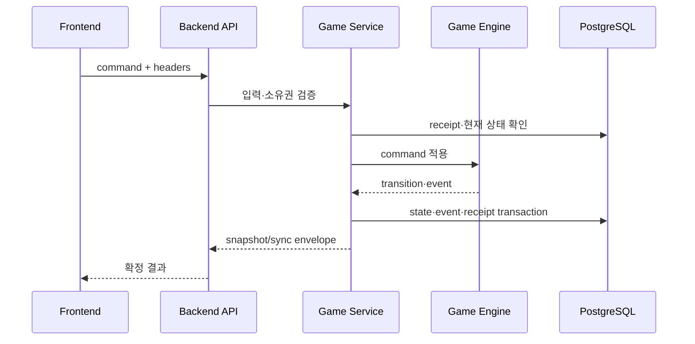

# AI 마피아 API 설계서

작성일: 2026-09-09  
문서 기준: 빈 디렉터리에서 현재 구현 상태까지 만들기 위한 API 계약

## 1. 목적

User Frontend, Admin Frontend, Backend, MCP runtime이 서로의 내부 구현을 알지
않고 통신할 수 있도록 요청·응답·오류·권한·상태 버전 계약을 정의한다.

## 2. API 계층

```text
User Frontend ─┐
Admin Frontend ├─ 공개/관리자 Backend API ─ Game Service ─ Game Engine
AI/MCP ────────┘        내부 Agent API ────────┘
```

- 공개 API: 사용자 게임 생성·조회·command·sync·feedback
- 관리자 API: read-only 운영 분석·게임 조회·feedback·audit
- 내부 API: actor Context와 검증된 AI action 제출
- health API: 프로세스와 의존성 준비 상태 확인

## 3. 공통 요청 계약

### 3.1 식별·추적 header

| Header | 용도 |
|---|---|
| `X-User-Id` | 사용자 소유권 식별 |
| `X-Request-Id` | 요청 추적 |
| `Idempotency-Key` | 변경 요청 중복 방지 |
| `Last-Event-ID` | SSE 재연결 cursor |
| 내부 capability header | 운영 보강 시 Agent/MCP 작업 범위 증명 |

header 값은 신뢰하지 않고 UUID 형식·허용 범위·만료 상태를 검증한다. 현재
내부 MCP API는 capability header를 실제로 받지 않으며, game·actor·phase·window·
state version binding과 Agent Job 상태를 Backend에서 검증한다. capability header
전달·검증은 운영 보강 범위다.

### 3.2 공통 응답

```json
{
  "data": {},
  "meta": {
    "request_id": "...",
    "state_version": 12
  }
}
```

오류는 내부 exception이나 connection detail을 노출하지 않고 안정된 error code와
사용자에게 필요한 메시지만 반환한다.

```json
{
  "error": {
    "code": "STALE_STATE_VERSION",
    "message": "현재 게임 상태가 변경되었습니다. 최신 상태를 확인해 주세요."
  },
  "meta": {"request_id": "..."}
}
```

## 4. 공개 API 설계

### 4.1 health·ready

- `/health`: Backend 프로세스가 요청을 처리할 수 있는지 확인
- `/ready`: PostgreSQL·Redis 등 필수 의존성이 준비되었는지 확인

ready 실패 시 connection string과 상세 예외를 반환하지 않는다.

### 4.2 게임 API

- `POST /api/v1/games`: 시나리오와 플레이어 구성으로 새 게임 생성
- `GET /api/v1/games`: 사용자 소유 게임 목록 조회
- `GET /api/v1/games/{game_id}`: 현재 사용자에게 허용된 snapshot 조회
- `DELETE /api/v1/games/{game_id}`: 조건을 충족한 진행 게임 삭제
- `POST /api/v1/games/{game_id}/commands`: 게임 command 제출

게임 command는 Backend가 소유권·현재 phase·legal action·target·deadline·state
version을 검증한다. Frontend가 전달한 역할·승패·phase를 그대로 신뢰하지 않는다.

### 4.3 sync·SSE

- `GET /api/v1/games/{game_id}/sync`: cursor 이후 확정 operation 조회
- `GET /api/v1/games/{game_id}/events`: 실시간 확정 event 전달

sequence gap, unknown operation, malformed batch가 발생하면 부분 적용하지 않고
authoritative snapshot을 재조회한다.

### 4.4 feedback·관리자 API

- `POST /api/v1/feedback`: 일반·게임별 피드백 저장
- 관리자 API: 게임 목록·상세·운영 지표·feedback·audit·발언 분석 조회

관리자 API는 read-only이며 allowlist, 입력 범위, audit 기록을 적용한다.

## 5. 내부 Agent/MCP API

### 5.1 Context 조회

Context 요청은 `game_id`, actor/player 식별자, phase, window, expected state
version을 binding으로 포함한다. 응답은 public·me·turn·persona scope를 분리하며
요청 actor가 아닌 다른 actor의 private 정보를 포함하지 않는다.

### 5.2 Action 제출

제출 payload는 action type, target, message, proposal id와 상태 binding을 포함한다.
Backend는 다음을 다시 검증한다.

- 내부 요청의 game·actor·window binding
- actor와 game의 관계
- 현재 phase와 window
- 허용 action과 target
- expected state version
- 중복 proposal

Agent job capability의 발급·수명·폐기는 Agent 실행 경계에서 관리하며, API 설계서의
핵심 계약은 capability 원문이 아니라 요청 binding과 Backend 최종 검증이다.

검증 성공 뒤에만 Game Engine이 적용하고 receipt를 반환한다. 내부 API의 성공은
“모델이 선택했다”가 아니라 “Backend가 확정 적용했다”는 의미로 정의한다.

## 6. 상태와 오류 계약

| 오류 | 의미 | 처리 |
|---|---|---|
| `MISSING_USER_ID` | 사용자 식별자 없음 | 요청 거부 |
| `GAME_NOT_FOUND` | 존재하지 않거나 소유하지 않음 | 동일한 안전 응답 |
| `INVALID_COMMAND` | schema·입력 오류 | 재시도 전 입력 수정 |
| `NOT_ALLOWED` | 현재 actor/action 권한 없음 | 실행 중지 |
| `STALE_STATE_VERSION` | 오래된 상태 | 최신 snapshot 재조회 |
| `WINDOW_EXPIRED` | 행동 창 만료 | fallback 또는 종료 |
| `DEPENDENCY_UNAVAILABLE` | DB·Redis·MCP 등 의존성 오류 | 제한된 재시도 |
| `DUPLICATE_REQUEST` | 기존 receipt 존재 | 기존 결과 replay |

## 7. 주요 호출 흐름



## 8. 구축 순서와 완료 기준

1. 공통 schema·error·response envelope
2. health와 게임 조회·생성 API
3. command와 transaction 연결
4. sync·SSE 연결
5. feedback·관리자 read-only API
6. 내부 Context·action API
7. schema 오류, 소유권, stale, 중복, redaction, reconnect 검증

완료 기준은 동일한 요청을 재전송해도 중복 상태가 생기지 않고, 오래된 요청·권한
없는 요청·잘못된 행동이 Game Engine 앞에서 차단되는 것이다.
