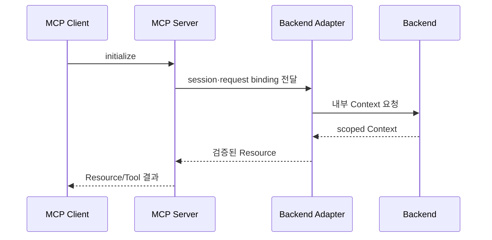

# AI 마피아 MCP 설계서

작성일: 2026-09-09  
문서 기준: 빈 디렉터리에서 현재 구현 상태까지 만들기 위한 MCP runtime 설계

## 1. 목적과 경계

MCP runtime은 AI가 Backend의 제한된 게임 정보와 행동 계약을 protocol 방식으로
사용할 수 있게 한다. MCP는 게임 규칙·승패·DB·Redis를 소유하지 않으며, 모든 실제
상태 변경은 Backend 내부 API와 Game Engine을 거친다.

```text
MCP Client
  → MCP session / Resource / Prompt / Tool
  → Backend HTTP adapter
  → Backend 내부 Context·Action API
  → Game Engine·PostgreSQL
```

## 2. MCP 서버 구성

- `main`: 서버 생성과 transport 실행
- FastMCP SDK session: Streamable HTTP initialize와 session lifecycle
- Resource registry: 게임 Context Resource 등록
- Prompt registry: AI 실행에 필요한 공통 지침 등록
- Tool registry: action 제출 Tool 등록
- Backend adapter: 내부 HTTP 호출과 응답 변환
- context schema: Resource 응답 계약 검증
- audit: 호출 metadata와 오류 기록

MCP runtime 내부에 DB·Redis client를 두지 않는다. 비어 있는 integration directory는
향후 확장 지점일 뿐 현재 데이터 접근 경로로 간주하지 않는다.

## 3. 외부 공개 표면과 내부 처리의 구분

MCP의 외부 공개 표면과 내부 실행 단계를 구분한다. 아래 항목 중 Resource·Prompt·
Tool만 protocol client가 직접 발견·호출하는 공개 interface이며, Context refresh와
결과 검증은 서버·Backend adapter 내부 처리 단계다.

```text
외부 공개 interface: Resource / Prompt / Tool
내부 처리 단계: session binding / Context refresh / 결과 receipt 검증
```

## 4. Resource 설계

Resource는 현재 게임에서 actor가 볼 수 있는 정보만 제공한다. Resource의 구체적인
data는 Backend 내부 API 응답을 검증한 뒤 전달한다.

| Resource 범주 | 목적 | 허용 정보 |
|---|---|---|
| public game | 공통 게임 상황 | phase, 생존자, 공개 사건, 공개 발언 |
| own context | 자기 actor 정보 | 자신의 role·fact·persona·허용 상태 |
| turn context | 현재 행동 조건 | window, deadline, 허용 action, valid target |
| persona/instruction | 표현 규칙 | 말투·표현 성향 등 비규칙 정보 |
| guide/summary | 게임 진행 안내 | 공개된 규칙·현재 단계 안내 |

Resource 요청마다 game·actor·window·state version을 binding한다. MCP 요청이 임의의
actor id나 scope를 지정해 권한을 확장할 수 없게 한다.

## 5. Prompt 설계

Prompt는 모델에게 전달할 역할·현재 단계·출력 계약을 조립하는 보조 표면이다.

- prompt가 게임 상태를 변경하지 않는다.
- prompt에 capability secret과 내부 인증값을 포함하지 않는다.
- prompt가 Backend의 허용 action을 변경하지 않는다.
- prompt의 자연어 지침보다 API schema와 Game Engine 검증이 우선한다.

## 6. Tool 설계

Tool은 Backend가 허용한 action을 전달하는 얇은 adapter다.

| 공개 Tool | 목적 | 서버 검증 |
|---|---|---|
| `submit_action` | 발언·PASS·투표·밤 행동 제출 | action·target·window·version |
| `manipulate_vote` | 사용자 전용 가중 투표 능력 제출 | 소유 HUMAN·능력·투표 window |
| `inspect_special_roles` | 해금된 특수 직업 조회 | 소유 게임·해금 조건·응답 scope |

Context refresh와 result check는 별도 Tool이 아니라 Resource 재조회와 action
응답 검증으로 처리되는 내부 단계다.

Tool은 모델이 직접 선택한 target이나 phase를 신뢰하지 않는다. Tool 실행 전후로
session, actor, game, window, phase, target, state version을 확인한다. 현재 최소
운영 경로에서 capability 원문은 MCP wire 요청에 전달하지 않으며, Backend가
요청 binding과 Agent Job 상태를 최종 검증한다. capability를 MCP session까지
전달·검증하는 구조는 운영 보강 범위다.

## 7. Session·권한 설계



- FastMCP SDK가 initialize와 session lifecycle을 관리한다.
- 현재 Backend는 game·actor·phase·window·state version binding을 검증한다.
- Agent capability는 Backend Agent 실행 경계에서 발급·폐기되며, 현재 MCP wire
  요청의 독립 인증값으로 전달되지는 않는다.
- 향후 capability를 MCP session에 binding할 경우 initialize와 각 요청에서 만료·
  폐기·scope를 검증해야 한다.
- session이 유효해도 Backend의 매 요청 권한·상태 검증은 생략하지 않는다.
- capability 원문은 응답·로그·화면에 노출하지 않는다.

## 8. 실패 처리

| 상황 | MCP 처리 |
|---|---|
| 잘못된 Resource scope | 요청 거부, private 정보 반환 금지 |
| malformed Context | 계약 오류로 중단, 임의 기본값 생성 금지 |
| Backend timeout | 제한된 재시도 또는 typed dependency 오류 |
| capability 만료 | 새 작업 없이 종료 |
| action stale | `STALE` 결과 반환, 새 target 추정 금지 |
| duplicate proposal | 기존 receipt replay |
| Backend commit 불명 | 원장 확인 전 재제출 금지 |

## 9. 감사·관찰성

기록 대상은 request id, game/job/window 식별자, Resource·Tool 종류, 결과 code,
소요 시간, 상태 version이다. 다음은 기록하지 않는다.

- raw capability
- secret과 token
- private Context 원문
- raw prompt
- 모델 내부 추론 전문

## 10. 구축 순서와 완료 기준

1. MCP domain·schema·port 정의
2. Backend HTTP adapter
3. FastMCP SDK initialize와 session lifecycle 연결
4. Resource registry
5. Prompt registry
6. Tool registry
7. audit와 redaction
8. 정상 왕복·scope 격리·timeout·중복·stale 검증
9. capability를 MCP session에 연결하는 운영 보강 검토

완료 기준은 MCP를 중지하거나 오류가 발생해도 Backend 원장과 게임 규칙이 안전하게
유지되고, MCP를 통해서도 Backend가 허용하지 않은 정보·행동을 얻을 수 없는 것이다.
