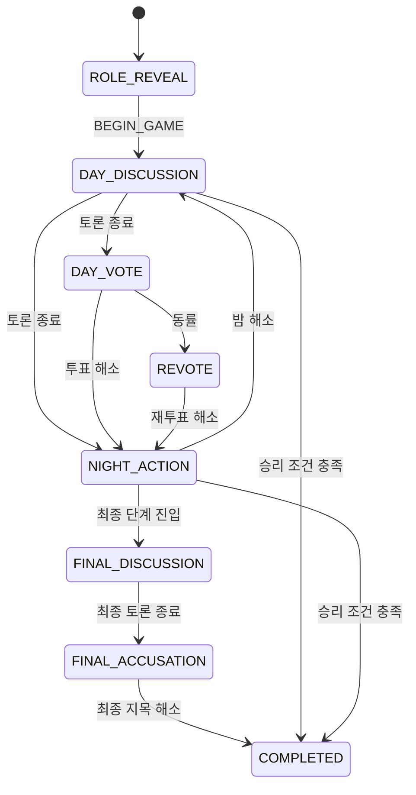

# AI 마피아 게임 엔진·시나리오 설계서

작성일: 2026-09-09  
문서 기준: 빈 디렉터리에서 현재 구현 상태까지 만들기 위한 게임 규칙 설계

## 1. 목적

게임의 규칙, 상태 전이, 행동 유효성, 승패를 외부 모델과 독립적으로 결정한다.
AI와 Frontend는 행동을 요청하거나 제안할 수 있지만 Game Engine만 최종 상태를
변경한다.

## 2. 핵심 불변식

- 현재 phase에 맞지 않는 command는 적용하지 않는다.
- 사망·비활성 플레이어는 허용되지 않은 행동을 할 수 없다.
- 행동 target은 현재 생존자와 phase 규칙을 통과해야 한다.
- 하나의 action window에서 actor의 제출을 중복 반영하지 않는다.
- 상태 변경과 공개 event·receipt는 같은 transaction에서 확정한다.
- 같은 seed와 같은 입력 순서는 같은 결정 결과를 만든다.
- AI의 자연어 응답은 규칙이나 승패를 변경하지 않는다.

## 3. 게임 lifecycle



각 전이는 현재 상태와 command를 모두 확인한 뒤 새 상태, event, 다음 action window를
함께 반환한다. Frontend가 다음 phase를 추측해 이동하지 않는다.

## 4. 시나리오 구성

### 4.1 게임 생성

1. 사용자가 시나리오와 6~9명 구성을 선택한다.
2. Backend가 허용된 구성과 역할 배치를 생성한다.
3. 사용자에게 본인에게 필요한 역할 정보만 공개한다.
4. 게임은 `ROLE_REVEAL` 상태로 생성된다.

### 4.2 역할 공개와 시작

`BEGIN_GAME`은 역할 공개를 확인한 사용자가 제출한다. 성공한 경우에만 첫 토론으로
전환한다. 다른 플레이어의 private role·fact는 공개 snapshot에 포함하지 않는다.

### 4.3 낮 토론

- 공개 대화는 game event로 기록한다.
- 자유 토론은 deadline과 발언 제한을 따른다.
- 인간은 현재 AI 처리 순서와 무관하게 허용된 토론 행동을 수행한다.
- 토론 종료 후 투표 또는 다음 phase를 결정한다.

### 4.4 밤 행동

- 역할에 따라 허용된 밤 행동과 target을 계산한다.
- 필요한 인간·AI 제출을 모은 뒤 window를 해소한다.
- 누락된 행동은 규칙에 따라 자동 처리하거나 fallback한다.
- 개인 행동의 비공개 결과와 공개 결과를 구분한다.

### 4.5 투표·재투표

- 생존자만 투표한다.
- 모든 필요한 제출을 모으면 투표를 집계한다.
- 동률이면 기존 후보 집합을 기준으로 재투표한다.
- 재투표 후보·자기 자신 투표·만료 처리도 Engine이 결정한다.
- 집계 결과와 처형 결과를 event와 snapshot에 반영한다.

### 4.6 종료

시민·마피아 승리 조건을 확인하고 `COMPLETED` 상태와 최종 결과를 저장한다. 결과
화면에 공개할 정보와 관리자 전용 정보는 서로 다른 projection을 사용한다.

## 5. 행동 처리 모델

```text
현재 snapshot
→ legal action 계산
→ action window 생성
→ 인간·AI 제출 수집
→ 제출별 schema·권한·target 검증
→ window resolution
→ 승리 조건 확인
→ event·snapshot·receipt 확정
→ 다음 phase 또는 COMPLETED
```

`PASS`, `SPEAK`, `SUBMIT_VOTE`, `SUBMIT_NIGHT_ACTION`, `SAVE_AND_EXIT`, `RESUME`,
`FAST_FORWARD`는 각자 허용 phase와 actor 조건을 가진다.

## 6. 시간·저장·복구

- deadline은 서버 기준으로 계산한다.
- 만료 시 이미 제출된 유효 행동은 보존하고 누락분만 자동 처리한다.
- 저장 시 열린 window와 남은 시간을 snapshot에 기록한다.
- 재개 시 실제 DB 상태와 window를 다시 읽어 화면을 복원한다.
- worker나 Front 재시작은 게임 규칙을 초기화하지 않는다.

## 7. 순수 엔진과 외부 계층 분리

```text
Game Engine: 규칙·phase·승패·유효성·결정적 fallback
Application Service: transaction·repository·동시성·API 조정
Agent/Provider: 행동 제안 생성
Frontend: 입력과 확정 상태 표시
```

Engine은 HTTP, PostgreSQL, Redis, LLM에 직접 의존하지 않는다. 외부 계층에서 받은
command는 Engine의 도메인 검증을 반드시 통과해야 한다.

## 8. 구축 순서와 완료 기준

1. enum·game state·command 모델
2. 플레이어·역할·생존 규칙
3. phase 전이
4. 토론
5. 밤 행동
6. 투표·재투표
7. 승패·최종 결과
8. 저장·재개·replay
9. 동시성·만료·중복 처리
10. 6~9명 게임 생성부터 종료까지 검증

완료 기준은 모델이나 화면이 없어도 Engine 테스트만으로 정상·예외·만료·동률·승패
경로를 재현할 수 있고, 실제 서비스에서는 모든 상태 변경이 Engine과 transaction을
통과하는 것이다.
