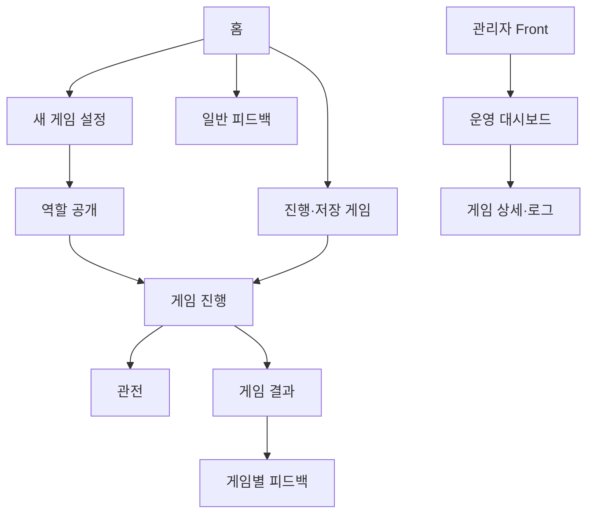

# AI 마피아 화면 설계서

작성일: 2026-09-09  
문서 기준: 빈 디렉터리에서 현재 구현 상태까지 만들기 위한 User/Admin Front 설계

## 1. 목적

Backend가 확정한 snapshot·legal action·sync event를 사용자가 이해하고 조작할 수
있는 화면으로 구성한다. 화면은 게임 규칙을 재구현하지 않으며 서버 상태를 표시한다.

## 2. 화면 구성



## 3. 공통 화면 원칙

- 로그인 없이 브라우저 UUID로 사용자를 식별한다.
- UUID는 인증 수단이 아니라 게임 소유권 식별자임을 안내한다.
- 화면의 phase·legal action·target은 Backend 응답을 사용한다.
- loading·empty·error를 구분하고, 로딩 중 빈 데이터처럼 보이지 않게 한다.
- 사용자 입력·게임 상태·sync cursor를 서로 섞지 않는다.
- public event와 private 정보의 표시 범위를 분리한다.
- 실패 시 사용자가 재시도할 수 있는 상태와 현재 게임 상태를 유지한다.

## 4. User Front 화면

### 4.1 홈

- 새 게임 시작
- 진행 중·저장 게임 목록
- 완료 게임 목록
- 게임 방법·일반 피드백·식별자 설정
- 게임 목록 조회 실패와 빈 목록을 별도 표시

### 4.2 새 게임 설정

- 시나리오 선택
- 플레이어 수와 구성 확인
- custom role·ability 선택이 있는 경우 허용 descriptor만 표시
- 생성 중에는 중복 submit을 막고, 요청 불명확 시 같은 payload로 재시도

### 4.3 역할 공개

- 본인 역할과 본인에게 허용된 정보만 표시
- 다른 플레이어의 private role·fact·seed를 화면 상태에 넣지 않음
- `게임 시작` 성공 후에만 게임 화면으로 이동

### 4.4 게임 진행

- 현재 phase·round·deadline
- 플레이어 목록과 생존 상태
- 공개 timeline
- 본인 private panel
- 현재 가능한 행동 panel
- AI 진행 activity 요약
- 처리 중·제출 완료·실패·재시도 상태

발언은 이름·아바타·말풍선으로, 행동은 action type과 아이콘으로 구분한다. raw
MCP Tool name, capability, prompt, 내부 추론을 화면에 노출하지 않는다.

### 4.5 관전

사용자가 사망했거나 관전 상태인 경우 게임은 Backend에서 계속 진행된다. 화면에는
관전 중임을 고정 표시하고, 관전자에게 허용된 공개 정보만 전달한다.

### 4.6 저장·재개

- 저장하고 나가기
- 게임 삭제
- 취소·닫기
- 저장 성공·실패
- 최신 snapshot 기반 재개

재개 성공 후 `ROLE_REVEAL`, 진행 화면, 결과 화면을 실제 phase에 따라 분기한다.

### 4.7 결과·피드백

- 승패와 공개 결과
- 역할·게임 기록
- 새 게임·홈 이동
- 게임별 feedback
- 일반 feedback

feedback은 게임 상태나 Agent prompt를 변경하는 입력이 아니며, 별도 저장 흐름으로
처리한다.

## 5. Admin Front 화면

- 관리자 UUID allowlist 확인
- 운영 지표
- 게임 목록·상세
- 사용자·게임 feedback
- 공개 발언 분석
- 관리자 audit log

관리자 화면은 read-only 원칙을 따른다. demo mode의 합성 데이터와 실제 API 데이터는
화면에서 구분하며, private role·seed·비공개 행동은 표시하지 않는다.

## 6. 화면 상태와 API 연결

```text
Backend snapshot 조회
→ 화면 상태 변환
→ 사용자에게 확정 상태 표시
→ 사용자가 legal action 선택
→ command API 제출
→ receipt/snapshot 수신
→ sync 또는 재조회로 화면 갱신
```

- `snapshot`: 화면의 기준 상태
- `legal_actions`: 현재 사용자가 선택 가능한 행동
- `valid_targets`: 선택 가능한 대상
- `action_window`: 제출·deadline·version binding
- `game_events`: 공개 timeline
- `sync envelope`: 마지막 cursor 이후 변경

## 7. 동기화·재연결

1. 게임 진입 시 snapshot과 last sequence를 조회한다.
2. SSE 또는 polling으로 확정 operation을 받는다.
3. batch 전체를 검증한 뒤 원자적으로 적용한다.
4. sequence gap·unknown operation·scope 불일치가 있으면 적용하지 않는다.
5. authoritative snapshot을 다시 조회한다.
6. 재연결 뒤에는 서버 상태로 화면 입력·timer·목록을 보정한다.

사용자 입력 중인 text와 서버 snapshot 갱신은 별도 상태로 관리하여, 새 event가
도착해도 작성 중인 입력을 임의로 삭제하지 않는다.

## 8. 오류·복구 화면

| 상황 | 화면 동작 |
|---|---|
| 손상·누락 UUID | 식별자 초기화 안내 |
| 게임 없음·소유권 오류 | 게임을 찾을 수 없다는 안전한 안내 |
| stale 상태 | 최신 상태 재조회 |
| dependency 오류 | 현재 화면과 식별자를 유지하고 재시도 |
| command timeout | 동일 요청 재시도 또는 receipt 확인 |
| window 만료 | 허용된 다음 행동과 종료 안내 |
| SSE gap | snapshot 복원 후 연결 재시도 |

## 9. 구축 순서와 완료 기준

1. 앱 shell·UUID·공통 message·loading
2. 홈·새 게임·역할 공개
3. 게임 진행·action panel
4. sync/SSE·재연결
5. 관전·저장·재개·결과
6. feedback
7. 관리자 dashboard·상세
8. 반응형·접근성·오류 화면

완료 기준은 사용자가 새 게임을 생성해 역할 공개부터 게임 종료와 feedback까지
진행할 수 있고, 새로고침·재연결·API 실패 상황에서도 private 정보가 노출되거나
확정되지 않은 화면 상태가 표시되지 않는 것이다.
