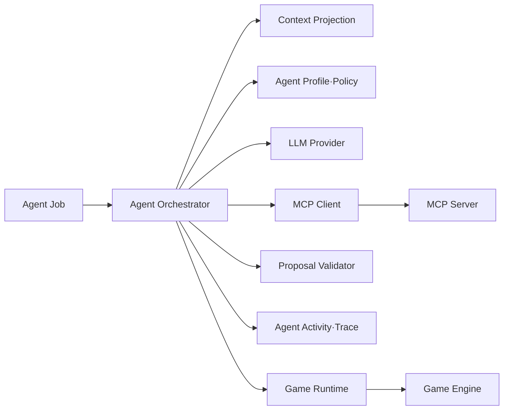

# AI 마피아 에이전트 아키텍처 설계서

작성일: 2026-09-09  
문서 기준: `docs/arrangement` 하위 설계서와 현재 저장소 구현

## 1. 목적과 설계 범위

이 문서는 AI 마피아의 AI Agent가 게임 Context를 관찰하고, 다음 행동을 제안하며,
제안 결과를 안전하게 반영하고 평가하는 구조를 정의한다.

이 문서의 핵심 질문은 다음과 같다.

> AI Agent는 어떤 정보를 보고, 어떤 기준으로 행동을 선택하며, 그 행동을 어떻게
> 검증·실행·기록하고 개선하는가?

### 1.1 이 문서가 소유하는 내용

- Agent의 목표·Persona·행동 판단 책임
- Agent 실행 Job과 실행 상태
- Agent Context를 판단에 사용하는 방식
- Provider 응답을 proposal로 다루는 규칙
- Agent 수준의 Tool 선택 정책
- proposal 교정·재시도·fallback 정책
- Agent 실행의 멱등성·stale 결과 처리 정책
- Agent Trace와 실행 결과 분류
- Agent 결과 평가와 개선 피드백 루프
- 빈 디렉터리에서 현재 Agent 구현을 만드는 구현 순서

### 1.2 이 문서가 소유하지 않는 내용

| 주제 | 정본 문서 | 이 문서의 처리 방식 |
|---|---|---|
| 전체 컴포넌트 배치와 서비스 연결 | [전체 시스템 설계서](AI_MAFIA_SYSTEM_ARCHITECTURE_DESIGN.md) | Agent가 연결되는 위치만 참조 |
| 공개·내부 API URL과 HTTP Schema | [API 설계서](02_API_DESIGN.md) | Agent가 사용하는 요청 의미만 참조 |
| MCP Resource·Prompt·Tool의 protocol·Schema | [MCP 설계서](03_MCP_DESIGN.md) | Agent 입장에서 선택 가능한 기능만 참조 |
| 게임 phase·역할·승패·상태 전이 | [게임 엔진·시나리오 설계서](04_GAME_ENGINE_SCENARIO_DESIGN.md) | Agent 판단 조건만 참조 |
| PostgreSQL Table·Migration·Redis Key | [DB·Redis 설계서](01_DB_REDIS_DESIGN.md) | Job·Receipt·Trace 저장 목적만 참조 |
| 화면 구성·사용자 입력·관리자 화면 | [화면 설계서](05_SCREEN_DESIGN.md) | 사용자에게 표시할 Agent 상태만 참조 |
| 구현 순서 전체와 작업 일정 | [구현 계획서](AI_MAFIA_IMPLEMENTATION_PLAN.md) | Agent 관련 작업의 세부 기준으로 참조 |

같은 내용을 이 문서에 복제하지 않는다. 다른 설계서와 충돌할 경우 각 영역의
정본을 따르며, Agent 문서는 그 정본을 어떻게 소비하는지만 정의한다.

## 2. Agent 아키텍처 목표

AI 플레이어마다 독립적인 Agent 실행을 제공한다. 여러 AI 플레이어가 존재해도
Agent끼리 직접 메시지를 주고받는 Coordinator·Handoff 구조는 사용하지 않는다.
하나의 공통 Orchestrator가 `actor_id`별 Context와 Job을 바꾸어 실행한다.

```text
공통 Agent 실행 구조
+ actor별 Context
+ actor별 역할·Persona
+ actor별 허용 행동
= 독립적으로 실행되는 Single Agent
```

Agent는 게임을 직접 운영하지 않는다.

| 주체 | 책임 |
|---|---|
| Agent/LLM | 다음 행동 또는 발언 proposal 생성 |
| Agent Orchestrator | Job, Context, Provider 호출, proposal 처리, retry 관리 |
| Backend | 입력·권한·binding 검증과 실행 경계 제공 |
| Game Engine | 게임 규칙·상태 전이·승패의 최종 판정 |
| PostgreSQL | 확정 상태·Event·Receipt·Agent Job 원장 |
| MCP Server | Resource·Prompt·Tool protocol 제공과 Backend adapter 호출 |

## 3. 사용자 중심 Agent 서비스 시나리오

### 3.1 AI 발언

```text
토론 단계에서 AI의 차례 도달
→ Agent Job 예약
→ 공개 정보·개인 정보·Turn Context 조회
→ 발언 proposal 생성
→ 발언 형식과 실행 binding 검증
→ action 제출
→ Game Engine 반영 결과 확인
→ activity·event·trace 기록
```

발언 내용의 자연스러움은 Agent 평가 대상이지만, 발언 차례와 발언 가능 여부는
Game Engine과 Backend가 결정한다.

### 3.2 AI 투표

```text
투표 단계 시작
→ 생존자·공개 발언·현재 투표 창 조회
→ 의심 대상 선택
→ 투표 proposal 생성
→ 대상·phase·window·state version 검증
→ 투표 제출
→ receipt 확인
```

Agent는 투표 결과나 다음 phase를 계산하지 않는다. 투표 집계와 동률 처리는
[게임 엔진·시나리오 설계서](04_GAME_ENGINE_SCENARIO_DESIGN.md)의 책임이다.

### 3.3 AI 밤 행동

```text
밤 행동 단계 시작
→ 자신의 역할과 사용 가능한 행동 확인
→ 유효 대상 Context 확인
→ 밤 행동 proposal 생성
→ 역할·능력·대상·행동 창 검증
→ action 제출
→ 모든 제출 결과를 Game Engine이 처리
```

Agent는 다른 플레이어의 비공개 역할을 조회하거나, 자신의 권한을 임의로
확장하지 않는다.

### 3.4 최종 고발

최종 고발도 일반 AI 행동과 동일한 Agent 실행 구조를 사용한다. 다만 실제 최종
판정과 게임 종료는 Game Engine에 위임한다.

## 4. Agent 상태 흐름

```text
CREATED
  ↓
RESERVED
  ↓
CONTEXT_LOADED
  ↓
DECIDING
  ↓
PROPOSED
  ↓
VALIDATING
  ├─ CORRECTION_REQUIRED → DECIDING
  ├─ STALE → COMPLETED
  ├─ DUPLICATE → COMPLETED
  └─ VALID
        ↓
SUBMITTING
  ├─ RETRYING
  ├─ FALLBACK
  ├─ FAILED
  └─ APPLIED
        ↓
TRACE_RECORDED
        ↓
COMPLETED
```

| 상태 | 의미 |
|---|---|
| `CREATED` | Agent 실행 작업이 생성됨 |
| `RESERVED` | Worker가 Job Lease를 확보함 |
| `CONTEXT_LOADED` | Agent 판단에 필요한 Context를 확보함 |
| `DECIDING` | Provider가 다음 행동을 판단 중 |
| `PROPOSED` | Provider가 proposal을 반환함 |
| `VALIDATING` | proposal의 형식·행동·binding을 검증 중 |
| `CORRECTION_REQUIRED` | 오류 정보를 바탕으로 제한된 교정이 필요함 |
| `STALE` | 판단 당시 상태가 현재 상태와 달라 적용하지 않음 |
| `DUPLICATE` | 동일한 행동이 이미 처리됨 |
| `SUBMITTING` | 검증된 행동을 Backend/MCP에 제출 중 |
| `RETRYING` | 재시도 가능한 오류를 복구 중 |
| `FALLBACK` | 제한된 대체 실행 경로를 사용함 |
| `APPLIED` | Game Engine에 의해 행동이 확정 반영됨 |
| `FAILED` | 복구할 수 없는 오류로 종료됨 |
| `COMPLETED` | Agent 실행이 종료됨 |

`DECIDED`는 모델이 행동을 결정했다는 의미이고, `APPLIED`는 게임 상태가 실제로
변경되었다는 의미다. 두 상태를 구분해야 “AI가 선택했지만 규칙 검증에서 거부된
경우”를 정확히 설명할 수 있다.

## 5. Agent 구성 요소



| 구성 요소 | Agent 설계에서의 책임 |
|---|---|
| Agent Job | 한 actor의 한 단계 실행 단위 |
| Agent Orchestrator | Agent Loop와 실행 상태 조정 |
| Agent Profile | 목표·Persona·허용 행동·Context 범위 정의 |
| Context Projection | actor가 볼 수 있는 정보로 Context 구성 |
| LLM Provider | 비신뢰 proposal 생성 |
| Proposal Validator | Provider 출력의 형식·의미·binding 검사 |
| MCP Client | 현재는 Resource 조회와 `submit_action` 제출을 Agent 실행에 연결 |
| Activity/Trace | 외부에 관찰 가능한 실행 단계 기록 |
| Game Runtime | proposal을 실제 게임 명령으로 연결 |

MCP Server 내부의 FastMCP SDK session, Resource handler, Tool registry 구현은 MCP
설계서의 책임이다. Agent 문서에서는 MCP Client가 어떤 시점에 어떤 기능을
사용하는지만 기록한다. 현재 Agent 실행은 MCP Prompt를 직접 호출하지 않고 Context에
포함된 `agent_instruction`과 Orchestrator의 system instruction을 사용한다.

## 6. Agent Profile 설계

Agent Profile은 게임 역할 자체가 아니라 역할을 수행하는 AI의 판단 설정이다.

| 속성 | 의미 |
|---|---|
| `agent_id` | Agent 유형 식별자 |
| `actor_id` | 현재 게임에서 행동하는 AI 플레이어 |
| `goal` | 현재 실행에서 달성할 목표 |
| `persona` | 말투와 플레이 성향 |
| `instructions` | 판단 시 고려할 정보와 금지 행동 |
| `allowed_actions` | proposal로 생성할 수 있는 행동 |
| `allowed_context_scopes` | 조회할 수 있는 Context 범위 |
| `max_steps` | 한 Job에서 허용하는 Provider 판단 횟수 |

역할별 능력, 승리 조건, phase 전이는 게임 엔진 설계서에 정의한다. Agent Profile은
그 정보를 입력으로 사용하되 별도로 재정의하지 않는다.

## 7. Context 사용 설계

Context의 실제 Resource URI와 Schema는 [MCP 설계서](03_MCP_DESIGN.md)를 참조한다.
이 절은 Agent가 각 Context를 어떻게 사용하는지만 정의한다.

| Scope | Agent 판단에서의 사용 |
|---|---|
| `public` | 공개 발언·생존자·공개 투표 등 공통 정보 확인 |
| `me` | 자신의 역할·생존 상태·개인 행동 가능 여부 확인 |
| `turn` | 현재 phase·action window·state version 확인 |
| `persona` | 말투와 판단 성향 적용 |

Agent 실행에는 다음 binding 정보가 보존된다.

```text
game_id
+ actor_id
+ phase
+ window_id
+ expected_state_version
+ allowed_actions
+ valid_targets
```

Agent는 Context에 없는 정보를 사실로 간주하지 않는다. Context를 조회한 뒤 게임
상태가 변경되면 기존 proposal을 폐기하고 새 Context를 조회한다.

## 8. Agent 행동과 Tool 선택

### 8.1 Agent가 사용하는 기능의 구분

MCP 설계서에 정의된 실제 외부 Tool은 다음과 같다.

| MCP 기능 | Agent 관점의 사용 |
|---|---|
| `submit_action` | MCP가 제공하는 공통 action 제출 기능; 현재 Agent 경로에서는 주로 발언 제출 |
| `manipulate_vote` | 해당 특수 역할의 투표 능력 사용 |
| `inspect_special_roles` | 해당 권한이 있는 플레이어의 조사 기능 사용 |

`manipulate_vote`와 `inspect_special_roles`는 일반 AI Agent가 항상 사용하는 Tool이
아니다. 현재 구현에서는 사용자 전용 MCP 기능이며, 역할·phase·사용 횟수·대상
조건을 Backend가 다시 검증한다.

### 8.2 논리적 행동과 실제 Tool의 구분

Context에는 `propose_speech`, `propose_pass`, `propose_vote`,
`propose_night_action`과 같은 허용 행동 정보가 포함될 수 있다. 이는 Agent가
생성할 수 있는 논리적 proposal 유형이며, MCP에 등록된 Tool 이름과 반드시 같은
개념은 아니다.

```text
Provider proposal
→ 논리적 행동 유형 생성
→ Agent가 허용 목록 확인
→ Runtime이 phase별 제출 경로로 변환
→ 발언은 `submit_action` 또는 binding된 Backend fallback
→ 투표·밤 행동은 Backend batch action service
```

### 8.3 Tool 선택 정책

- 현재 Context에 필요한 정보가 없을 때만 추가 조회한다.
- 현재 phase에서 허용되지 않는 Tool은 선택하지 않는다.
- 역할과 권한에 맞지 않는 특수 Tool은 선택하지 않는다.
- 이미 동일한 행동을 제출했다면 재제출하지 않는다.
- Tool 결과가 불충분하면 재판단하고, 결과가 오래되면 Context를 갱신한다.
- 현재 Provider에는 MCP Tool Schema가 직접 전달되지 않으며, Provider는 JSON
  proposal을 생성한다.
- Runtime이 proposal을 실제 MCP Tool 또는 Backend action으로 변환한다.
- Provider가 proposal 입력을 생성하더라도 최종 허용 여부는 Backend가 판단한다.

## 9. Proposal 생성과 검증

Agent 실행의 반환값은 확정 행동이 아니라 비신뢰 proposal이다.

```text
Provider proposal
→ 구조 검증
→ 행동 유형 검증
→ actor·game binding 검증
→ phase·window·state version 검증
→ 역할·대상·사용 가능 여부 검증
→ Backend/Game Engine 실행 요청
```

### 9.1 Agent 실행 경계에서 확인할 내용

- JSON 및 필수 필드가 올바른가?
- 행동 유형이 현재 Job과 일치하는가?
- `actor_id`와 `game_id`가 Job과 일치하는가?
- 대상이 Context가 제공한 후보 안에 있는가?
- 발언에 불필요한 대상 필드가 섞이지 않았는가?
- 최대 실행 단계나 재시도 한도를 초과하지 않았는가?

### 9.2 Backend·Game Engine에 위임할 내용

- 실제 phase와 action window가 유효한가?
- 역할이 해당 행동을 수행할 수 있는가?
- 현재 생존 상태와 대상 상태가 유효한가?
- 게임 규칙상 행동이 허용되는가?
- 행동 결과가 게임 상태에 어떻게 반영되는가?

상세 규칙은 [게임 엔진·시나리오 설계서](04_GAME_ENGINE_SCENARIO_DESIGN.md)를
따르며, API 요청·응답 형식은 [API 설계서](02_API_DESIGN.md)를 따른다.

## 10. Job·Lease·동시 실행 제어

Agent Job은 게임 이벤트에서 발생한 AI 행동 하나의 실행 단위다.

```text
Job 생성
→ Worker 예약
→ Lease와 fencing 정보 확인
→ Context·Provider·Tool 실행
→ 현재 Job의 lease·binding 재확인
→ 결과 저장 및 완료
```

Agent 설계에서 관리해야 하는 논리 정보는 다음과 같다.

- Job 식별자
- game·actor·phase·window binding
- 실행 시도 횟수
- Worker Lease
- Lease 만료 시각
- fencing token
- 현재 Agent 실행 상태
- 마지막 오류와 fallback 사유

DB 테이블의 실제 컬럼과 index는 [DB·Redis 설계서](01_DB_REDIS_DESIGN.md)에
정의한다. Lease가 만료되었거나 fencing token이 오래된 Worker의 결과는
`APPLIED`로 처리하지 않는다.

## 11. 멱등성 설계

멱등성은 Agent 문서에서 별도 핵심 항목으로 관리한다. 같은 AI 행동이 재시도되어도
게임 상태는 한 번만 변경되어야 한다.

### 11.1 멱등성 식별

사용자 API 변경 요청은 `Idempotency-Key`를 사용한다. Agent 행동의 논리적 중복
여부는 다음 binding과 Job·window·state 검증을 함께 고려한다.

```text
game_id
+ actor_id
+ window_id
+ action_type
+ idempotency_key
```

Agent Job 중복 실행은 Job ID, attempt, fencing token으로 구분한다.

### 11.2 처리 원칙

```text
Action 제출 전 Receipt 확인
→ 성공 Receipt 존재: 기존 결과 반환
→ 처리 중 Receipt 존재: 새 실행 생성 금지
→ Receipt 없음: 한 번 실행
→ 응답 불명확: 새 key를 만들어 재실행하지 않고 Receipt·원장 확인
→ state version/window 불일치: STALE 처리
```

동일 키인데 요청 본문이 다르면 새로운 행동으로 해석하지 않고 요청을 거부한다.
사용자 API는 동일 key 재사용을 보장한다. 현재 Agent 내부 MCP·batch 제출은
제출 지점에서 새 UUID를 생성하므로, Agent 재시도는 Job·window·state·Engine
중복 검증을 중심으로 보호된다. Agent action별 안정적인 key 재사용은 보강 대상이다.
Receipt의 저장 방식과 unique 제약은 DB 설계서에 위임한다.

## 12. 재시도·교정·Fallback

| 상황 | Agent 처리 |
|---|---|
| Provider 일시 오류 | 제한된 횟수로 재시도 |
| JSON·필수 필드 오류 | 오류 정보를 포함해 제한된 교정 |
| 허용되지 않은 행동 | proposal 폐기 후 재판단 또는 종료 |
| MCP 일시 오류 | 제한된 재시도 후 Fallback 또는 실패 |
| 상태 version 불일치 | Context 갱신 후 재판단 또는 `STALE` |
| action window 종료 | 실행하지 않고 `STALE` |
| 중복 action | 기존 Receipt replay |
| 적용 여부 불명 | 새 action 없이 Receipt 확인 |
| 최대 단계 초과 | 안전하게 Agent 실행 종료 |

Fallback은 임의의 target이나 임의의 게임 상태를 만들어내지 않는다. 검증 가능한
동일 proposal의 제한적 재제출 또는 안전한 실행 포기로만 동작한다.

## 13. Trace와 Activity

Trace는 모델의 내부 추론 전문을 저장하지 않고, Agent 실행을 외부에서 검증할 수
있는 단계와 결과만 기록한다.

| Stage | 기록 의미 |
|---|---|
| `run_started` | Agent 실행 시작 |
| `job_reserved` | Job 예약 완료 |
| `context_loaded` | Context 조회 완료 |
| `provider_called` | Provider 호출 |
| `proposal_created` | proposal 생성 |
| `proposal_validated` | proposal 검증 완료 |
| `correction_requested` | 교정 요청 |
| `tool_submitted` | MCP/Backend 제출 |
| `action_applied` | 게임 상태에 실제 반영 |
| `duplicate_replayed` | 기존 Receipt 반환 |
| `stale_rejected` | 오래된 결과 거부 |
| `fallback_used` | Fallback 사용 |
| `run_completed` | 실행 종료 |

Trace에는 다음 metadata를 포함한다.

- `trace_id`, `run_id`, `job_id`
- `game_id`, `actor_id`, `phase`, `window_id`
- `state_version`, `action_type`, `tool_name`
- `attempt`, `status`, `error_code`, `latency`

private role 정보, capability 원문, raw prompt, 모델 내부 추론 전문은 공개 Activity와
운영 로그에 포함하지 않는다. 저장 위치와 보존 정책은 DB·Redis 및 운영 설계의
정본을 따른다.

## 14. 평가와 개선 피드백 루프

```text
Agent 실행
→ proposal·Tool·검증·반영 Trace 수집
→ 게임 결과·사용자 feedback 결합
→ 실패 유형 분류
→ Context·Prompt·Tool 계약·정책 개선
→ 동일 시나리오 재실험
→ 개선 전후 비교
```

### 14.1 평가 기준

| 영역 | 평가 질문 |
|---|---|
| 행동 유효성 | 규칙 위반·잘못된 대상 proposal이 발생했는가? |
| Tool 선택 | 필요한 기능을 선택하고 불필요한 호출을 줄였는가? |
| 역할 준수 | 자신의 역할과 허용 행동을 지켰는가? |
| 정보 보호 | 접근할 수 없는 정보를 사용하거나 노출했는가? |
| 최신성 | stale Context에 따른 행동이 차단되었는가? |
| 멱등성 | 동일 요청이 한 번만 반영되었는가? |
| 전략 품질 | 생존률·승률·목표 달성에 기여했는가? |
| 발언 품질 | 현재 토론과 일관되고 자연스러운가? |
| 실행 효율 | Provider·Tool 호출 수와 latency가 적절한가? |

개선은 모델만 변경하는 방식으로 한정하지 않는다. 오류 원인에 따라 Context의
범위, Prompt 지침, proposal Schema, Tool 설명, 검증 정책, retry 한도를 개선한다.

## 15. 구현 순서

빈 디렉터리에서 현재 구현 상태를 만드는 Agent 관련 순서는 다음과 같다.

| 순서 | 구현 단위 | 결과 |
|---:|---|---|
| 1 | Agent 공통 타입 | Job, proposal, result, status, error 정의 |
| 2 | Actor Context Projection | public/me/turn/persona Context 생성 |
| 3 | Proposal Schema·Policy | 행동별 출력 정규화와 허용 정책 |
| 4 | Provider 추상화 | Fake·Dummy·외부 Provider 교체 구조 |
| 5 | Agent Repository 연결 | Job reservation, lease, capability, 완료 상태 |
| 6 | Agent Orchestrator | Context→Provider→검증→결과 처리 Loop |
| 7 | MCP Client 연결 | Resource 조회·`submit_action` 제출 연결 |
| 8 | Backend action 경계 연결 | proposal을 검증된 action으로 제출 |
| 9 | Worker 연결 | 열린 AI 작업 예약·실행·복구 |
| 10 | Activity·Trace 연결 | 실행 단계와 실패 결과 기록 |
| 11 | 평가 시나리오 | 정상·중복·stale·timeout·fallback 검증 |

세부 파일 목록과 선행 작업은 [구현 계획서](AI_MAFIA_IMPLEMENTATION_PLAN.md)의
IP-08~IP-11을 따른다. Agent 구현을 위해 API·MCP·DB·Game Engine 계약이 먼저
확정되어야 하며, Agent 문서에서 해당 계약을 다시 정의하지 않는다.

## 16. 테스트 및 완료 기준

### 16.1 필수 테스트

- actor별 Context가 public/me/turn/persona 범위로 분리되는가?
- 허용되지 않은 행동과 Tool이 차단되는가?
- Provider의 잘못된 JSON이 교정 또는 안전 종료되는가?
- phase·window·state version이 바뀐 proposal이 `STALE` 처리되는가?
- 사용자 API의 같은 `Idempotency-Key`가 한 번만 반영되는가?
- Agent 내부 재시도에서 Job·window·state·Engine 중복 검증이 동작하는가?
- 적용 여부가 불명확할 때 무조건 재실행하지 않는가?
- Job Lease와 fencing으로 동시·늦은 실행이 차단되는가?
- MCP 오류와 Provider timeout에 retry 상한이 적용되는가?
- fallback과 실제 `APPLIED` 결과가 구분되는가?
- 주요 Agent 단계가 Trace에 기록되는가?
- private role과 raw 내부 추론이 Activity에 노출되지 않는가?

### 16.2 완료 조건

- Agent Job이 현재 actor·phase·window에 binding된다.
- Agent는 제한된 Context만 사용한다.
- Provider 출력은 반드시 proposal 검증을 통과한다.
- 상태 변경은 Backend와 Game Engine의 최종 검증을 거친다.
- 중복·stale·늦은 Worker 결과가 게임 상태에 반영되지 않는다.
- MCP·Provider 장애 시 재시도와 fallback 정책이 적용된다.
- `DECIDED`, `APPLIED`, `FALLBACK`, `STALE`, `FAILED` 결과가 구분된다.
- 실행 Trace로 Agent 판단부터 반영까지를 재구성할 수 있다.
- Trace와 게임 결과를 이용한 평가·개선 사이클을 반복할 수 있다.

## 17. 현재 구현 기준 제약

- 현재 구조는 Multi-Agent 간 협업이 아니라 actor별 독립 Single Agent 실행이다.
- Game Engine은 Agent가 아니라 Backend 실행 경계의 최종 규칙 계층이다.
- MCP Server는 PostgreSQL·Redis에 직접 접근하지 않고 Backend 내부 API를 호출한다.
- 모델의 내부 추론 전문이나 지속적인 장기 memory는 이 설계 범위에 포함하지 않는다.
- MCP capability의 수명·binding은 Agent 실행 경계와 Backend 검증이 책임진다.
  현재 MCP wire 요청에 capability header를 전달하지 않으며, session-level
  capability 인증은 운영 보강 범위다.
- 실제 LLM 품질 평가는 fake·mock 기반 자동 테스트와 게임 Trace·feedback 기반
  분석을 구분한다.

## 18. 관련 문서

- [전체 시스템 아키텍처 설계서](AI_MAFIA_SYSTEM_ARCHITECTURE_DESIGN.md)
- [DB·Redis 설계서](01_DB_REDIS_DESIGN.md)
- [API 설계서](02_API_DESIGN.md)
- [MCP 설계서](03_MCP_DESIGN.md)
- [게임 엔진·시나리오 설계서](04_GAME_ENGINE_SCENARIO_DESIGN.md)
- [화면 설계서](05_SCREEN_DESIGN.md)
- [구현 계획서](AI_MAFIA_IMPLEMENTATION_PLAN.md)
