# AI 마피아 전체 시스템 아키텍처 설계서

작성일: 2026-09-09  
문서 기준: `docs/arrangement/AI_MAFIA_IMPLEMENTATION_PLAN.md`와 현재 저장소 코드

## 1. 목적

본 문서는 AI 마피아 MVP의 전체 시스템 구조와 컴포넌트 간 책임·호출·데이터
흐름을 설명한다. User Frontend, Admin Frontend, Backend, Game Engine, Agent,
LLM Provider, MCP Server, PostgreSQL, Redis의 관계를 정의하며, 구현에 필요한
세부 작업 순서와 함수별 명세는 [구현 계획서](AI_MAFIA_IMPLEMENTATION_PLAN.md)에서
관리한다.

현재 코드에 구현된 구조를 기준으로 작성한다. StateGraph runtime, 지속 요약
memory, 자동 학습처럼 구현되지 않은 기능은 현재 아키텍처로 표현하지 않는다.

전체 시스템 설계서는 에이전트가 시스템 안에서 연결되는 위치와 데이터 경계만
정의한다. 에이전트 내부의 판단 상태, 세부 Tool 선택 전략과 평가 방법은 별도의
에이전트 아키텍처 설계서 작성 범위로 남긴다.

## 0. 하위 설계서

이 문서는 전체 구조와 컴포넌트 간 경계를 정의하고, 다음 하위 설계서가 각 영역의
구축 계약을 구체화한다. 하위 설계서는 빈 디렉터리에서 현재 구현 상태를 만들기
위한 설계를 기록하며, 에이전트 내부 판단 구조는 별도 문서 범위로 둔다.

- [DB·Redis 설계서](01_DB_REDIS_DESIGN.md)
- [API 설계서](02_API_DESIGN.md)
- [MCP 설계서](03_MCP_DESIGN.md)
- [게임 엔진·시나리오 설계서](04_GAME_ENGINE_SCENARIO_DESIGN.md)
- [화면 설계서](05_SCREEN_DESIGN.md)
- [에이전트 아키텍처 설계서](06_AGENT_ARCHITECTURE_DESIGN.md)

## 2. 시스템 목표와 범위

### 2.1 시스템 목표

인간 사용자 1명이 여러 AI 플레이어와 소셜 디덕션 게임을 진행하고 완주할 수
있도록 한다. AI는 actor별로 허용된 Context 안에서 발언·밤 행동·투표 proposal을
생성하고, Backend Game Engine이 규칙·권한·대상·phase·승패를 최종 판정한다.

### 2.2 핵심 실행 결과

```text
사용자 또는 게임 이벤트
→ Backend가 현재 상태와 AI 작업을 생성
→ Agent가 actor별 Context를 조회
→ Provider가 구조화 proposal 생성
→ Backend가 proposal을 검증
→ MCP 또는 Backend action 경계로 제출
→ Game Engine이 최종 적용
→ PostgreSQL receipt/event 저장
→ Frontend가 확정 상태와 activity 표시
```

### 2.3 포함 범위

- UUID 기반 사용자 식별과 게임 생성
- 6~9명 게임, 역할, 시나리오, phase, 승패
- 낮 토론, 밤 행동, 투표·재투표, 최종 지목
- 저장·재개·관전·결과·feedback
- 공개·관리자·내부 Backend API
- PostgreSQL 확정 원장과 Redis 보조 기능
- Agent Context projection, Provider, proposal 검증
- MCP Resource·Prompt·Tool과 Backend adapter
- AI worker, receipt, event, activity
- User Frontend와 Admin Frontend

### 2.4 범위 밖

- StateGraph 라이브러리를 사용하는 실제 runtime
- 지속적인 요약 memory 저장·검색
- 모델 내부 추론 전문의 저장·공개
- 자동 프롬프트 학습
- 실제 유료 LLM을 사용하는 자동 회귀 테스트

## 3. 시스템 논리적 구성

### 3.1 시스템 컨텍스트

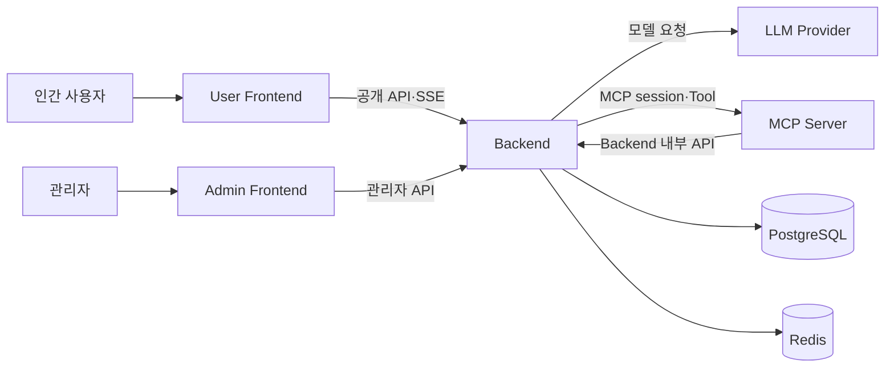

Backend가 시스템의 중심 경계다. Frontend는 DB·Redis·LLM·MCP를 직접 호출하지
않으며, MCP Server도 PostgreSQL·Redis를 직접 접근하지 않는다.

### 3.2 논리적 컴포넌트 구성

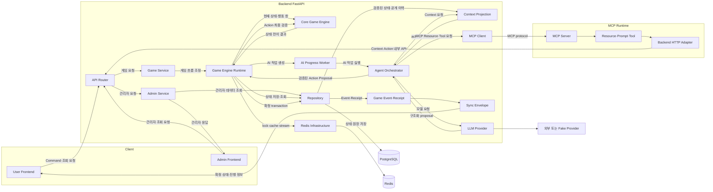

주요 데이터 흐름은 `Client → API Router → Game Service → Game Engine Runtime`에서
시작한다. Runtime은 현재 게임 상태를 확인한 뒤 인간 행동·AI 행동·자동 처리 중
하나를 선택한다. AI 작업은 `AI Progress Worker → Agent Orchestrator → Context /
LLM / MCP`를 거쳐 proposal로 돌아오며, 인간 action과 AI proposal은 모두 Runtime을
통해 Core Game Engine의 최종 검증을 받는다. 검증된 결과는 Repository를 통해
PostgreSQL에 확정 저장되고, Event·Receipt가 Sync Envelope로 변환되어 Frontend에
돌아간다.

Redis는 확정 상태를 전달하는 주 흐름이 아니라 lock·cache·stream을 제공하는 보조
경로다. MCP Server는 Resource·Prompt·Tool을 제공하지만 DB와 Redis를 직접 호출하지
않고 Backend 내부 API adapter를 통해서만 결과를 전달한다.

### 3.3 컴포넌트 책임

| 컴포넌트 | 책임 | 직접 접근하지 않는 대상 |
|---|---|---|
| User Frontend | 사용자 입력, snapshot 표시, sync, feedback | DB·Redis·LLM·MCP |
| Admin Frontend | 관리자 조회와 지표 표시 | DB·Redis 직접 접근 |
| API Router | HTTP 입력 검증과 응답 envelope | 규칙 직접 판정 |
| Game Service | command 조정, transaction, 상태 조회 | 모델 판단 |
| Game Engine | phase, 행동, 대상, 승패 최종 판정 | HTTP·DB·LLM |
| Agent Worker | 열린 AI 작업 탐색과 실행 요청 | 게임 규칙 결정 |
| Agent Orchestrator | job, Context, Provider, proposal, fallback | 승패 직접 결정 |
| Context Projection | public/me/turn/persona scope 분리 | 상태 변경 |
| LLM Provider | 비신뢰 proposal 생성 | 게임 상태 변경 |
| MCP Server | protocol session, Resource, Prompt, Tool adapter | DB·Redis 직접 접근 |
| Repository | SQL 조회·저장과 원장 접근 | LLM·MCP 호출 |
| PostgreSQL | 확정 상태, event, receipt, job 원장 | 모델 추론 |
| Redis | lock, cache, stream 보조 기능 | 확정 승패·원장 대체 |

### 3.4 의존 방향

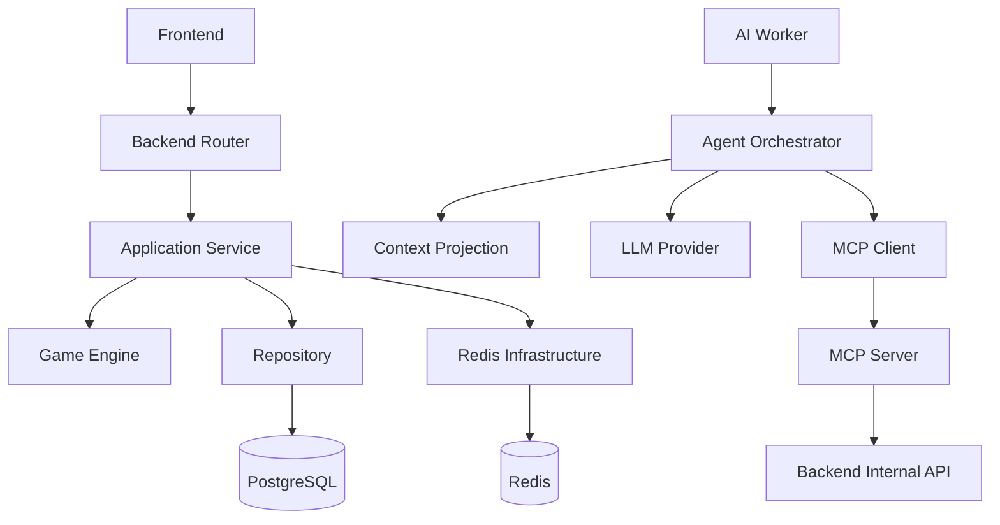

화살표는 호출·의존 방향을 의미한다. Game Engine은 다른 컴포넌트에 의해
호출되지만 DB나 외부 서비스에 의존하지 않는 순수 규칙 계층이다.

## 4. 시스템 상태와 실행 흐름

### 4.1 게임 상태 그래프

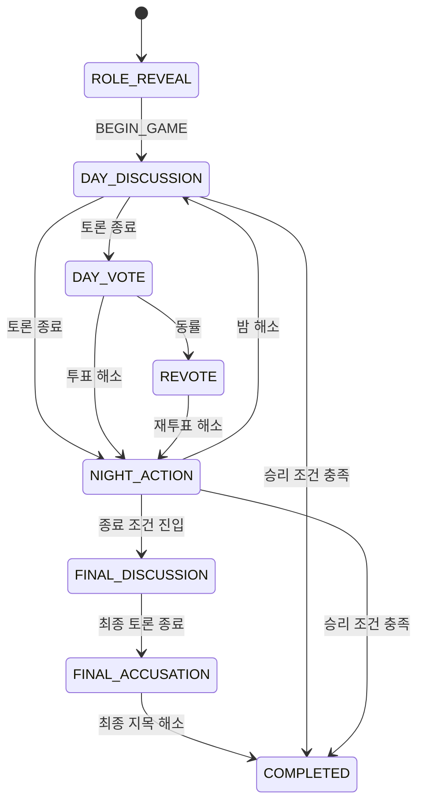

게임 phase 전이는 Frontend나 LLM이 계산하지 않는다. Backend Game Engine이 현재
상태, command, 생존자, deadline, 승리 조건을 검증하고 결정한다.

주요 전이 조건은 다음과 같다.

- 첫날 `DAY_DISCUSSION` 종료 → `NIGHT_ACTION`
- 둘째 날 이후 `DAY_DISCUSSION` 종료 → `DAY_VOTE`
- `DAY_VOTE` 동률 → `REVOTE`
- 일반 투표 해소 후 승패가 없으면 → `NIGHT_ACTION`
- 다섯 번째 밤 이후 → `FINAL_DISCUSSION`
- `FINAL_DISCUSSION` 종료 → `FINAL_ACCUSATION`
- 최종 지목 해소 후 → `COMPLETED`

### 4.2 AI 실행 상태 그래프

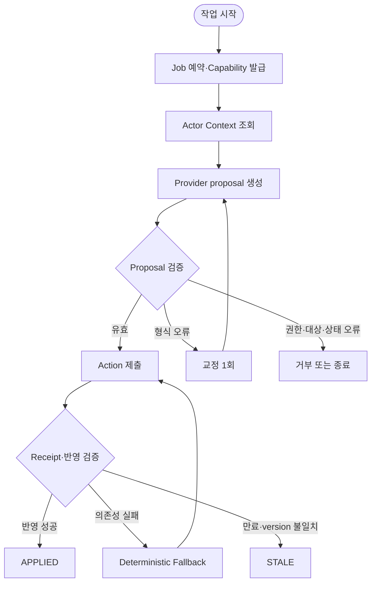

현재 코드에서 이 흐름은 StateGraph runtime이 아니라
`AgentOrchestrator.run()`과 `PostgresRuntime`의 직접 비동기 호출로 구현된다.

### 4.3 사용자 command 처리

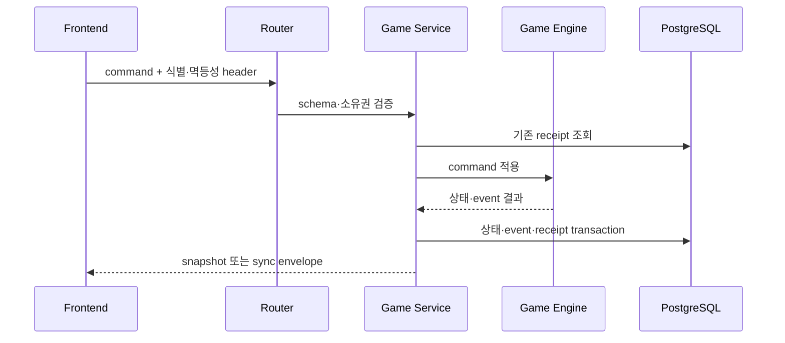

### 4.4 AI 행동 처리

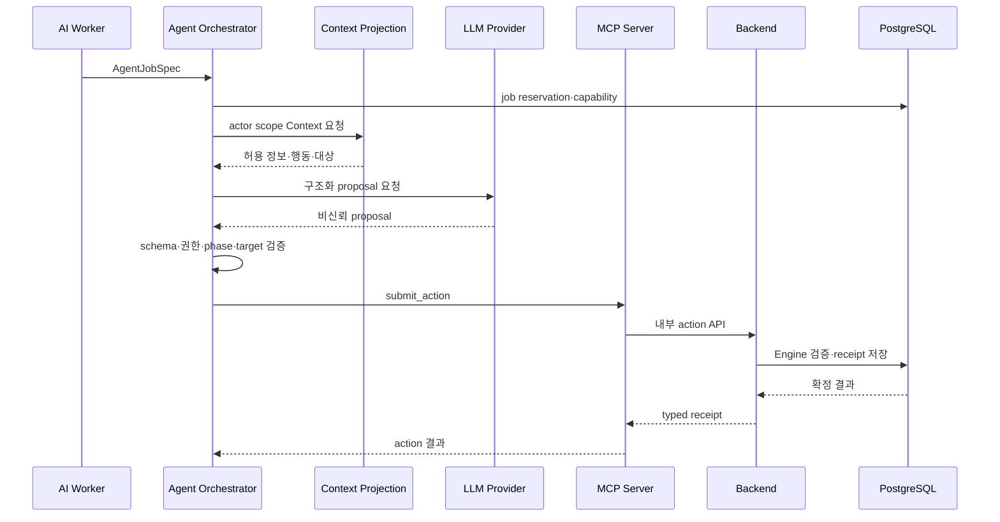

## 5. 데이터 및 인터페이스 계약

### 5.1 식별자와 상태 제어

| 값 | 역할 |
|---|---|
| `user_id` | 사용자 소유권 식별 |
| `game_id` | 게임 경계 식별 |
| `player_id` | actor와 플레이어 식별 |
| `window_id` | 현재 행동 창 binding |
| `state_version` | 낡은 상태 결과 차단 |
| `Idempotency-Key` | 변경 요청 중복 방지 |
| `X-Request-Id` | 요청 추적 |
| `Last-Event-ID` | SSE 재연결 cursor |
| capability | Agent 실행 경계에서 Job 범위를 제한하는 권한 정보; 현재 MCP wire header로 전달하지 않음 |

### 5.2 공개·내부 인터페이스

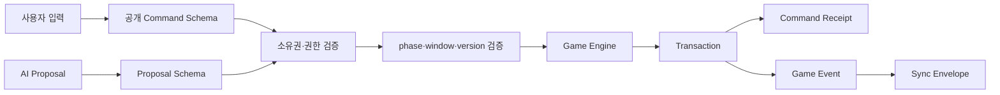

공개 API는 게임 생성·조회·command·sync/SSE·feedback·관리자 조회를 제공한다.
내부 API는 Agent Context와 action 제출을 제공하며 game·actor·window·state binding과
Backend의 내부 검증을 적용한다. Agent job capability의 발급·폐기는 Agent 실행
경계에서 담당하지만, 현재 최소 MCP wire 경로에는 capability header를 전달하지
않는다. capability를 MCP session 인증까지 확장하는 것은 운영 보강 범위다.
상세 field schema는 API 설계서가 소유하고, 구현 계획서는 파일별 사용 필드를
관리한다.

### 5.3 Agent·MCP 계약

```text
Agent → Context
- game_id
- player_id / actor scope
- phase
- window_id
- expected_state_version
- allowed actions / valid targets

Provider → Agent
- type: SPEAK | PASS | VOTE | NIGHT_ACTION
- message: SPEAK에서만 허용
- target_player_id: VOTE/NIGHT_ACTION에서만 허용

MCP → Backend
- game_id
- player_id
- action
- proposal 또는 logical request id
- capability
- expected state binding

Backend → MCP/Agent
- accepted
- replayed
- typed receipt
- result_state_version
```

### 5.4 DB 논리 구조

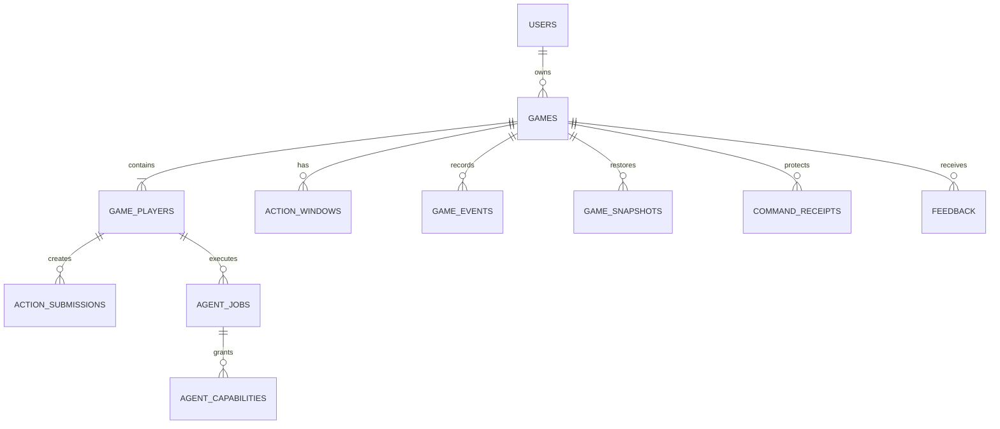

데이터 그룹별 책임은 다음과 같다.

| 데이터 그룹 | 주요 테이블 | 저장 목적 |
|---|---|---|
| 사용자·게임 | `users`, `games`, `game_players` | 소유권과 게임 구성 |
| 진행 상태 | `action_windows`, `action_submissions`, `game_snapshots` | 현재 행동과 재개 |
| 사건 원장 | `game_events`, `command_receipts` | 확정 event와 멱등성 |
| Agent | `agent_jobs`, `agent_capabilities` | 예약·권한·실행 상태 |
| 운영·분석 | `feedback`, `admin_audit_events`, `speech_analysis` | 관리자와 품질 분석 |

### 5.5 데이터 소유권

```text
게임 상태·승패·phase       : Game Engine / PostgreSQL
행동 유효성                 : Backend
AI proposal                 : Agent 실행 경계
확정 action·receipt·event   : Backend / PostgreSQL
공개 cache·lock·stream      : Redis Infrastructure
화면 표시                   : Backend snapshot과 sync 결과
```

## 6. 오류·예외·보안 설계

### 6.1 오류 처리 흐름

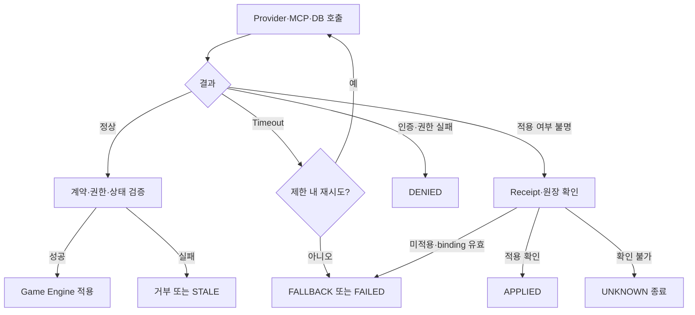

### 6.2 오류 유형별 정책

| 오류 | 처리 |
|---|---|
| 입력 schema 오류 | 요청 단계에서 거부 |
| 소유권·권한 오류 | 접근 거부, 권한 확대 금지 |
| 잘못된 proposal | 교정 1회 또는 fallback |
| Provider timeout | 제한된 retry 후 fallback |
| MCP timeout·Backend 오류 | 오류 분류 후 fallback 또는 안전 종료 |
| target·phase 불일치 | 재시도 없이 거부 |
| state version·window 만료 | `STALE` 처리 |
| receipt 중복 | 기존 결과 replay |
| commit 여부 불명 | 새 action 없이 원장 확인 |
| Redis 장애 | PostgreSQL 기준으로 보조 기능 축소 |

### 6.3 보안·정보 격리

- User Front는 `X-User-Id`와 Backend 소유권 검증을 사용한다.
- Agent Context는 public/me/turn/persona scope를 분리한다.
- 모델이 반환한 actor, 권한, state version으로 서버 binding을 변경하지 않는다.
- Agent job capability는 Agent 실행 범위와 수명을 제한하며, MCP는 요청 binding과
  Backend 검증을 통과한 범위만 전달한다.
- MCP runtime은 DB·Redis에 직접 접근하지 않는다.
- public 응답·activity·cache에 private role, secret, capability 원문을 넣지 않는다.
- 모델의 내부 추론 전문과 raw prompt를 저장·공개하지 않는다.

### 6.4 동시성·멱등성

- Game command는 PostgreSQL transaction으로 확정한다.
- `expected_state_version`으로 낡은 명령을 거부한다.
- `Idempotency-Key`와 `command_receipts`로 중복 결과를 재사용한다.
- AI job은 reservation·lease·fencing으로 늦은 결과를 차단한다.
- Redis lock은 PostgreSQL 원장을 대체하지 않는다.
- 동일 작업의 응답이 불명확할 때 새로운 action을 생성하지 않는다.

## 7. 배포 및 운영 구조

### 7.1 프로세스 구성

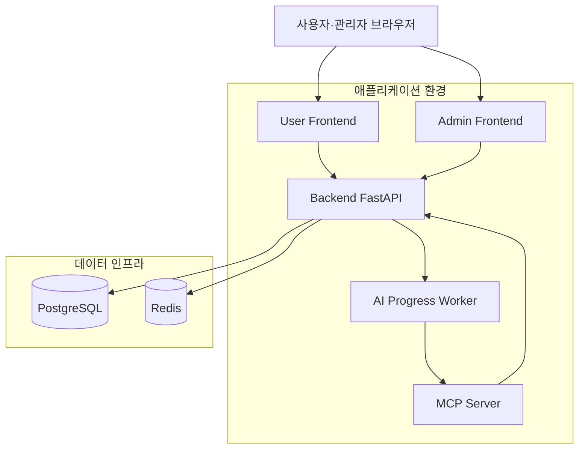

### 7.2 기동 순서

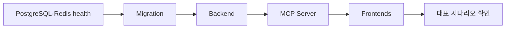

1. PostgreSQL과 Redis health 확인
2. migration과 seed 적용
3. Backend와 AI worker 기동
4. MCP Server 기동
5. User/Admin Frontend 기동
6. `/health`, `/ready` 확인
7. 대표 게임 시나리오 실행

### 7.3 운영 설정

설정은 환경 변수로 주입하며 실제 secret은 문서에 기록하지 않는다.

| 영역 | 설정 예시 |
|---|---|
| Backend | `DATABASE_URL`, `DATABASE_NAME`, `REDIS_URL` |
| MCP | `BACKEND_API_URL`, `MCP_LISTEN_HOST`, `MCP_LISTEN_PORT` |
| Frontend | Backend base URL |
| LLM | Provider 선택, model, timeout, output budget |
| 관리자 | allowlist 설정 |

### 7.4 운영 관찰성

- Backend health/ready
- game event와 command receipt
- Agent activity stage
- MCP audit metadata
- worker 오류와 fallback code
- sync sequence·state version
- 관리자 KPI·feedback·speech analysis

관찰 로그는 실행 단계와 결과 확인에 필요한 metadata만 기록한다. 원문 prompt,
비밀값, private Context, 모델 내부 추론 전문은 운영 로그에 남기지 않는다.
