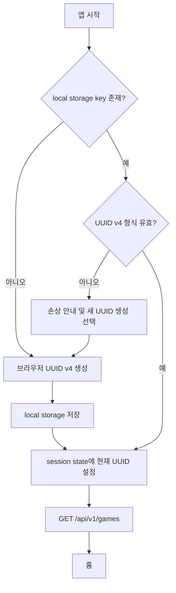
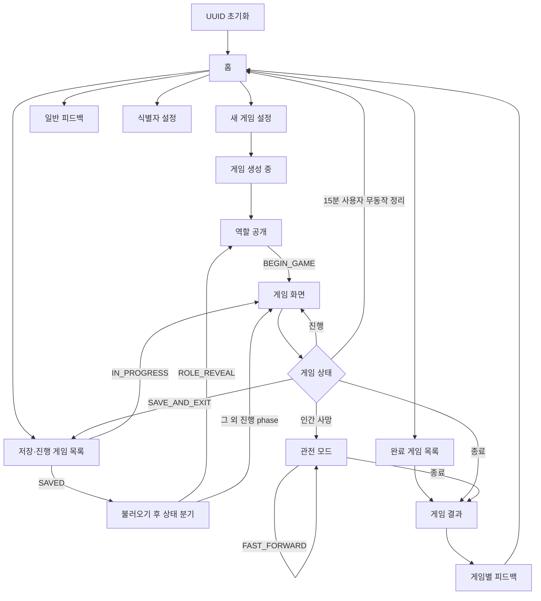
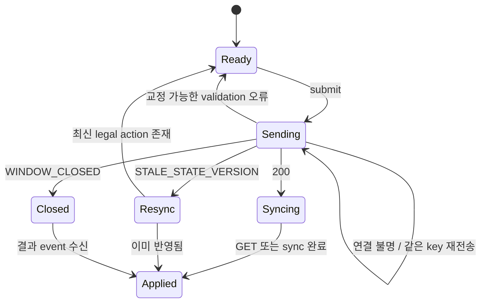
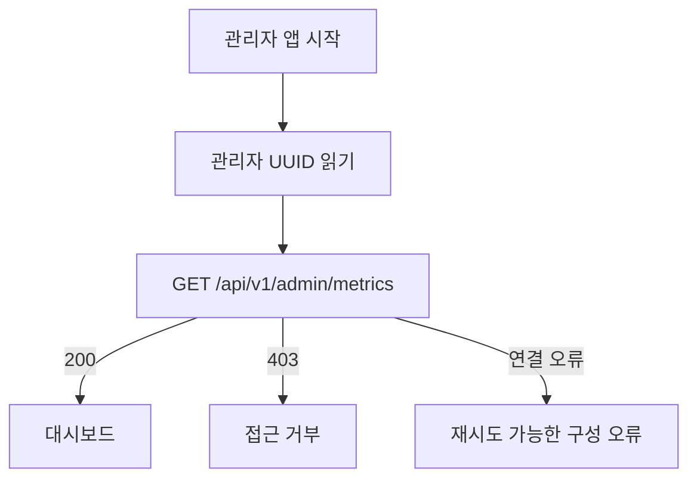

# AI 마피아 MVP 화면 흐름도

**상위 계약:** [AI_MAFIA_MASTER_PLAN.md](../01_core/AI_MAFIA_MASTER_PLAN.md)

**API 계약:** [AI_MAFIA_API_SPEC.md](../01_core/AI_MAFIA_API_SPEC.md)

**대상 UI:** `frontend_user` Streamlit, `frontend_admin` Streamlit

이 문서는 사용자·관리자 화면, 화면 상태, API 호출, 오류 복구와 반응형 동작의
정본이다. 화면은 Backend snapshot과 `legal_actions`를 표현하며 게임 규칙을 자체
판정하지 않는다.

## 1. UX 원칙

- 로그인 화면을 제공하지 않는다. UUID 초기화가 끝나면 바로 홈을 표시한다.
- 사용자가 기억해야 할 핵심은 현재 phase, 내 역할, 남은 시간과 지금 가능한 행동이다.
- 다른 player의 비공개 정보는 DOM, Streamlit session state와 client log에도 넣지 않는다.
- countdown은 안내용이다. 0이 되면 제출 UI를 잠그고 Backend 확정 event를 기다린다.
- 변경 요청을 낙관적으로 성공 처리하지 않는다. Backend terminal 결과를 받은 뒤
  GET 또는 sync로 현재 snapshot을 확인하고 화면을 갱신한다.
- 긴 게임에서 refresh·reconnect·save/resume이 같은 상태를 복원해야 한다.
- 사망 뒤에는 입력보다 관전 정보와 빠른 진행 선택을 명확히 보여 준다.
- 사용자 note, OAuth, 프로필, Provider 비용·token·timeout 설정 UI를 만들지 않는다.

### 1.1 AI 판단·행동 요약

WU-B6 발언·투표 장애 수정에 연결되는 기존 shell에는 `AI 판단과 실행`을 표시한다.
정보 확인 → 판단 → 선택 → 적용의 순서와 최근 actor별 선택 근거 유형을 보여 준다.
같은 actor·상태 버전에서 발생한 fallback·더미·실패 원인은 APPLIED 뒤에도 보존해
모델의 자발적 PASS와 장애로 인한 PASS가 구분되어야 한다. AI 판단과 실행 전체는
기본적으로 접힌 expander로 제공하며 펼치면 장애와 최근 기록의 UTC 시각·단계·근거를 표시한다.
공개 근거는 API 2.4.1절의 코드에서 만든 한국어 요약만 사용하고, 자유 형식
Provider rationale·비공개 컨텍스트·내부 사고 원문은 표시하지 않는다.

기존 게임 shell의 공개 대화 옆에 작은 `AI 진행` 영역을 둔다. 각 AI의 공개 발언
단계(정보 확인 → 판단 중 → 행동 선택 → 적용 완료)와 짧은 처리 요약을 표시하고
자세한 최근 기록은 접어 둔다. `판단 요약은 처리 상태를 설명하며 내부 사고 원문이
아닙니다`라는 짧은 설명을 둔다. 표시 계약은 API 2.4.1절을 따른다.

밤과 투표에는 대상·역할·개별 응답 여부 대신 공통 비공개 단계 안내를 표시한다.
로그가 없는 AI는 대기, 탈락자는 탈락으로 구별한다. 새 window로 넘어간 과거 기록을
현재 진행으로 표시하지 않으며 서버 재시작 뒤에는 최근 상태가 없음을 자연스럽게
처리한다. 색상·카드 구성은 기존 디자인을 유지하고 공통 버튼/입력의 글자 대비만
보정한다.

## 2. 브라우저 사용자 UUID

### 2.1 저장 key

| 앱 | same-origin local storage key |
|---|---|
| 일반 사용자 `:8501` | `ai_mafia_user_id_v1` |
| 관리자 `:8502` | `ai_mafia_admin_user_id_v1` |

port가 다른 두 앱은 local storage origin이 다르므로 값을 공유한다고 가정하지 않는다.
Streamlit custom component는 UUID 문자열만 읽고 쓰며 Backend secret이나 게임
snapshot을 저장하지 않는다.

### 2.2 초기화 흐름



- UUID 생성은 browser crypto API를 사용한다. 시간·난수 결합의 자체 UUID 구현을
  사용하지 않는다.
- Streamlit rerun 때마다 UUID를 새로 만들지 않는다.
- Backend 목록 요청 실패는 UUID를 삭제하거나 바꾸지 않는다.
- local storage가 차단된 브라우저에서는 UUID를 session 안에서만 임시 유지하고
  게임 복구가 보장되지 않는다는 경고를 표시한다.

### 2.3 식별자 보기·복구

설정 drawer의 `내 게임 식별자`에서 현재 UUID를 확인·복사할 수 있다. 복구 입력은
다음 절차를 따른다.

1. UUID v4 형식을 client에서 검사한다.
2. `이 식별자는 비밀번호가 아니며 아는 사람이 같은 게임을 볼 수 있습니다` 경고를
   표시한다.
3. 확인 modal에서 현재 UUID 교체를 한 번 더 승인받는다.
4. 새 값을 local storage와 session state에 저장하고 게임 cache를 모두 비운다.
5. `GET /api/v1/games`를 호출해 새 scope의 홈으로 이동한다.

서버 기반 계정 찾기, 이메일 복구와 UUID 병합은 없다. UUID를 잃어버리면 기존 게임을
복구할 수 없음을 첫 게임 생성 전 한 번 안내한다.

## 3. 전체 사용자 흐름



## 4. 공통 화면 shell

### 4.1 상단 bar

- 좌측: `AI 마피아` wordmark, 누르면 홈 이동
- 중앙: 게임 안에서는 scenario 제목, day·round와 phase badge
- 우측: 연결 상태, 저장 버튼, 설정 drawer
- 모바일: wordmark와 phase만 남기고 나머지는 overflow menu로 이동
- 홈을 제외한 모든 사용자 화면은 상단 bar 바로 아래에 실제 `뒤로가기`와 `홈`
  button을 표시한다. 모바일에서도 두 button을 숨기지 않는다.
- `뒤로가기`는 앱 내부에서 직전에 방문한 화면으로 이동하고 방문 기록이 없으면 홈으로
  이동한다. 다만 진행 중인 역할 공개·게임·관전 화면은 이동 전에 10.1절의 저장·삭제
  팝업을 자동으로 연다. 팝업을 열기만 해서는 command를 제출하거나 게임·입력·결과 불명
  요청을 삭제하지 않는다. 일반 `홈` 이동은 방문 기록을 비우고 게임·입력·결과 불명 요청을
  보존하며, 홈 목록 cache만 무효화해 최신 상태를 다시 조회한다.

연결 상태:

| 표시 | 조건 | 동작 |
|---|---|---|
| `실시간 연결` | SSE가 최신 Front sequence까지 적용됨 | 없음 |
| `다시 연결 중` | SSE 끊김, polling 복구 중 | command 중복 전송 금지 |
| `상태 확인 필요` | sync도 실패 | retry와 홈 이동 제공 |

### 4.2 공통 message

- global 오류는 상단 고정 banner로 표시한다.
- field validation은 해당 입력 바로 아래 표시한다.
- 일시적 성공 toast는 command type과 결과만 말하고 비공개 target을 공용 log에 쓰지
  않는다.
- request ID는 오류 상세 `문제 해결 정보`를 펼쳤을 때만 보여 준다.

### 4.3 로딩 skeleton

앱 시작, 게임 생성, snapshot 최초 로드에는 레이아웃 크기가 유지되는 skeleton을
사용한다. spinner만 있는 빈 화면을 만들지 않는다. 10초 이상 응답이 없어도 LLM
timeout 설정 UI를 표시하지 않으며 Backend 연결 오류 복구 UI만 제공한다.

## 5. 홈

### 5.1 목적

새 게임 시작과 기존 게임 복귀를 한 화면에서 제공한다.

### 5.2 구성

```text
[AI 마피아 소개와 새 게임 시작 CTA]

[이어하기]
  진행 중 또는 저장 게임 card 최대 3개

[최근 완료 게임]
  결과 card 최대 3개

[게임 방법] [일반 피드백] [내 게임 식별자]
```

게임 card:

- scenario 제목
- `진행 중`, `저장됨`, `완료`, `복구 필요` status badge
- day·round·phase
- 마지막 갱신 상대 시각
- `계속하기`, `불러오기`, `결과 보기` 중 하나

API:

- 진입: `GET /api/v1/games?limit=20`
- 빈 목록: 오류가 아닌 첫 게임 안내
- 새로고침: 같은 endpoint, UUID는 유지

홈을 떠날 때 목록 cache를 비우고 수동 `목록 새로고침`을 제공한다. 조회 후 30초가
지났으면 다음 홈 실행에서 재조회한다. 조회 실패는 자동 반복하지 않고 재시도
입력을 기다린다. cache 만료 갱신 전에 같은 실행의 홈·설정 버튼 입력을 처리하여
새 게임·UUID 확인 클릭을 재실행으로 소실하지 않는다. 최신 20개 안에서 이어하기·최근 완료·복구 필요 목록을 각각 최대
3개 표시한다. 일반 피드백 버튼은 GENERAL 피드백 화면으로 연결한다.

## 6. 새 게임 설정

### 6.1 입력

- 전체 인원 segmented control: `6`, `7`, `8`, `9`
- 선택 인원별 역할 구성 preview
- 규칙 요약: 인간 1명, 첫날 무투표, 밤 30초, 투표 30초, 최대 밤 5회
- `게임 만들기` primary button
- `취소` secondary button

`STANDARD`에서는 시나리오, 역할과 persona를 사용자가 고르지 않는다. 반복 플레이
편향을 줄이기 위해 Backend가 결정적으로 선택한다. `CUSTOM_ROLE`의 인간 자유 직업
선택은 이 문서의 CP-0 절을 따른다.

### 6.2 제출

```http
POST /api/v1/games
{
  "player_count": 6,
  "ruleset_version": "mystery-v1",
  "scenario_version": "scenario-v1"
}
```

- button을 누를 때 UUID v4 `Idempotency-Key`를 한 번 만들고 terminal 응답 전까지
  session state에 보관한다.
- 처리 중 button과 인원 입력을 잠근다.
- 네트워크 결과를 모르면 같은 key와 body로만 재시도한다.
- 성공 직후 실제 snapshot.players의 이름을 표시하는 생성 완료 화면으로 이동하고
  역할 공개로 이어진다. 새 생성 화면 진입에서는 이전 SUCCEEDED 상태만 제거하며
  결과 불명 요청의 key와 body는 보존한다.
- 성공하면 응답의 `snapshot_url`을 GET하고 현재 snapshot으로 역할 공개 또는 이미
  진행된 게임 화면으로 이동한다.

## 7. 역할 공개

### 7.1 표시

- scenario 제목, 배경, 피해자와 장소
- `내 역할` card
- 역할 능력과 승리 조건 한 줄 설명
- 자신의 알리바이와 관찰 정보
- 전체 인원과 시작 마피아 수
- `게임 시작` button

다른 player의 role, persona private prompt와 seed는 화면 상태에 존재하지 않아야 한다.
마피아여도 다른 마피아를 알려주지 않는다.

### 7.2 시작

`게임 시작`은 `BEGIN_GAME` command다. 성공 전에 게임 화면으로 낙관 이동하지 않는다.
성공하면 sync하고, stale version이면 최신 snapshot을 받아 이미 시작됐는지 확인한 뒤
게임 화면으로 복구한다.

## 8. 게임 화면

### 8.1 Desktop 배치

```text
┌────────────────────────────────────────────────────────────┐
│ scenario / day·phase / connection / save                  │
├────────────────────────────────────────────────────────────┤
│ 현재 행동 panel: 안내 / countdown / target / submit      │
├───────────────┬──────────────────────────────┬─────────────┤
│ 플레이어 목록 │ 사건·공개 대화·결과 timeline │ 내 정보     │
│ 생존·탈락     │                              │ 역할·사실   │
└────────────────────────────────────────────────────────────┘
```

- 현재 행동 panel은 생존자의 진행 화면에서 phase 제목 바로 다음에 한 번만 표시한다.
- 공개 timeline은 행동 입력이 있는 밤·일반 투표·재투표·최종 지목에서도 같은 중앙
  열에 계속 표시한다.
- 인간에게 제출할 행동이 열려 있는 동안 현재 행동과 남은 시간을 요약한 bar를 화면
  하단에 고정한다. 새 인간 행동 window는 한 번만 행동 panel로 이동하고 첫 입력 또는
  panel 제목에 focus를 둔다.

### 8.2 Mobile 배치

- 상단: phase·countdown sticky bar
- 본문: timeline 한 column
- player 목록과 내 정보: 접을 수 있는 sheet
- 행동 panel: 화면 하단 sticky 영역, safe-area 반영
- target button은 최소 44px touch target을 유지한다.
- dialog와 sheet 안에서만 page scroll이 잠기며 focus가 바깥으로 나가지 않는다.

### 8.3 플레이어 목록

- 좌석순으로 표시한다.
- 생존, 밤 사망, 처형과 내 player를 색상 이외 icon·text로도 구분한다.
- 처형 role만 즉시 표시하고 밤 사망 role은 숨긴다.
- target을 선택하는 phase에는 `valid_targets`만 활성화한다.
- 자기 자신 금지 규칙은 disabled 표시뿐 아니라 Backend validation에 의존한다.

### 8.4 공개 timeline

event를 `front_sequence` 순으로 표시한다.

| Event | 화면 표현 |
|---|---|
| `GAME_BEGAN` | 사건 안내와 고정 시작 문장 |
| `TURN_OPENED` | 현재 발언자 강조 |
| `PLAYER_SPOKE` | player 이름과 최대 200자 발언 bubble |
| `PLAYER_PASSED` | `발언을 넘겼습니다` compact row |
| `NIGHT_RESOLVED` | 사망자 또는 `사망자가 없습니다` |
| `VOTE_RESOLVED` | 후보별 득표수, 동률·재투표 안내 |
| `PLAYER_EXECUTED` | 탈락 player와 공개 role |
| `GAME_SAVED` | 저장 시각 안내 |
| `GAME_ENDED` | 승리 진영과 결과 CTA |

HTML을 허용하지 않고 plain text로 렌더링한다. 내부 event payload 전체를 debug UI로
출력하지 않는다.

### 8.5 내 정보 panel

- 역할 badge와 능력 설명
- 알리바이·관찰 정보
- 탐정의 과거 조사 결과
- 현재 생존·관전 상태
- 의사의 보호 선택은 해당 밤 제출 완료 여부만 보여 주고 성공 여부는 표시하지 않는다.
- 공격·보호·투표 target은 public timeline에 표시하지 않는다.

## 9. Phase별 행동 UI

| Phase·상태 | 안내 | 입력 | 완료 후 |
|---|---|---|---|
| `DAY_DISCUSSION`, 발언 가능 | 최대 200자 발언, 첫날은 인간·AI 모두 PASS 금지 | 발언 입력, 글자수, 첫날에는 `PASS` 숨김 | 서버 legal action·deadline에 따른 제어 |
| `DAY_DISCUSSION`, 다른 차례 | 현재 발언자 표시 | 없음 | event 대기 |
| `NIGHT_ACTION`, 마피아 | 공격 대상 선택, 30초 | target radio, 제출 | 대상 비공개 유지 |
| `NIGHT_ACTION`, 탐정 | 조사 대상 선택, 30초 | target radio, 제출 | private 결과 event 대기 |
| `NIGHT_ACTION`, 의사 | 보호 대상 선택, 30초 | target radio, 제출 | 성공 여부 숨김 |
| `NIGHT_ACTION`, 시민 | 밤이 지나가는 중 | 없음 | 결과 대기 |
| `DAY_VOTE` | 처형 후보 선택, 30초 | target radio, 투표 | 집계 전 선택 비공개 |
| `REVOTE` | 동률 후보 중 선택, 30초 | 축소 target radio | 결과 대기 |
| `FINAL_DISCUSSION` | 마지막 발언 또는 넘기기 | 낮과 같은 입력 | 최종 지목 대기 |
| `FINAL_ACCUSATION` | 마지막 대상 선택, 30초 | target radio, 투표 | 종료 결과 대기 |
| 인간 사망 | 관전 안내 | `빠른 진행`, `저장하고 나가기` | 공개 event와 기존 본인 정보 표시 |
| `SAVED` | 저장 상태 | `불러오기` | 같은 phase 복원 |
| `COMPLETED` | 승리 진영 | `결과 보기` | 결과 화면 |

### 9.1 countdown

- 투표·재투표·최종 지목의 흰색 행동 패널에는 제목, 안내·잔여 시간, 공개 요약,
  후보 이름과 생존 표기를 검은색(`#000000`)으로 지정한다. 다크 테마에서도
  동일하게 읽을 수 있어야 하며 파란 제출 버튼의 글자는 기존 흰색을 유지한다.
- snapshot의 `server_time`, `deadline_at`, `remaining_ms`로 최초 offset을 계산한다.
- 10초 남은 밤 행동, 15초와 5초 남은 투표에 시각·텍스트 경고를 준다.
- 새 인간 행동과 10초·15초·5초 경고는 `aria-live=polite`에서 임계값이 바뀔 때만
  읽는다. 매초 변하는 시각 countdown을 live region으로 반복해서 읽지 않는다.
- browser timer가 0이 되면 submit button을 비활성화하지만 자동 target을 client에서
  선택하거나 제출하지 않는다.
- server가 `WINDOW_CLOSED`를 반환하면 결과 sync로 전환한다.
- tab background·sleep 뒤 복귀하면 local countdown을 믿지 않고 즉시 sync한다.

### 9.2 command 제출 상태



- 한 화면 action마다 한 `Idempotency-Key`만 유지한다.
- response를 받지 못했다고 새 key로 자동 재전송하지 않는다.
- `ACTION_ALREADY_SUBMITTED`이면 snapshot을 다시 받아 제출 완료 상태를 표시한다.
- stale sync 후 원래 target이 더 이상 유효하면 자동으로 다른 target을 선택하지 않는다.

## 10. 저장과 불러오기

### 10.1 저장

- 상단 `저장하고 나가기`를 누르면 현재 phase·남은 시간이 저장된다는 확인 modal을
  표시한다.
- command 처리 중 또는 server resolution 중에는 button을 잠시 비활성화한다.
- 성공 뒤 local game cache를 비우고 홈의 `이어하기` section으로 이동한다.
- 저장 실패 시 게임 화면에 남고 UUID·현재 snapshot을 삭제하지 않는다.
- 저장은 화면의 최신 버전 일치를 요구하지 않고 마지막으로 확정된 진행 상황을 사용한다.
  팝업에는 작성 중인 입력·처리 중인 응답이 포함되지 않을 수 있음을 안내한다. 저장 전
  최신 화면을 맞추기 위한 반복 조회·재확인은 요구하지 않으며 실제 저장 단계·시간은
  서버가 확정한다.
- 진행 중 게임의 `뒤로가기`는 즉시 이동하지 않고 `저장하고 나가기`, `게임 삭제`,
  `계속 플레이` 팝업을 연다. 저장은 기존 확인 흐름으로, 삭제는 복구 불가 안내를
  표시한 뒤 사용자의 명시적 선택으로만 실행한다. 취소·닫기는 게임 화면을 유지한다.
- 삭제 성공 또는 삭제 요청의 404 확인 뒤 홈으로 이동하고 해당 게임 cache와 홈 목록을
  비운다. 삭제 실패·응답 유실은 화면에 머물며 재확인을 제공한다. 버전이 바뀌면 최신
  snapshot을 다시 확인한 뒤 사용자가 다시 선택해야 한다. 이미 저장된 게임·결과와
  일반 화면의 뒤로가기는 기존 방문 기록 이동을 유지한다.

### 10.2 불러오기

1. card 선택 시 `GET /games/{game_id}`로 최신 상태를 확인한다.
2. `SAVED` snapshot에 action window가 있으면 `paused=true`, `deadline_at=null`이다.
   timed window의 `remaining_ms`는 동결 표시만 하고 countdown을 시작하지 않는다.
   `ROLE_REVEAL`처럼 window가 없는 저장 상태는 `action_window=null`이다.
3. 사용자가 `불러오기`를 눌러 `RESUME` command를 제출한다.
4. 성공 뒤 GET 또는 sync한 현재 snapshot을 기준으로 화면을 다시 분기한다.
   `ROLE_REVEAL`이면 역할 공개로, 다른 phase면 게임 화면으로 이동한다.
5. timed window만 새 `deadline_at`으로 countdown을 시작한다. untimed 발언 window는
   deadline 없이 복원한다.
6. 이미 다른 tab에서 재개됐다면 stale snapshot을 교체하고 현재 phase 화면으로 이동한다.

`IN_PROGRESS` game card의 `계속하기`는 `RESUME`을 보내지 않고 snapshot만 연다.
게임 생성 또는 마지막 성공 command 뒤 15분 동안 새 사용자 command가 없으면 Backend가
해당 `IN_PROGRESS` 게임을 삭제한다. 화면 조회·SSE·polling과 AI 자동 진행은 이 시간을
연장하지 않는다. 목록 갱신에서는 card가 사라지고, 이미 열린 화면의 다음 조회·command가
`404 GAME_NOT_FOUND`를 받으면 기존 게임 불러오기 오류를 표시한다. 사용자가 `홈으로 이동`을
선택하면 로컬 game ID를 비우고 홈으로 돌아간다. 삭제 여부와 소유권 오류는 화면에서
구분하지 않는다. 저장·완료·실패 게임은 이 자동 정리 흐름에 포함하지 않는다.

## 11. 관전과 빠른 진행

- 인간 player의 `alive=false`를 받은 즉시 입력 panel을 제거한다.
- `관전 중` badge와 `게임은 AI 플레이어끼리 계속 진행됩니다` 안내를 고정한다.
- 공개 timeline, 생존자, 후보별 투표 결과, 밤 사망자와 이미 허용된 본인의 역할·개인
  정보만 볼 수 있다.
- 다른 player의 role·private event는 종료 전 보여 주지 않는다.
- `FAST_FORWARD`는 한 번 확인 후 제출하고 snapshot의
  `fast_forward_enabled=true`를 받은 뒤 활성화 상태를 표시한다.
- 빠른 진행 중에도 SSE Front sequence 순서, 공개 범위와 확정 RNG 결과를 그대로
  사용한다.
- 사용자가 화면을 닫아도 Backend 진행과 deadline은 중단하지 않는다.

## 12. 결과 화면

결과 화면의 밝은 summary·역할·기록 카드에는 짙은 전경색을 명시한다. 특히
`▣ 게임 기록 보기`의 밤·투표 원장 `st.text`, 공개 발언, 날짜 caption과 요약 metric은
브라우저/Streamlit 다크 테마의 밝은 글자색을 상속하지 않아야 한다. 기록 카드는
옅은 회청색 배경·분명한 테두리, 본문은 짙은 남색, 보조 문구는 회청색으로 구별한다.
승리 배너의 흰색 글자와 어두운 배경은 그대로 유지한다.

### 12.1 구성

- 승리 진영과 종료 이유
- scenario, 전체 day·round와 주요 사건 요약
- 전체 player의 최종 role과 탈락 시점
- 밤별 공격·보호·조사 결과
- 일반·재·최종 투표의 player별 선택과 자동 선택 여부
- 주요 공개 발언 timeline
- `게임별 피드백`, `새 게임`, `홈으로` CTA

결과의 승패·역할·행동 집계는 `status=COMPLETED` snapshot의 `result`만 사용한다.
공개 타임라인은 같은 snapshot의 `public_events` 중 `result.public_event_ids`에 명시된
이벤트만 표시할 수 있다. 최종 지목의 확정 대상이 result에 없으면 집계로 추정하지 않는다.
Front가 event를
조합해 승패나 숨은 역할을 추측하지 않는다. `FAILED` game은 공개 가능한 마지막 상태와
고정 복구 불가 안내만 보여 주고 전체 비공개 정보를 열지 않는다.

## 13. 피드백 화면

### 13.1 일반 피드백

- 홈에서 접근한다.
- 별점 1~5, 선택 comment 최대 1000자, tag 최대 5개다.
- 제출 성공 뒤 입력을 비우고 홈으로 돌아간다.

### 13.2 게임별 피드백

- 완료 결과 화면에서만 접근한다.
- game ID와 scenario 제목은 읽기 전용으로 표시한다.
- 같은 game에 이미 제출했다면 form 대신 완료 안내를 표시한다.
- 입력을 게임 note로 저장하거나 Agent에 전달하지 않는다.

두 화면 모두 submit 때 새 idempotency key를 만들고 terminal 응답 전까지 유지한다.

## 14. 오류·복구 화면

| API code·상황 | 사용자 동작 |
|---|---|
| `MISSING_USER_ID`·손상 UUID | 식별자 초기화 화면으로 이동 |
| `GAME_NOT_FOUND` | `이 식별자에서 게임을 찾을 수 없습니다`, 홈 이동 |
| `STALE_STATE_VERSION` | 입력 보존 없이 즉시 sync, 최신 action 재확인 |
| `ACTION_ALREADY_SUBMITTED` | snapshot refresh 후 제출 완료 표시 |
| `WINDOW_CLOSED` | action panel 잠금, 결과 event sync |
| `PLAYER_DEAD` | 관전 mode snapshot으로 교체 |
| `INVALID_PHASE` | snapshot refresh, 계속되면 홈·request ID 제공 |
| `GAME_BUSY` | 짧은 backoff 뒤 같은 읽기 sync, mutation 자동 새 key 금지 |
| `DEPENDENCY_UNAVAILABLE` | 현재 화면과 UUID 유지, 재시도 button |
| SSE disconnect | `다시 연결 중`, polling fallback |
| local storage 사용 불가 | session-only 경고와 UUID 복사 안내 |

validation 오류는 사용자가 수정한 뒤 새 request body에 새 idempotency key를 사용한다.
결과 불명 네트워크 오류만 원래 key를 재사용한다.

## 15. 관리자 화면

관리자 앱은 별도 origin이므로 최초 실행에 allowlist UUID를 직접 입력해
`ai_mafia_admin_user_id_v1`에 저장한다. 로그인·비밀번호 UI로 표현하지 않는다.

### 15.1 접근 확인



- `403`이면 dashboard component와 partial data를 렌더링하지 않는다.
- 정상 연결 시에는 관리자 식별자 UI를 표시하지 않고 관리자 화면으로 진입한다.
- UUID 최초 설정·권한 오류 시에만 입력 카드와 교체 확인 절차를 표시한다.
- 공개 인터넷에서 사용할 수 있는 관리자 인증이라고 안내하지 않는다.

### 15.2 대시보드

관리자 화면은 다음 네 탭으로 나누어 운영자가 필요한 정보를 한눈에 확인한다.

- **운영 분석**: 전체 사용자·누적 게임·완료율·시민/마피아 승률, 평균 round,
  진영별 승리 도넛, 에이전트 페르소나별 얇은 승률 그래프와 날짜별 노란색 생성 추이
- **사용자 피드백**: 평균 피드백 점수, 종류·평점 필터, 사용자 의견과 커서 페이지 이동
- **관리자 로그**: `AI Agent 행동`(기본)과 `관리자 조회 이력`을 선택한다.
  AI 행동은 API 7.11의 작업 종류·처리 상태·게임 UUID 필터, 생성·완료 시각,
  에이전트 이름, 실패 코드와 작업·게임·플레이어·window ID·예약 버전을 표시한다.
  관리자 조회 이력은 기존 조회 유형 필터와 요청·대상 식별자를 유지한다.
  두 목록은 20건씩 이전/다음 페이지를 이동하며 필터·식별자 변경 시 첫 페이지로
  돌아간다. 잘못된 게임 UUID는 안내와 빈 목록을 표시하고 조회하지 않는다.
  생성 성공·대체 결과 생성은 실제 반영 완료와 구분하고, 작업별 현재 상태임을 안내한다.
- **AI 발언 분석**: 공개 AI 발언의 임베딩 유사 주제 히트맵, 원문 키워드 빈도,
  페르소나별 발언 비중·stance와 대표 근거 발언
- 최근 게임 목록·종료 게임 수 KPI는 요약 화면에서 제외한다.
- 진행 중 role·개별 행동·private context는 표시하지 않는다.
- 수정, 강제 종료, 삭제, Provider 변경과 LLM 비용·token·timeout panel은 없다.

### 15.3 관리자 로컬 데모 미리보기

WU-F8 화면 개발 시 `ADMIN_DEMO_MODE=true`에서만 합성 데이터로 미리볼 수 있다.
공개 테스트 문자열 `demo_ai_mafia_admin_v1`은 로컬 가상 클라이언트의 연결 시험용이며,
실제 관리자 인증 키가 아니다. 실 API header나 Backend 권한 계약에 추가하지 않는다.
키 입력 실패 시 예시 데이터도 숨기고 재입력할 수 있게 한다.
페르소나별 집계·사용자 수·피드백·감사 로그·AI 발언 분석·AI 작업 로그는 API 명세 7.4~7.11에 따라 운영 모드에서도
조회한다. 데모는 같은 필드의 합성 응답을 제공하고 화면에 가상 데이터임을 표시한다.
운영 분석 화면은 metrics, persona-win-rates와 metrics.daily_games, 피드백/로그는
feedback와 선택한 로그에 따른 agent-jobs 또는 audit-logs를 사용한다. 운영 분석에는 전체 사용자·누적 게임·완료율·진영별
승률·평균 라운드 KPI를 중복 없이 배치한다. 페르소나 상세 수치는 그래프 옆 상세 정보
팝오버에서 확인한다. 목록은 필터 변경 시 첫 페이지로
돌아가며 이전/다음
버튼으로 읽는다. 감사 로그의 필터는 저장된 이벤트 종류이며 가상의 로그 등급이 아니다.
운영 분석 fragment는 30초마다 Backend를 다시 조회하며 그래프 위에 실시간 API 또는 가상
데이터 상태, 마지막 조회 시각, 자동 갱신 주기와 즉시 새로고침 버튼을 표시한다.
실제 관리자 모드는 기존 UUID allowlist를 유지하고 데모 오류로 자동 전환하지 않는다.
가상 게임 1,200건은 20건씩 페이지를 선택하며 상태 필터별 페이지를 구분한다.
진영별 승리는 도넛 차트와 승리 횟수·비율 텍스트를 함께 표시한다.
페르소나별 AI 집계는 종료된 합성 게임에서 사람 좌석을 제외하고 계산하며, 페르소나의
성격 요약만 설명용으로 표시한다.

AI 발언 분석은 `GET /api/v1/admin/speech-analytics`를 사용한다. 화면은 분석 버전과
대상 발언·임베딩·주장 완료 수를 표시한다. 기간·에이전트·라운드·게임 UUID 조건을
적용할 수 있으며, 주제 선택 시 해당 주제의 대표 원문과 최대
5개 공개 근거를 펼친다. 히트맵과 비율 그래프는 표본 상한·부분 완료를 숨기지 않으며,
키워드와 같은 주제의 표현은 동의어 확정이 아닌 원문 동시 출현 후보로 안내한다.
벡터·role·faction·개별 행동·투표·private context는 표시하지 않는다.
팀 DB의 전체 기간 집계가 일반 조회보다 오래 걸릴 수 있으므로 발언 분석 GET만
최대 30초를 기다리고, 나머지 관리자 요청은 기존 5초 제한을 유지한다. 제한 시간을
넘거나 403을 받으면 기존 fail-closed 오류 처리를 유지하며 자동 재시도하지 않는다.

## 16. 화면 상태 소유권

| 상태 | 원본 | Front 저장 범위 |
|---|---|---|
| `user_id` | browser local storage | session state mirror |
| game snapshot | Backend | 현재 화면 session cache |
| `state_version`·`front_sequence`·`operation_index` | Backend | 마지막 적용 batch 위치 |
| idempotency key | Front | 요청 terminal 결과까지 session state |
| countdown | Backend deadline | 표시용 계산값 |
| 선택 중 target·message | 사용자 입력 | 현재 form session state |
| role·private event | Backend projection | 현재 game session에만, local storage 금지 |
| 연결 상태 | Front transport | session state |

URL query parameter에는 `user_id`, role, private 정보와 capability를 넣지 않는다. URL은
필요하면 opaque `game_id`만 포함하고 Backend 소유권 검사를 항상 거친다.

## 17. 동기화 전략

1. 게임 진입 시 `GET /games/{game_id}` snapshot과 `last_sequence`를 받는다.
2. SSE를 열고 마지막 Front sequence 이후 완전한 `game_sync` batch를 적용한다.
3. SSE가 끊기면 `GET /sync` polling으로 전환한다.
4. `(game_id, front_sequence, operation_index)` 중복은 무시한다.
5. Front sequence·batch index gap, 불완전 batch, 알 수 없는 operation 또는 local
   version 역행을 발견하면 batch를 부분 적용하지 않고 전체 snapshot을 다시 받는다.
6. snapshot 교체 시 제출 중 idempotency receipt 결과를 확인하기 전 같은 command를
   새 key로 만들지 않는다.

`mode=SNAPSHOT` 응답은 `operations=[]`이며 snapshot을 한 번만 교체한다. delta는
sequence별 모든 operation을 받은 뒤 하나의 UI 갱신으로 적용해 같은 transaction의
phase와 action panel이 중간 상태로 보이지 않게 한다.

Streamlit rerun은 transport reconnect를 일으킬 수 있으므로 화면 widget state와
authoritative game state를 분리한다. callback 안에서 domain phase를 직접 바꾸지 않는다.

자동 sync·AI 진행·공개 기록 갱신은 채팅 입력 영역을 로딩 상태로 만들지 않는다.
countdown 표시는 입력과 분리해 갱신하며, 같은 자유 토론 안에서 AI 예약 window가
교체돼도 작성 중인 초안·선택·포커스를 유지한다. 실제 단계·행동 허용·생존 상태의
변경은 서버 snapshot에 맞춰 입력을 갱신한다. 발언과 PASS 제출에는 같은 게임의
최신 검증 상태를 사용하고, 결과 불명 요청의 기존 body와 idempotency key는 보존한다.
Shift+Enter로 작성한 줄바꿈은 전송 전에 공백으로 정리한다. 자유 토론의 연속 발언은
Front 세션의 대기열에 입력 순서대로 예약하며, 전송 중에도 다음 발언을 입력할 수 있다.
예약 내용과 대기 상태를 표시한다. 동일 토론 범위에서 확정된 버전/창 충돌은 최신
상태로 자동 재시도하고, 발언 빈도 제한은 예약 순서를 유지하며 기다린다. 응답 불명
요청은 최초 body/key로만 재확인한다. 입력 형식 오류는 원문을 보존해 수정할 수 있다.
빈도 제한으로 `SPEAK`가 없어지고 `has_submitted=true`가 되어도 같은 자유 토론의
예약 입력·초안·포커스는 유지한다. 실제 전송은 `SPEAK`가 다시 허용된 뒤에만 수행한다.
토론 종료·사망·저장·이탈·사용자 변경 시 아직 보내지 않은 예약은 취소한다. 이미
서버로 보낸 요청을 취소한 것으로 표시하지 않으며 다른 토론으로 예약을 넘기지 않는다.
예약은 현재 Front 세션에만 유지되며 새로고침·재접속 후 영구 복원하지 않는다.

## 18. 접근성·반응형

- 모든 입력은 보이는 label과 programmatic label을 가진다.
- phase, 생존·탈락, 승패와 연결 상태를 색상만으로 표현하지 않는다.
- countdown 경고는 `aria-live=polite`, 제출 오류는 focus 가능한 alert로 제공한다.
- 새 event가 와도 사용자가 읽는 위치를 강제로 timeline 끝으로 이동하지 않는다.
- keyboard만으로 target 선택, 발언, 저장과 modal 취소가 가능해야 한다.
- focus order는 header, phase·현재 action, 생존자·AI 상태, timeline, 본인 정보 순으로
  일관되게 유지한다.
- `prefers-reduced-motion`에서 card flip과 신규 event animation을 끈다.
- 320px 너비에서 가로 overflow 없이 주요 command를 사용할 수 있어야 한다.
- 200% 확대에서 text나 button이 겹치지 않아야 한다.

## 19. Front 구현 경계

| 영역 | 책임 |
|---|---|
| `frontend_user/app.py` | route·session 초기화만 담당하는 얇은 entrypoint |
| `frontend_user/app_pages/` | 홈, 생성, 역할, 게임, 결과, 피드백 화면 조율 |
| `frontend_user/components/` | 공통 card, timeline, countdown, local storage bridge |
| `frontend_user/core/api_client.py` | `X-User-Id`, request ID, idempotency와 HTTP 오류 변환 |
| `frontend_user/core/sync.py` | snapshot·operation 검증과 SSE/polling 전환 |
| `frontend_user/core/view_models.py` | API model을 안전한 화면 model로 변환 |
| `frontend_admin/` | allowlist UUID, read-only dashboard와 별도 API client |

기존 `auth/`, login page, OIDC secrets 검사와 Front HMAC 코드는 `WU-F1`에서 실행
경로와 테스트에서 제거한다. 파일 삭제·이동이 필요하면 실제 대상 목록을 WU 시작 전에
확정하고 README 구조를 함께 갱신한다.

## 20. 화면 검증

- UUID 최초 생성, rerun 유지, 손상 복구, 수동 교체와 storage 차단
- 홈 loading·empty·error와 status별 card CTA
- 6~9명 create validation, 중복 click·결과 불명 재시도
- 역할 화면에서 본인 정보만 존재하는지 DOM·session 검사
- 모든 phase의 legal action 표시와 금지 action 미표시
- 200자 경계, target allowlist와 제출 중 이중 click
- 밤 10초, 투표 15초·5초 경고와 background 복귀 sync
- stale, closed, already-submitted, dead와 busy 오류 복구
- save/resume 남은 시간, refresh와 다중 tab 상태 변경
- SSE reconnect, polling fallback, Front sequence·batch index duplicate·gap과 AI private
  event 비노출
- 관전 command 제거와 빠른 진행
- 종료 전 role·행동 비노출, 종료 후 결과 공개
- 일반·게임별 feedback union과 game당 한 건
- 관리자 allowlist fail-closed와 read-only 경계
- mobile 320px, keyboard, screen reader, reduced motion과 200% zoom
- OAuth·로그인·사용자 note·LLM token·비용·timeout UI가 없는지 회귀 검사

### 공개 기록 표현 개선 (2026-09-07)

- 게임·관전 타임라인에서 발언은 이름·아바타·말풍선, 행동은 아이콘·종류가 있는 작은 알림으로 구분한다. 순서는 공개 이벤트 순서를 유지한다.
- 종료 결과에서 개별 공격은 `마피아 선택`, 최종 대상은 `최종 공격 대상`으로 표시한다. 유효한 서로 다른 두 마피아의 선택 대상이 갈리고 확정 대상이 그 후보 중 하나일 때 RNG 결정 사유를 표시한다.
- 이 사유는 종료 후 공개된 선택 원장만 사용한다. 진행 중 공개 타임라인에는 비공개 마피아 선택을 노출하지 않는다.

## 2026-09-07 자유 토론 변경 (사용자 승인 WU-B4)

이번 단일 WU-B4는 1분 45초 자유 토론과 연결되는 Front·MCP 표현의 변경이다. 이 절이 기존 좌석당 한 번 발언·전원 PASS 추가 순환 규칙보다 우선한다. 새 일반·최종 토론은 Backend deadline 105초까지 열리며 인간은 AI 처리 순서와 무관하게 발언한다. 플레이어별 최근 60초 SPEAK는 최대 7회이며 서버 게임 행 잠금 안에서 원장으로 검증한다. PASS는 조기 마감하지 않는다. AI 작업은 기존 단일 예약 창을 재사용해 공정하게 배분하고, 발언마다 새 window를 열되 토론 deadline은 보존한다. turn_player_id는 AI 스케줄링 힌트이며 인간의 발언 권한 제한이 아니다. SPEECH에도 deadline·remaining_ms가 제공된다. 저장 시 잔여 시간을 보존한다. 마감 뒤 첫날은 밤, 이후 낮은 투표, 최종 토론은 최종 지목으로 진행한다. 과거 deadline 없는 발언 창은 기존 방식으로 처리한다. DB 구조와 idempotency·게임 상태 버전 검증은 보존한다.

공개 채팅 목록은 게임·관전 화면 모두 높이 480px의 독립 스크롤 영역으로 표시한다. 새 발언·행동 추가 시 기본 autoscroll을 활성화해 최하단을 표시하며 제목·사건 안내는 스크롤 영역 밖에 둔다.

자유 토론 발언 입력은 같은 게임 안에서 발언 window가 갱신되어도 작성 중인 내용을
유지한다. Enter는 발언을 제출하고 Shift+Enter는 줄바꿈을 입력한다. 제출된 발언은
기존 command 정규화·길이·멱등성 검증을 그대로 거친다.


## WU-F9 최소 발언 분석 보조 화면 (2026-09-07)

- 신규 `frontend_user/components/vote_insights.py`와 전용
  `frontend_user/tests/test_vote_insights_f9.py`를 기존 디렉터리에 추가한다.
  기존 API client와 action panel만 연결하며 CSS나 복잡한 카드는 추가하지 않는다.
- 일반 투표·재투표·최종 지목에서 접이식 `AI 발언 돌아보기`를 제공한다.
  후속 B14에서 토론 종료 후 분석 완료까지 마감된 토론 화면에 대기하고, 투표 창을
  열 때부터 투표 제한 시간을 계산한다. 분석 준비 중에는 투표 보조 API를 호출하지 않는다.
  현재 토론(기본)/게임 누적을 선택하고 지목 순위·유사 주장 각각 최대 3개를 표시한다.
  후보별 의심·옹호·질문 근거는 별도 후보 선택으로 확인하며 기존 투표 선택을 변경하지 않는다.
  최초 근거 후보는 현재 투표 선택이 있으면 그 값을 사용한다.
- `GET /api/v1/games/{game_id}/vote-insights`에 `window_id`와
  `scope=current_discussion|game`을 전달하고 기존 `data` envelope를 사용한다.
  응답의 game/window/scope가 요청과 다르면 버린다. 저장·일시정지에는 조회하지 않고
  재개 후 다시 조회한다. API가 없거나 비활성·실패이면 게임 입력을 계속 제공한다.
- 공개 AI 발언 기준이며 사실 판정이 아니라는 안내, 범위, 분석 단계별 완료/전체/실패 수,
  부분 결과 표시를 항상 제공한다. 빈 READY와 PENDING/PARTIAL/UNAVAILABLE을 구분한다.
  READY/UNAVAILABLE/실패는 같은 창·범위에서 반복 조회하지 않고 PENDING/PARTIAL만
  공개 기록 갱신 fragment에서 재조회한다. 매초 countdown fragment에서는 조회하지 않는다.
  보조 조회 timeout은 최대 0.75초로 제한한다.
- 현재 timeline에는 event별 deep link가 없으므로 원문 expander의 event ID·시점·sequence와
  공개 발언 전문을 최소 대체로 제공한다. 이름은 공개 player 목록으로 매핑하고
  주장·이름·원문은 `st.text`로 출력하여 HTML 또는 Markdown 원문을 삽입하지 않는다.
- 선택·command pending·기존 timer anchor는 별도 상태로 보존한다. 테스트는 fake API와
  component로 상태, stale, 실패 격리, 범위 전환과 기존 투표 상태 보존을 검증한다.


### 2026-09-08 WU-F9 실시간 공개 대화 요약

이 확장은 기존 투표 전용·AI 전용 안내보다 우선한다. 같은 vote_insights 컴포넌트의
접이식 제목을 `대화 요약과 발언 분석`으로 바꾸고 일반·최종 토론에서도 표시한다.
현재 토론/게임 누적 범위의 공개 사용자·AI 발언을 함께 보여준다. conversation_summary의
핵심 주장과 원문을 안전한 st.text로 표시하고 최신 20발언 제한과 생략 수를 안내한다.
별도 모델의 전체 대화 종합문으로 표현하지 않는다. coverage와 부분 결과를 함께 표시한다.
토론 중에는 지목 순위·후보 선택을 표시하지 않고 투표 화면에서는 기존 카드를 유지한다.
토론 응답은 READY라도 공개 기록 갱신 fragment에서 다시 조회한다. 실패도 다음 갱신에
재시도하며 초당 countdown fragment에서는 조회하지 않는다. 투표는 고정 cutoff의
완료 캐시를 재사용한다. 저장·일시정지 중에는 조회하지 않고 재개 후 이어간다.

토론 분석 범위 선택은 game/phase/round에 묶어 발언마다 바뀌는 window_id와 분리한다.
같은 토론의 새 발언이 도착해도 게임 누적 선택을 유지하며, 각 요약 바로 앞에 공개
명부의 화자 이름을 표시한다. 원문 expander를 펼치지 않아도 화자를 구분할 수 있다.

## 2026-09-08 CUSTOM_ROLE 사용자 흐름 (CP-0, WU-F11 예약)

새 게임 설정의 기본값은 `STANDARD`이고 기존 화면·요청을 그대로 유지한다.
`CUSTOM_ROLE`을 선택하면 Front는 `GET /api/v1/game-config/custom-role-abilities`의
`custom-role-v1` catalog를 읽어 진영, 자유 직업명, 능력 1~3개를 받는다. 직업명은
NFC·연속 공백·앞뒤 공백 정규화 결과 1~40자를 안내하고, 서버 응답 전에는 catalog를
신뢰한 것으로 간주하지 않는다. `CITIZEN` 화면은 공격 외 네 능력 중 1~3개를 제공하며 낮/조회 능력만도 선택할 수 있다.
`MAFIA` 화면은 공격을 선택 해제할 수 없게 하고 나머지 중 추가하여 총 1~3개를 받되, 조작된 요청의 최종 거부는 Backend가 담당한다.

역할 공개와 내 정보에는 snapshot의 `me.role_name`, `me.faction`, `me.ability_ids`,
`me.ability_options`만 사용한다. 이 값은 본인 projection 밖의 상태·cache·analytics에
복제하지 않는다. 공개 플레이어 목록은 처형 또는 게임 종료 전에는 자유 직업명을
표시하지 않고, 그 뒤 Backend가 보낸 additive `revealed_role_name`만 표시한다.

CUSTOM_ROLE 밤 화면은 `ability_options` 중 하나를 먼저 선택한 뒤 해당 능력의
`valid_targets`에서 대상을 골라 `SUBMIT_NIGHT_ACTION`에 `ability_id`를 보낸다. 한 밤에
한 능력만 제출할 수 있고 두 번째 제출은 기존 `ACTION_ALREADY_SUBMITTED` 처리를 따른다.
STANDARD는 능력 선택 UI와 `ability_id`를 보내지 않으며 Backend가 기존 role에서 행동을
결정한다. catalog 실패·구버전·빈 허용 목록·진영 불일치에서는 생성 또는 제출을
fail-closed로 막고 안전한 재시도를 제공한다. raw MCP Tool명, action subtype, prompt는
어떤 입력 필드나 화면 상태에도 노출하지 않는다.

### 2026-09-08 WU-M10 추가 능력의 Front 연결 준비

catalog에는 두 진영 모두 `vote.triple.v1`과 `intel.special_roles.v1`이 추가된다.
이번 WU는 MCP/Backend 연결 준비이며 Front 화면 구현은 후속 WU-F12 범위다.
투표 조작은 DAY_VOTE·REVOTE에서 선택한 대상에 `SUBMIT_VOTE`와 고정 ability_id를 함께
보내는 한 번의 제출이다. 일반 투표·자동 투표·최종 지목은 1표다. 특수 직업 조회는
첫 밤 종료 이후 본인에게만 보여 주며 AI·공개 명부·analytics에 복제하지 않는다.
밤 화면은 기존 ability_options에 있는 밤 능력만 사용하므로 낮/조회 능력만 가진
시민 커스텀 직업은 밤 제출 UI를 표시하지 않는다. raw Tool명은 공개 선택값으로 쓰지 않는다.


### 2026-09-08 CP-0.1 사용자 Front 확장 (WU-F12)

생성 화면은 [API 정본](../01_core/AI_MAFIA_API_SPEC.md)의 `custom-role-v1` 다섯 descriptor의
ID·label·factions를 정확히 검증한다. 누락·미지/중복 ID·미지 필드·타입 오류·진영 배열
불일치·중복 진영은 fail-closed로 막고 안전한 재시도를 제공한다. `vote.triple.v1`과
`intel.special_roles.v1`은 정상 선택값이다. 공격은 `[MAFIA]`, 나머지 네 능력은
`[CITIZEN, MAFIA]`이며 생성 시에도 중복 없는 1~3개와 진영 제약을 검증한다.

생존 CUSTOM_ROLE HUMAN의 `vote.triple.v1` 보유자에게 DAY_VOTE/REVOTE에서
일반 1표 또는 능력 3표를 명시적으로 선택하게 한다. 일반 선택은 `SUBMIT_VOTE`의
ability_id를 생략하고 능력 선택은 `ability_id=vote.triple.v1`을 보낸다. 기존 target·
window·state_version·멱등성·제출 잠금 규칙을 유지하며 숫자 weight는 보내지 않는다.
FINAL_ACCUSATION에는 이 선택을 노출하거나 능력 ID를 전달하지 않는다.

생존 CUSTOM_ROLE HUMAN의 `intel.special_roles.v1` 보유자는 IN_PROGRESS이고
`day_number >= 2`일 때 본인 private panel에서 조회한다. raw MCP Tool 대신
`GET /api/v1/games/{game_id}/special-roles`를 `X-User-Id`로 호출한다. 해금 전에는
첫 밤 종료 후 사용 가능함을 안내한다. 실패 시 서버 원문/비공개 payload 대신 안전한
오류와 재시도를 제공하고 오래된 성공 결과를 남기지 않는다. 권한·상태 오류는 snapshot을
갱신해 사용 가능 조건을 재평가한 뒤 재시도한다.

결과는 요청 identity/game/player/state_version과 현재 본인 상태의 일치를 확인한 뒤
본인 UI에만 둔다. identity·game·state 전환, 로그아웃, 사망·종료·권한 상실 때 폐기하며
이전 요청의 늦은 응답도 표시하지 않는다. 공유 cache·공개 명부·timeline·analytics에
복제하지 않고 표시 이름은 평문 escape한다. 종료 화면은 custom `role_name`·`faction`을
표준 역할 표시보다 우선하고 평문 escape하며 private 조회 결과를 재사용하지 않는다.
